# Paper's Skeleton
The idea is to have two papers
Questions to be solved

* Calification/descualification rate
  * We need to analyse the raw data in order to have those sampling events that were qualified and which doesn't (RiversideWasteVariety_AttemptedSampling == 1 and RiversideWasteVariety_Qualified == 1)
  

# Litter Presence/Absence

# Community-based approach to analyze composition of litter

# Look for explanatory variables inside the dataset from Plastic Pirates. (se está dejando para después)

# Include extra-explanatory variables for all the variables will be nice if something else can take care on this.

# Next meeting before the Workshop on Data Validation/Consolidation and Analysis.
## Focused in the general aspect of data (Types, Kg, Zones, etc.)

# We have to include the informaton of group D (look at quantitative/semi-quantitative data)

# Data Analysis

## Loading Packages

Loading R packages necessary to perform the __EDA__.


``` r
library(tidyverse)
library(readxl)
library(writexl)
library(DT)
library(lubridate)
library(scales)
library(vegan)       # decostand(), rda(), adonis2()
library(factoextra)  # fviz_pca_biplot(), fviz_dend()
library(randomForest)
library(RColorBrewer)
library(tidyHeatmap)
```

## Data loading


``` r
# Cargamos los datos incorporando las modificaciones para trabajar con él
# Cuidado con el nombre de los ríos, hay besòs y bessos.
Riverbank <- 
  read.csv(file = "PlasticPirates_Riverbank_data/Riverbank_data_v2.0.0.csv", header = TRUE, sep = ",", na.strings = "na") %>% 
  mutate(SamplingDate = lubridate::ymd(SamplingDate)) %>% 
  mutate(across(where(is.character), as.factor))
```

## Pre-proccessing


``` r
# Loading the rivers' dictionary
Riverbank_dictionary <- read_excel("Riverbank_data_v2.1.xlsx", sheet = "Final vocabulary clean")

Riverbank <-
  Riverbank %>%
  left_join(Riverbank_dictionary, by = "SamplingRiver") %>%
    #select(SamplingRiver, Corrected_river_English, SamplingRiverSystem, River_basin, everything()) %>% 
    mutate(River_basin = str_remove(River_basin, regex("\\s+Basin$", ignore_case = TRUE))) %>% 
  mutate(SamplingRiver = coalesce(Corrected_river_English, SamplingRiver),
         SamplingRiverSystem = River_basin) %>% 
  select(-c("No", "Country", "Corrected_river", "Corrected_river_English", "River_basin", "Count of SamplingRiver"))
```


## RESEARCH QUESTIONS

### Citizens Description

#### Numer of samplings per year and country

* Table 


``` r
Riverbank %>% 
  group_by(CountryResponsible, SamplingYear) %>%
  summarise(Num_Sampling = n())
```

```
## # A tibble: 29 × 3
## # Groups:   CountryResponsible [12]
##    CountryResponsible SamplingYear Num_Sampling
##    <fct>                     <int>        <int>
##  1 austria                    2021            1
##  2 austria                    2022           17
##  3 austria                    2023           58
##  4 austria                    2024           66
##  5 belgium                    2022           22
##  6 belgium                    2024           31
##  7 bulgaria                   2023           10
##  8 germany                    2022           75
##  9 germany                    2023           11
## 10 germany                    2024            6
## # ℹ 19 more rows
```
* Plot


``` r
Riverbank %>% 
  group_by(CountryResponsible, SamplingYear) %>%
  summarise(Num_Sampling = n(), .groups = 'drop') %>%
    # Capitalizar primera letra de cada país
  mutate(CountryResponsible = str_to_title(CountryResponsible)) %>%
  # Crear todas las combinaciones posibles de país y año
  complete(CountryResponsible, SamplingYear, fill = list(Num_Sampling = 0)) %>%
  # Ordenar por total acumulado
  mutate(CountryResponsible = reorder(CountryResponsible, -Num_Sampling, sum)) %>%
  ggplot(aes(x = CountryResponsible, y = Num_Sampling, fill = factor(SamplingYear))) +
  geom_bar(stat = "identity", position = "dodge", colour = 'black') +
  theme_classic() +
  theme(axis.text.x = element_text(angle = 45, hjust = 1)) +
  # Paleta de colores con intensidad creciente hacia 2024
  scale_fill_manual(values = c("2021" = "#E0FFFF", "2022" = "#B8D4F0", "2023" = "#4A90E2", "2024" = "#1E3A8A")) +
  scale_y_continuous(expand = expansion(mult = c(0, 0.1))) +
  labs(x = "", 
       y = "Number of samplings campaigns",
       fill = "Sampling Year")
```

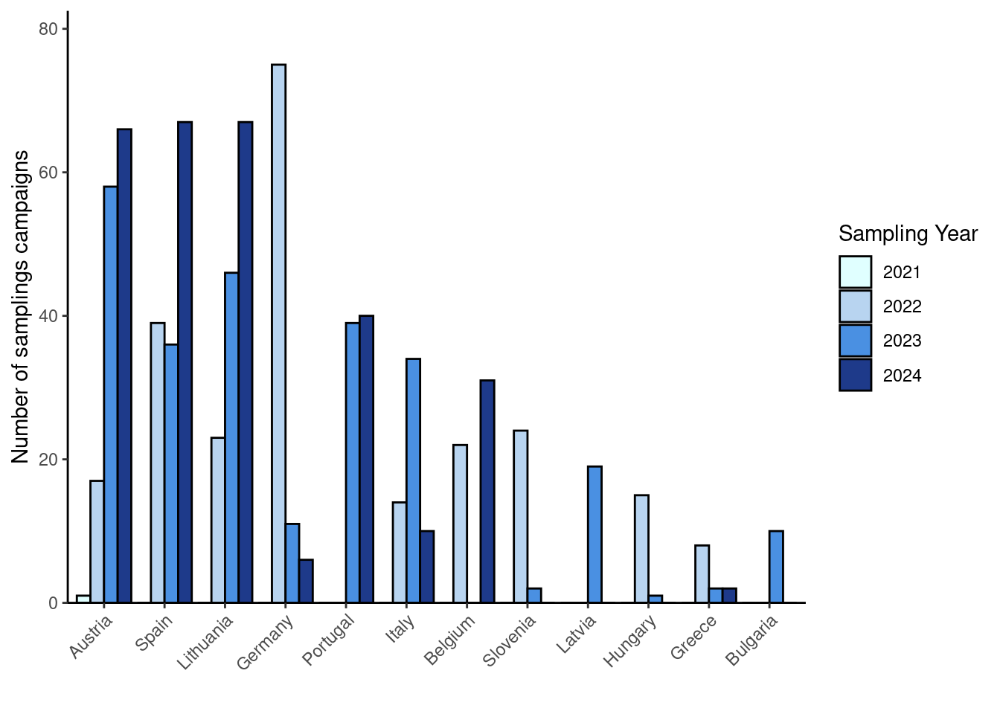

#### Numer of Rivers sampled per year and country

*  Table


``` r
Riverbank %>% 
  group_by(CountryResponsible, SamplingYear) %>%
  summarise(Rivers = n_distinct(SamplingRiver))
```

```
## # A tibble: 29 × 3
## # Groups:   CountryResponsible [12]
##    CountryResponsible SamplingYear Rivers
##    <fct>                     <int>  <int>
##  1 austria                    2021      1
##  2 austria                    2022     10
##  3 austria                    2023     35
##  4 austria                    2024     35
##  5 belgium                    2022     12
##  6 belgium                    2024     18
##  7 bulgaria                   2023      1
##  8 germany                    2022     58
##  9 germany                    2023     10
## 10 germany                    2024      5
## # ℹ 19 more rows
```
* Plot (without numbers)


``` r
Riverbank %>% 
  group_by(CountryResponsible, SamplingYear) %>%
  summarise(Rivers = n_distinct(SamplingRiver), .groups = 'drop') %>%
  # Capitalizar primera letra de cada país
  mutate(CountryResponsible = str_to_title(CountryResponsible)) %>%
  # Crear todas las combinaciones posibles de país y año
  complete(CountryResponsible, SamplingYear, fill = list(Rivers = 0)) %>%
  # Ordenar por total acumulado de ríos
  mutate(CountryResponsible = reorder(CountryResponsible, -Rivers, sum)) %>%
  ggplot(aes(x = CountryResponsible, y = Rivers, fill = factor(SamplingYear))) +
  geom_bar(stat = "identity", position = "stack", colour = 'black') +
  theme_classic() +
  theme(axis.text.x = element_text(angle = 45, hjust = 1)) +
  # Paleta de colores con intensidad creciente hacia 2024
  scale_fill_manual(values = c("2021" = "#E0FFFF", "2022" = "#B8D4F0", "2023" = "#4A90E2", "2024" = "#1E3A8A")) +
  scale_y_continuous(expand = expansion(mult = c(0, 0.1))) +
  labs(x = "", 
       y = "Number of rivers",
       fill = "Sampling Year")
```

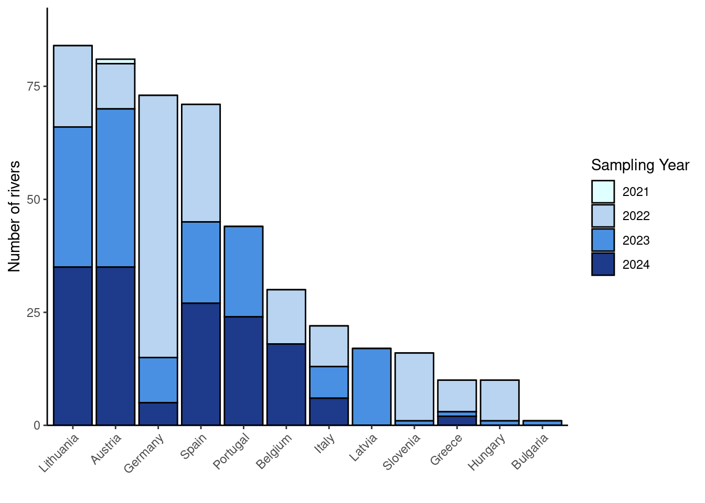

* Plot (with numbers)


``` r
# Preparar los datos
plot_data <- Riverbank %>% 
  group_by(CountryResponsible, SamplingYear) %>%
  summarise(Rivers = n_distinct(SamplingRiver), .groups = 'drop') %>%
  # Capitalizar primera letra de cada país
  mutate(CountryResponsible = str_to_title(CountryResponsible)) %>%
  # Crear todas las combinaciones posibles de país y año
  complete(CountryResponsible, SamplingYear, fill = list(Rivers = 0)) %>%
  # Ordenar por total acumulado de ríos
  mutate(CountryResponsible = reorder(CountryResponsible, -Rivers, sum))

# Crear el gráfico
ggplot(plot_data, aes(x = CountryResponsible, y = Rivers, fill = factor(SamplingYear))) +
  geom_bar(stat = "identity", position = "stack", colour = 'black') +
  # Añadir etiquetas solo para valores superiores a 20
  geom_text(data = filter(plot_data, Rivers > 8), 
            aes(label = Rivers), 
            position = position_stack(vjust = 0.5),
            color = "white", fontweight = "bold", size = 2.5) +
  theme_classic() +
  theme(axis.text.x = element_text(angle = 45, hjust = 1)) +
  # Paleta de colores con intensidad creciente hacia 2024
  scale_fill_manual(values = c("2021" = "#E0FFFF", "2022" = "#B8D4F0", "2023" = "#4A90E2", "2024" = "#1E3A8A")) +
  scale_y_continuous(expand = expansion(mult = c(0, 0.1))) +
  labs(x = "", 
       y = "Number of rivers",
       fill = "Sampling Year")
```


### Most common types and quantities of litter per region? (Group B: riverbanks; Group C: floating litter)

#### Group B: Riverside Waste

Statistics of the variable `RiversideWasteVariety_AttemptedSampling` to see how many samplings were performed.

``` r
Riverbank %>% 
  select(RiversideWasteVariety_AttemptedSampling) %>% 
  table()
```

```
## RiversideWasteVariety_AttemptedSampling
##   0   1 
##  27 756
```

To work with the `RiversideWasteVariety_` data, we need to filter the dataset to include only those rows where `RiversideWasteVariety_AttemptedSampling` is 1 (indicating that a sampling was attempted) and `RiversideWasteVariety_Qualified` is also 1 (indicating that the sampling was qualified).


``` r
Riverbank %>% 
  filter(RiversideWasteVariety_AttemptedSampling == 1 & RiversideWasteVariety_Qualified == 1)
```

```
##                                             file.source DatasetID CountryResponsible                             ResearchInstituteResponsible
## 1  austria_verified_data_plasticpirates_autumn2022.xlsx   at_6270            austria institute of waste management and circularity (abf-boku)
## 2  austria_verified_data_plasticpirates_autumn2022.xlsx   at_6297            austria institute of waste management and circularity (abf-boku)
## 3  austria_verified_data_plasticpirates_autumn2022.xlsx   at_6382            austria institute of waste management and circularity (abf-boku)
## 4  austria_verified_data_plasticpirates_autumn2022.xlsx   at_6393            austria institute of waste management and circularity (abf-boku)
## 5  austria_verified_data_plasticpirates_autumn2022.xlsx   at_6429            austria institute of waste management and circularity (abf-boku)
## 6  austria_verified_data_plasticpirates_autumn2022.xlsx   at_6429            austria institute of waste management and circularity (abf-boku)
## 7  austria_verified_data_plasticpirates_autumn2022.xlsx   at_6448            austria institute of waste management and circularity (abf-boku)
## 8  austria_verified_data_plasticpirates_autumn2022.xlsx   at_6463            austria institute of waste management and circularity (abf-boku)
## 9  austria_verified_data_plasticpirates_autumn2022.xlsx   at_6463            austria institute of waste management and circularity (abf-boku)
## 10 austria_verified_data_plasticpirates_autumn2022.xlsx   at_6536            austria institute of waste management and circularity (abf-boku)
##               PersonResponsible                                      PersonContact GeneralCommentDataset SamplingCampaign SamplingYear
## 1  anna noichl; magdalena kraml anna.noichl@boku.ac.at; magdalena.kraml@boku.ac.at                  <NA>      autumn 2022         2022
## 2  anna noichl; magdalena kraml anna.noichl@boku.ac.at; magdalena.kraml@boku.ac.at                  <NA>      autumn 2022         2022
## 3  anna noichl; magdalena kraml anna.noichl@boku.ac.at; magdalena.kraml@boku.ac.at                  <NA>      autumn 2022         2022
## 4  anna noichl; magdalena kraml anna.noichl@boku.ac.at; magdalena.kraml@boku.ac.at                  <NA>      autumn 2022         2022
## 5  anna noichl; magdalena kraml anna.noichl@boku.ac.at; magdalena.kraml@boku.ac.at                  <NA>      autumn 2022         2022
## 6  anna noichl; magdalena kraml anna.noichl@boku.ac.at; magdalena.kraml@boku.ac.at                  <NA>      autumn 2022         2022
## 7  anna noichl; magdalena kraml anna.noichl@boku.ac.at; magdalena.kraml@boku.ac.at                  <NA>      autumn 2022         2022
## 8  anna noichl; magdalena kraml anna.noichl@boku.ac.at; magdalena.kraml@boku.ac.at                  <NA>      autumn 2022         2022
## 9  anna noichl; magdalena kraml anna.noichl@boku.ac.at; magdalena.kraml@boku.ac.at                  <NA>      autumn 2022         2022
## 10 anna noichl; magdalena kraml anna.noichl@boku.ac.at; magdalena.kraml@boku.ac.at                  <NA>      autumn 2022         2022
##                          SamplingTeamName                               SamplingInstitution SamplingAttempted DatasetReasonDisqualified DatasetQualified
## 1                             bgr-pirates                                         bgr steyr                 1                      <NA>                1
## 2                       die roten drachen                            jugendrotkreuz braunau                 1                      <NA>                1
## 3                 future team hak tamsweg                                       hak tamsweg                 1                      <NA>                1
## 4                            hlsp villach höhere lehranstalt für sozialbetreuung und pflege                 1                      <NA>                1
## 5                                     bg9                                     bg9 wasagasse                 1                      <NA>                1
## 6                                     bg9                                     bg9 wasagasse                 1                      <NA>                1
## 7  adventistische privatschule klagenfurt            adventistische privatschule klagenfurt                 1                      <NA>                1
## 8                               stitch_6b                                      bg schwechat                 1                      <NA>                1
## 9                               stitch_6b                                      bg schwechat                 1                      <NA>                1
## 10                             gymgmunden                                    bg/brg gmunden                 1                      <NA>                1
##    SamplingOnlineOnWebsite SamplingDate SamplingCoordinatesLatitude SamplingCoordinatesLongitude       SamplingPlace   SamplingRegion  SamplingRiver
## 1                        1   2022-10-18                    48.04275                     14.42192               steyr   oberösterreich    Steyr River
## 2                        1   2022-10-22                    48.26034                     13.03440      braunau am inn   oberösterreich      Inn River
## 3                        1   2022-11-08                    47.11828                     13.81419             tamsweg         salzburg      Mur River
## 4                        1   2022-11-09                    46.58301                     13.84115             villach          kärnten     Gail River
## 5                        1   2022-11-08                    48.21108                     16.43973        wien stadlau             wien   Danube River
## 6                        1   2022-11-08                    48.21108                     16.43973        wien stadlau             wien   Danube River
## 7                        1   2022-11-11                    46.60477                     14.27800          klagenfurt          kärnten Sattnitz River
## 8                        1   2022-11-21                    48.12415                     16.85212 petronell-carnuntum niederösterreich   Danube River
## 9                        1   2022-11-21                    48.12415                     16.85212 petronell-carnuntum niederösterreich   Danube River
## 10                       1   2022-12-07                    47.92751                     13.79926             gmunden   oberösterreich    Traun River
##    SamplingRiverSystem SamplingParticipants SamplingComment RiversideLitterCircles_AttemptedSampling
## 1               Danube                    9            <NA>                                        0
## 2               Danube                    8            <NA>                                        1
## 3               Danube                   20            <NA>                                        1
## 4               Danube                   38            <NA>                                        1
## 5               Danube                   20            <NA>                                        1
## 6               Danube                   20            <NA>                                        1
## 7               Danube                   16            <NA>                                        1
## 8               Danube                   20            <NA>                                        1
## 9               Danube                   20            <NA>                                        1
## 10              Danube                    6            <NA>                                        1
##                                                                                                      RiversideLitterCircles_DisqualifiedReason
## 1                                                                                                                                         <NA>
## 2  groups with inexplicable differences between litter counts and material composition on photographs upon comparison to submitted data sheets
## 3                                                                                                                          no photos available
## 4                                                                                                                                         <NA>
## 5                                                                                                                                         <NA>
## 6                                                                                                                                         <NA>
## 7                                                                                                                                         <NA>
## 8  groups with inexplicable differences between litter counts and material composition on photographs upon comparison to submitted data sheets
## 9  groups with inexplicable differences between litter counts and material composition on photographs upon comparison to submitted data sheets
## 10                                                                                                                                        <NA>
##    RiversideLitterCircles_Qualified RiversideLitterCircles_Results_NumberOfStationsSampled RiversideLitterCircles_Results_NumberOfStationsWithLitterFindings
## 1                                NA                                                     NA                                                                NA
## 2                                 0                                                     NA                                                                NA
## 3                                 0                                                     NA                                                                NA
## 4                                 1                                                      9                                                                 7
## 5                                 1                                                      9                                                                 9
## 6                                 1                                                      9                                                                 9
## 7                                 1                                                      9                                                                 3
## 8                                 0                                                     NA                                                                NA
## 9                                 0                                                     NA                                                                NA
## 10                                1                                                      9                                                                 5
##    RiversideLitterCircles_Results_PaperTotal RiversideLitterCircles_Results_CigarettesTotal RiversideLitterCircles_Results_PlasticTotal
## 1                                         NA                                             NA                                          NA
## 2                                         NA                                             NA                                          NA
## 3                                         NA                                             NA                                          NA
## 4                                         20                                             11                                          23
## 5                                         10                                             46                                          15
## 6                                         10                                             46                                          15
## 7                                          0                                              1                                           2
## 8                                         NA                                             NA                                          NA
## 9                                         NA                                             NA                                          NA
## 10                                         0                                              3                                           2
##    RiversideLitterCircles_Results_MetalTotal RiversideLitterCircles_Results_GlassTotal RiversideLitterCircles_Results_FoodLeftoverTotal
## 1                                         NA                                        NA                                               NA
## 2                                         NA                                        NA                                               NA
## 3                                         NA                                        NA                                               NA
## 4                                         25                                         2                                                0
## 5                                         14                                         1                                                0
## 6                                         14                                         1                                                0
## 7                                          1                                         0                                                0
## 8                                         NA                                        NA                                               NA
## 9                                         NA                                        NA                                               NA
## 10                                         1                                         1                                                0
##    RiversideLitterCircles_Results_OtherTotal RiversideLitterCircles_Results_OverallTotal RiversideLitterCircles_Results_AveragePerM2
## 1                                         NA                                          NA                                          NA
## 2                                         NA                                          NA                                          NA
## 3                                         NA                                          NA                                          NA
## 4                                          4                                          85                                   1.3492000
## 5                                          2                                          88                                   1.3968000
## 6                                          2                                          88                                   1.3968000
## 7                                          0                                           4                                   0.0635000
## 8                                         NA                                          NA                                          NA
## 9                                         NA                                          NA                                          NA
## 10                                         8                                          15                                   0.2380952
##    RiversideLitterCircles_ResultsComment RiversideWasteVariety_AttemptedSampling RiversideWasteVariety_DisqualifiedReason RiversideWasteVariety_Qualified
## 1                                   <NA>                                       1                                     <NA>                               1
## 2                                   <NA>                                       1                                     <NA>                               1
## 3                                   <NA>                                       1                                     <NA>                               1
## 4                                   <NA>                                       1                                     <NA>                               1
## 5                                   <NA>                                       1                                     <NA>                               1
## 6                                   <NA>                                       1                                     <NA>                               1
## 7                                   <NA>                                       1                                     <NA>                               1
## 8                                   <NA>                                       1                                     <NA>                               1
## 9                                   <NA>                                       1                                     <NA>                               1
## 10                                  <NA>                                       1                                     <NA>                               1
##    RiversideWasteVariety_Results_PlasticBags RiversideWasteVariety_Results_PlasticBottles RiversideWasteVariety_Results_PlasticLids
## 1                                          2                                            0                                         0
## 2                                         NA                                            1                                         4
## 3                                          0                                            0                                         0
## 4                                         34                                           22                                        13
## 5                                          7                                           22                                        17
## 6                                          7                                           22                                        17
## 7                                          3                                            4                                         1
## 8                                          0                                           16                                        13
## 9                                          0                                           16                                        13
## 10                                         0                                            1                                         1
##    RiversideWasteVariety_Results_TakeawayFastFood RiversideWasteVariety_Results_PlasticCutleryPlates RiversideWasteVariety_Results_PlasticPackagingSweets
## 1                                               2                                                  0                                                    1
## 2                                               1                                                  1                                                   14
## 3                                               0                                                  0                                                    2
## 4                                               2                                                 NA                                                   34
## 5                                               9                                                  3                                                   10
## 6                                               9                                                  3                                                   10
## 7                                               3                                                  0                                                    1
## 8                                               1                                                  0                                                   37
## 9                                               1                                                  0                                                   37
## 10                                              1                                                  1                                                    2
##    RiversideWasteVariety_Results_CottonBuds RiversideWasteVariety_Results_WetWipesSanitaryProducts RiversideWasteVariety_Results_Polystyrene
## 1                                         0                                                      1                                         0
## 2                                        NA                                                      3                                        NA
## 3                                         0                                                      0                                         1
## 4                                        NA                                                     NA                                        NA
## 5                                         2                                                      7                                         6
## 6                                         2                                                      7                                         6
## 7                                         0                                                      0                                         0
## 8                                         0                                                      1                                        25
## 9                                         0                                                      1                                        25
## 10                                        0                                                      0                                         0
##    RiversideWasteVariety_Results_SingleUsePlasticTotal RiversideWasteVariety_Results_SmallPlasticPieces.2.5cm
## 1                                                    6                                                      0
## 2                                                   24                                                      7
## 3                                                    3                                                      2
## 4                                                   NA                                                     NA
## 5                                                   83                                                     11
## 6                                                   83                                                     11
## 7                                                   13                                                      0
## 8                                                   93                                                     65
## 9                                                   93                                                     65
## 10                                                   6                                                      0
##    RiversideWasteVariety_Results_OtherUnidentifiablePlastic RiversideWasteVariety_Results_MetalBeverageCans RiversideWasteVariety_Results_BottleCaps
## 1                                                         5                                               1                                        5
## 2                                                        28                                               4                                       11
## 3                                                         7                                               0                                        1
## 4                                                        23                                              38                                       28
## 5                                                         2                                              23                                        6
## 6                                                         2                                              23                                        6
## 7                                                         9                                              13                                        1
## 8                                                        39                                               3                                        0
## 9                                                        39                                               3                                        0
## 10                                                        2                                               4                                        2
##    RiversideWasteVariety_Results_AluminiumFoil RiversideWasteVariety_Results_OtherUnidentifiableMetal RiversideWasteVariety_Results_GlassBottles
## 1                                            2                                                     57                                          1
## 2                                           18                                                      8                                          1
## 3                                            1                                                      3                                          0
## 4                                           53                                                     14                                         17
## 5                                            6                                                      6                                         13
## 6                                            6                                                      6                                         13
## 7                                            3                                                      2                                          7
## 8                                            2                                                      2                                          4
## 9                                            2                                                      2                                          4
## 10                                           1                                                      3                                          0
##    RiversideWasteVariety_Results_GlassPieces RiversideWasteVariety_Results_OtherUnidentifiableGlass RiversideWasteVariety_Results_CigaretteButts
## 1                                         50                                                      0                                           10
## 2                                          2                                                     NA                                           73
## 3                                          0                                                      0                                            2
## 4                                         25                                                     NA                                          179
## 5                                         51                                                      0                                           39
## 6                                         51                                                      0                                           39
## 7                                          8                                                      0                                            2
## 8                                          8                                                      0                                            1
## 9                                          8                                                      0                                            1
## 10                                         0                                                      0                                            0
##    RiversideWasteVariety_Results_Paper RiversideWasteVariety_Results_Textiles RiversideWasteVariety_Results_Rubber RiversideWasteVariety_Results_Balloons
## 1                                    9                                      2                                    0                                      0
## 2                                   56                                     NA                                    3                                     NA
## 3                                    0                                      0                                    1                                      0
## 4                                  140                                      5                                    0                                      2
## 5                                    0                                      6                                    0                                      0
## 6                                    0                                      6                                    0                                      0
## 7                                    7                                      1                                    0                                      0
## 8                                    2                                      3                                    0                                      1
## 9                                    2                                      3                                    0                                      1
## 10                                   0                                      0                                    0                                      0
##    RiversideWasteVariety_Results_OtherUnidentifiableWaste RiversideWasteVariety_Results_LocalWaste RiversideWasteVariety_Results_TotalNumber.incl.SUP.
## 1                                                       5                                        1                                                 154
## 2                                                       7                                        1                                                 243
## 3                                                       0                                        0                                                  20
## 4                                                      28                                        0                                                 657
## 5                                                       0                                       42                                                 288
## 6                                                       0                                       42                                                 288
## 7                                                       3                                        0                                                  69
## 8                                                       7                                        1                                                 210
## 9                                                       7                                        1                                                 210
## 10                                                      3                                        0                                                  27
##    RiversideWasteVariety_Results_ProportionSingleUsePlastic RiversideWasteVariety_Results_LengthOfRiverbankSearchedM
## 1                                                       0.5                                                     30.0
## 2                                                       9.9                                                    210.0
## 3                                                      15.0                                                    100.0
## 4                                                        NA                                                    136.5
## 5                                                      28.8                                                    188.0
## 6                                                      28.8                                                    188.0
## 7                                                      18.8                                                     30.0
## 8                                                      44.0                                                    155.0
## 9                                                      44.0                                                    155.0
## 10                                                     22.0                                                    100.0
##    RiversideWasteVariety_Results_WidthOfRiverbankSearchedM RiversideWasteVariety_Results_WeightPlasticWasteKG RiversideWasteVariety_Results_WeightAllWasteKG
## 1                                                       12                                              0.005                                            7.1
## 2                                                       28                                               0.15                                          17.08
## 3                                                       10                                               1.04                                           1.32
## 4                                                       20                                               14.3                                           <NA>
## 5                                                       20                                               2.85                                           <NA>
## 6                                                       20                                               2.85                                           <NA>
## 7                                                       20                                              0.711                                           4.73
## 8                                                       20                                               3.45                                            6.6
## 9                                                       20                                               3.45                                            6.6
## 10                                                      15                                               <NA>                                          0.196
##    RiversideWasteVariety_Results_ResultsComment ReporterTeam_AttemptedSampling ReporterTeam_DisqualifiedReason ReporterTeam_Qualified
## 1                                          <NA>                              0                            <NA>                     NA
## 2                                          <NA>                              0                            <NA>                     NA
## 3                                          <NA>                              1                            <NA>                      1
## 4                                          <NA>                              1                            <NA>                      1
## 5                                          <NA>                              0                            <NA>                     NA
## 6                                          <NA>                              0                            <NA>                     NA
## 7                                          <NA>                              1                            <NA>                      1
## 8                                          <NA>                              0                            <NA>                     NA
## 9                                          <NA>                              0                            <NA>                     NA
## 10                                         <NA>                              0                            <NA>                     NA
##    ReporterTeam_Results_SourceResidents ReporterTeam_Results_SourceVisitors ReporterTeam_Results_SourceFlyTippers ReporterTeam_Results_SourceIndustry
## 1                                  <NA>                                <NA>                                  <NA>                                <NA>
## 2                                  <NA>                                <NA>                                  <NA>                                <NA>
## 3                                   yes                                 yes                              possibly                                 yes
## 4                                    no                                 yes                                    no                                  no
## 5                                  <NA>                                <NA>                                  <NA>                                <NA>
## 6                                  <NA>                                <NA>                                  <NA>                                <NA>
## 7                                   yes                                 yes                                    no                                  no
## 8                                  <NA>                                <NA>                                  <NA>                                <NA>
## 9                                  <NA>                                <NA>                                  <NA>                                <NA>
## 10                                 <NA>                                <NA>                                  <NA>                                <NA>
##    ReporterTeam_Results_SourceAgriculture ReporterTeam_Results_SourceShipping ReporterTeam_Results_SourceFishing ReporterTeam_Results_Weather_Rain
## 1                                    <NA>                                <NA>                               <NA>                              <NA>
## 2                                    <NA>                                <NA>                               <NA>                              <NA>
## 3                                      no                                  no                           possibly                                no
## 4                                      no                                  no                                 no                                no
## 5                                    <NA>                                <NA>                               <NA>                              <NA>
## 6                                    <NA>                                <NA>                               <NA>                              <NA>
## 7                                      no                                  no                                 no                                no
## 8                                    <NA>                                <NA>                               <NA>                              <NA>
## 9                                    <NA>                                <NA>                               <NA>                              <NA>
## 10                                   <NA>                                <NA>                               <NA>                              <NA>
##    ReporterTeam_Results_Weather_Storm ReporterTeam_Results_Weather_Heat ReporterTeam_Results_Problems_GroupA ReporterTeam_Results_Problems_GroupB
## 1                                <NA>                              <NA>                                 <NA>                                 <NA>
## 2                                <NA>                              <NA>                                 <NA>                                 <NA>
## 3                                 yes                                no                          no problems                          no problems
## 4                                  no                                no                          no problems                        some problems
## 5                                <NA>                              <NA>                                 <NA>                                 <NA>
## 6                                <NA>                              <NA>                                 <NA>                                 <NA>
## 7                                  no                                no                          no problems                          no problems
## 8                                <NA>                              <NA>                                 <NA>                                 <NA>
## 9                                <NA>                              <NA>                                 <NA>                                 <NA>
## 10                               <NA>                              <NA>                                 <NA>                                 <NA>
##                                                                                                                                ReporterTeam_Results_Problems_BiggestProblems
## 1                                                                                                                                                                       <NA>
## 2                                                                                                                                                                       <NA>
## 3                                                                                                                                 doing the interviews and record the others
## 4                                                                                                                                                         to reach the waste
## 5                                                                                                                                                                       <NA>
## 6                                                                                                                                                                       <NA>
## 7                                                                                                                                                                       <NA>
## 8  drawing the circles was so difficult, plus they were very unrecognisable because we only had small pieces of wood. the 20 metres of group a and b ended up in the bushes.
## 9  drawing the circles was so difficult, plus they were very unrecognisable because we only had small pieces of wood. the 20 metres of group a and b ended up in the bushes.
## 10                                                                                                                                                                      <NA>
##  [ reached 'max' / getOption("max.print") -- omitted 541 rows ]
```
##### Percentage of qualified samplings

This represents the percentage of validated data among the total number of sampling beign attempted.

``` r
Riverbank %>%
  summarise(
    total_rows = n(),
    total_valid = sum(
      RiversideWasteVariety_AttemptedSampling == 1 &
      RiversideWasteVariety_Qualified == 1,
      na.rm = TRUE
    ),
    pct_valid_total = round((total_valid / total_rows) * 100, digits = 1),
    pct_valid_percent = paste(round((total_valid / total_rows) * 100, 1), "%", sep = "")
  )
```

```
##   total_rows total_valid pct_valid_total pct_valid_percent
## 1        785         551            70.2             70.2%
```


``` r
validated_pct_by_country <- 
  Riverbank %>% 
  group_by(CountryResponsible) %>% 
  summarise(total_rows = n(),
            total_valid = sum(RiversideWasteVariety_AttemptedSampling == 1 & RiversideWasteVariety_Qualified == 1, na.rm = TRUE),
    `pct_valid_total(%)`        = round((total_valid / total_rows) * 100,1),
    total_attempts         = sum(RiversideWasteVariety_AttemptedSampling == 1, na.rm = TRUE),
    valid_among_attempts   = sum(RiversideWasteVariety_AttemptedSampling == 1 & RiversideWasteVariety_Qualified == 1, na.rm = TRUE),
    `pct_valid_among_attempts(%)` = round((valid_among_attempts / total_attempts) * 100,1), .groups = "drop") %>% 
  mutate(CountryResponsible = str_to_title(CountryResponsible))

validated_pct_by_country
```

```
## # A tibble: 12 × 7
##    CountryResponsible total_rows total_valid `pct_valid_total(%)` total_attempts valid_among_attempts `pct_valid_among_attempts(%)`
##    <chr>                   <int>       <int>                <dbl>          <int>                <int>                         <dbl>
##  1 Austria                   142          74                 52.1            128                   74                          57.8
##  2 Belgium                    53          49                 92.5             52                   49                          94.2
##  3 Bulgaria                   10          10                100               10                   10                         100  
##  4 Germany                    92          86                 93.5             91                   86                          94.5
##  5 Greece                     12          11                 91.7             11                   11                         100  
##  6 Hungary                    16          15                 93.8             16                   15                          93.8
##  7 Italy                      58          51                 87.9             55                   51                          92.7
##  8 Latvia                     19          10                 52.6             19                   10                          52.6
##  9 Lithuania                 136          90                 66.2            133                   90                          67.7
## 10 Portugal                   79          45                 57               77                   45                          58.4
## 11 Slovenia                   26          24                 92.3             25                   24                          96  
## 12 Spain                     142          86                 60.6            139                   86                          61.9
```


``` r
Riverbank %>% 
  group_by(CountryResponsible, SamplingYear) %>% 
  summarise(
    n_attempted = sum(RiversideWasteVariety_AttemptedSampling == 1, na.rm = TRUE),
    n_validated = sum(RiversideWasteVariety_AttemptedSampling == 1 & RiversideWasteVariety_Qualified == 1, na.rm = TRUE),
    pct_validated = if_else(n_attempted > 0, n_validated / n_attempted * 100, 0),
    .groups = "drop"
  ) %>% 
  mutate(CountryResponsible = str_to_title(CountryResponsible)) %>% 
  complete(CountryResponsible, SamplingYear,
           fill = list(n_attempted   = 0,
                       n_validated   = 0,
                       pct_validated = 0)
  ) %>% 
  filter(SamplingYear > 2021)  %>% 
  mutate(CountryResponsible = reorder(CountryResponsible,-pct_validated, FUN = mean)) %>% 
  ggplot(aes(
    x    = CountryResponsible,
    y    = pct_validated,
    fill = factor(SamplingYear)
  )) +
    geom_col(
      position = "dodge",
      colour  = "black"
    ) +
  geom_text(aes(label = n_attempted),
              position = position_dodge(width = 0.9),
              vjust    = -0.3,
              size     = 3
    ) +
  # geom_text(aes(label = paste0("(", n_attempted, ")")),
  #           position = position_dodge(width = 0.9),
  #           vjust    = -0.3,
  #           size     = 2.8) +
    scale_fill_manual(
      values = c(
        "2021" = "#E0FFFF",
        "2022" = "#B8D4F0",
        "2023" = "#4A90E2",
        "2024" = "#1E3A8A"
      ),
      name = "Sampling Year"
    ) +
    scale_y_continuous(
      labels = percent_format(scale = 1),
      expand = expansion(mult = c(0, 0.05))
    ) +
    labs(
      x     = NULL,
      y     = "Validated sampling (%)",
      title = "Percentage of validated records and total sampling per country and year"
    ) +
    theme_classic(base_size = 12) +
    theme(
      axis.text.x = element_text(angle = 45, hjust = 1),
      plot.title  = element_text(hjust = 0.5)
    )
```

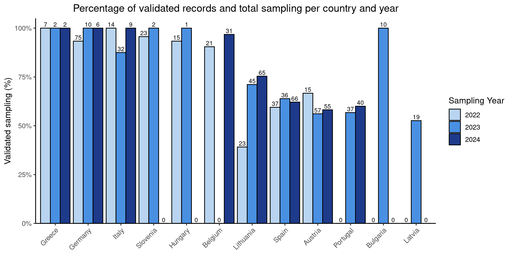

##### Most common types/quantities of litter


``` r
Riverbank %>% 
  filter(RiversideWasteVariety_AttemptedSampling == 1 & RiversideWasteVariety_Qualified == 1)
```

```
##                                             file.source DatasetID CountryResponsible                             ResearchInstituteResponsible
## 1  austria_verified_data_plasticpirates_autumn2022.xlsx   at_6270            austria institute of waste management and circularity (abf-boku)
## 2  austria_verified_data_plasticpirates_autumn2022.xlsx   at_6297            austria institute of waste management and circularity (abf-boku)
## 3  austria_verified_data_plasticpirates_autumn2022.xlsx   at_6382            austria institute of waste management and circularity (abf-boku)
## 4  austria_verified_data_plasticpirates_autumn2022.xlsx   at_6393            austria institute of waste management and circularity (abf-boku)
## 5  austria_verified_data_plasticpirates_autumn2022.xlsx   at_6429            austria institute of waste management and circularity (abf-boku)
## 6  austria_verified_data_plasticpirates_autumn2022.xlsx   at_6429            austria institute of waste management and circularity (abf-boku)
## 7  austria_verified_data_plasticpirates_autumn2022.xlsx   at_6448            austria institute of waste management and circularity (abf-boku)
## 8  austria_verified_data_plasticpirates_autumn2022.xlsx   at_6463            austria institute of waste management and circularity (abf-boku)
## 9  austria_verified_data_plasticpirates_autumn2022.xlsx   at_6463            austria institute of waste management and circularity (abf-boku)
## 10 austria_verified_data_plasticpirates_autumn2022.xlsx   at_6536            austria institute of waste management and circularity (abf-boku)
##               PersonResponsible                                      PersonContact GeneralCommentDataset SamplingCampaign SamplingYear
## 1  anna noichl; magdalena kraml anna.noichl@boku.ac.at; magdalena.kraml@boku.ac.at                  <NA>      autumn 2022         2022
## 2  anna noichl; magdalena kraml anna.noichl@boku.ac.at; magdalena.kraml@boku.ac.at                  <NA>      autumn 2022         2022
## 3  anna noichl; magdalena kraml anna.noichl@boku.ac.at; magdalena.kraml@boku.ac.at                  <NA>      autumn 2022         2022
## 4  anna noichl; magdalena kraml anna.noichl@boku.ac.at; magdalena.kraml@boku.ac.at                  <NA>      autumn 2022         2022
## 5  anna noichl; magdalena kraml anna.noichl@boku.ac.at; magdalena.kraml@boku.ac.at                  <NA>      autumn 2022         2022
## 6  anna noichl; magdalena kraml anna.noichl@boku.ac.at; magdalena.kraml@boku.ac.at                  <NA>      autumn 2022         2022
## 7  anna noichl; magdalena kraml anna.noichl@boku.ac.at; magdalena.kraml@boku.ac.at                  <NA>      autumn 2022         2022
## 8  anna noichl; magdalena kraml anna.noichl@boku.ac.at; magdalena.kraml@boku.ac.at                  <NA>      autumn 2022         2022
## 9  anna noichl; magdalena kraml anna.noichl@boku.ac.at; magdalena.kraml@boku.ac.at                  <NA>      autumn 2022         2022
## 10 anna noichl; magdalena kraml anna.noichl@boku.ac.at; magdalena.kraml@boku.ac.at                  <NA>      autumn 2022         2022
##                          SamplingTeamName                               SamplingInstitution SamplingAttempted DatasetReasonDisqualified DatasetQualified
## 1                             bgr-pirates                                         bgr steyr                 1                      <NA>                1
## 2                       die roten drachen                            jugendrotkreuz braunau                 1                      <NA>                1
## 3                 future team hak tamsweg                                       hak tamsweg                 1                      <NA>                1
## 4                            hlsp villach höhere lehranstalt für sozialbetreuung und pflege                 1                      <NA>                1
## 5                                     bg9                                     bg9 wasagasse                 1                      <NA>                1
## 6                                     bg9                                     bg9 wasagasse                 1                      <NA>                1
## 7  adventistische privatschule klagenfurt            adventistische privatschule klagenfurt                 1                      <NA>                1
## 8                               stitch_6b                                      bg schwechat                 1                      <NA>                1
## 9                               stitch_6b                                      bg schwechat                 1                      <NA>                1
## 10                             gymgmunden                                    bg/brg gmunden                 1                      <NA>                1
##    SamplingOnlineOnWebsite SamplingDate SamplingCoordinatesLatitude SamplingCoordinatesLongitude       SamplingPlace   SamplingRegion  SamplingRiver
## 1                        1   2022-10-18                    48.04275                     14.42192               steyr   oberösterreich    Steyr River
## 2                        1   2022-10-22                    48.26034                     13.03440      braunau am inn   oberösterreich      Inn River
## 3                        1   2022-11-08                    47.11828                     13.81419             tamsweg         salzburg      Mur River
## 4                        1   2022-11-09                    46.58301                     13.84115             villach          kärnten     Gail River
## 5                        1   2022-11-08                    48.21108                     16.43973        wien stadlau             wien   Danube River
## 6                        1   2022-11-08                    48.21108                     16.43973        wien stadlau             wien   Danube River
## 7                        1   2022-11-11                    46.60477                     14.27800          klagenfurt          kärnten Sattnitz River
## 8                        1   2022-11-21                    48.12415                     16.85212 petronell-carnuntum niederösterreich   Danube River
## 9                        1   2022-11-21                    48.12415                     16.85212 petronell-carnuntum niederösterreich   Danube River
## 10                       1   2022-12-07                    47.92751                     13.79926             gmunden   oberösterreich    Traun River
##    SamplingRiverSystem SamplingParticipants SamplingComment RiversideLitterCircles_AttemptedSampling
## 1               Danube                    9            <NA>                                        0
## 2               Danube                    8            <NA>                                        1
## 3               Danube                   20            <NA>                                        1
## 4               Danube                   38            <NA>                                        1
## 5               Danube                   20            <NA>                                        1
## 6               Danube                   20            <NA>                                        1
## 7               Danube                   16            <NA>                                        1
## 8               Danube                   20            <NA>                                        1
## 9               Danube                   20            <NA>                                        1
## 10              Danube                    6            <NA>                                        1
##                                                                                                      RiversideLitterCircles_DisqualifiedReason
## 1                                                                                                                                         <NA>
## 2  groups with inexplicable differences between litter counts and material composition on photographs upon comparison to submitted data sheets
## 3                                                                                                                          no photos available
## 4                                                                                                                                         <NA>
## 5                                                                                                                                         <NA>
## 6                                                                                                                                         <NA>
## 7                                                                                                                                         <NA>
## 8  groups with inexplicable differences between litter counts and material composition on photographs upon comparison to submitted data sheets
## 9  groups with inexplicable differences between litter counts and material composition on photographs upon comparison to submitted data sheets
## 10                                                                                                                                        <NA>
##    RiversideLitterCircles_Qualified RiversideLitterCircles_Results_NumberOfStationsSampled RiversideLitterCircles_Results_NumberOfStationsWithLitterFindings
## 1                                NA                                                     NA                                                                NA
## 2                                 0                                                     NA                                                                NA
## 3                                 0                                                     NA                                                                NA
## 4                                 1                                                      9                                                                 7
## 5                                 1                                                      9                                                                 9
## 6                                 1                                                      9                                                                 9
## 7                                 1                                                      9                                                                 3
## 8                                 0                                                     NA                                                                NA
## 9                                 0                                                     NA                                                                NA
## 10                                1                                                      9                                                                 5
##    RiversideLitterCircles_Results_PaperTotal RiversideLitterCircles_Results_CigarettesTotal RiversideLitterCircles_Results_PlasticTotal
## 1                                         NA                                             NA                                          NA
## 2                                         NA                                             NA                                          NA
## 3                                         NA                                             NA                                          NA
## 4                                         20                                             11                                          23
## 5                                         10                                             46                                          15
## 6                                         10                                             46                                          15
## 7                                          0                                              1                                           2
## 8                                         NA                                             NA                                          NA
## 9                                         NA                                             NA                                          NA
## 10                                         0                                              3                                           2
##    RiversideLitterCircles_Results_MetalTotal RiversideLitterCircles_Results_GlassTotal RiversideLitterCircles_Results_FoodLeftoverTotal
## 1                                         NA                                        NA                                               NA
## 2                                         NA                                        NA                                               NA
## 3                                         NA                                        NA                                               NA
## 4                                         25                                         2                                                0
## 5                                         14                                         1                                                0
## 6                                         14                                         1                                                0
## 7                                          1                                         0                                                0
## 8                                         NA                                        NA                                               NA
## 9                                         NA                                        NA                                               NA
## 10                                         1                                         1                                                0
##    RiversideLitterCircles_Results_OtherTotal RiversideLitterCircles_Results_OverallTotal RiversideLitterCircles_Results_AveragePerM2
## 1                                         NA                                          NA                                          NA
## 2                                         NA                                          NA                                          NA
## 3                                         NA                                          NA                                          NA
## 4                                          4                                          85                                   1.3492000
## 5                                          2                                          88                                   1.3968000
## 6                                          2                                          88                                   1.3968000
## 7                                          0                                           4                                   0.0635000
## 8                                         NA                                          NA                                          NA
## 9                                         NA                                          NA                                          NA
## 10                                         8                                          15                                   0.2380952
##    RiversideLitterCircles_ResultsComment RiversideWasteVariety_AttemptedSampling RiversideWasteVariety_DisqualifiedReason RiversideWasteVariety_Qualified
## 1                                   <NA>                                       1                                     <NA>                               1
## 2                                   <NA>                                       1                                     <NA>                               1
## 3                                   <NA>                                       1                                     <NA>                               1
## 4                                   <NA>                                       1                                     <NA>                               1
## 5                                   <NA>                                       1                                     <NA>                               1
## 6                                   <NA>                                       1                                     <NA>                               1
## 7                                   <NA>                                       1                                     <NA>                               1
## 8                                   <NA>                                       1                                     <NA>                               1
## 9                                   <NA>                                       1                                     <NA>                               1
## 10                                  <NA>                                       1                                     <NA>                               1
##    RiversideWasteVariety_Results_PlasticBags RiversideWasteVariety_Results_PlasticBottles RiversideWasteVariety_Results_PlasticLids
## 1                                          2                                            0                                         0
## 2                                         NA                                            1                                         4
## 3                                          0                                            0                                         0
## 4                                         34                                           22                                        13
## 5                                          7                                           22                                        17
## 6                                          7                                           22                                        17
## 7                                          3                                            4                                         1
## 8                                          0                                           16                                        13
## 9                                          0                                           16                                        13
## 10                                         0                                            1                                         1
##    RiversideWasteVariety_Results_TakeawayFastFood RiversideWasteVariety_Results_PlasticCutleryPlates RiversideWasteVariety_Results_PlasticPackagingSweets
## 1                                               2                                                  0                                                    1
## 2                                               1                                                  1                                                   14
## 3                                               0                                                  0                                                    2
## 4                                               2                                                 NA                                                   34
## 5                                               9                                                  3                                                   10
## 6                                               9                                                  3                                                   10
## 7                                               3                                                  0                                                    1
## 8                                               1                                                  0                                                   37
## 9                                               1                                                  0                                                   37
## 10                                              1                                                  1                                                    2
##    RiversideWasteVariety_Results_CottonBuds RiversideWasteVariety_Results_WetWipesSanitaryProducts RiversideWasteVariety_Results_Polystyrene
## 1                                         0                                                      1                                         0
## 2                                        NA                                                      3                                        NA
## 3                                         0                                                      0                                         1
## 4                                        NA                                                     NA                                        NA
## 5                                         2                                                      7                                         6
## 6                                         2                                                      7                                         6
## 7                                         0                                                      0                                         0
## 8                                         0                                                      1                                        25
## 9                                         0                                                      1                                        25
## 10                                        0                                                      0                                         0
##    RiversideWasteVariety_Results_SingleUsePlasticTotal RiversideWasteVariety_Results_SmallPlasticPieces.2.5cm
## 1                                                    6                                                      0
## 2                                                   24                                                      7
## 3                                                    3                                                      2
## 4                                                   NA                                                     NA
## 5                                                   83                                                     11
## 6                                                   83                                                     11
## 7                                                   13                                                      0
## 8                                                   93                                                     65
## 9                                                   93                                                     65
## 10                                                   6                                                      0
##    RiversideWasteVariety_Results_OtherUnidentifiablePlastic RiversideWasteVariety_Results_MetalBeverageCans RiversideWasteVariety_Results_BottleCaps
## 1                                                         5                                               1                                        5
## 2                                                        28                                               4                                       11
## 3                                                         7                                               0                                        1
## 4                                                        23                                              38                                       28
## 5                                                         2                                              23                                        6
## 6                                                         2                                              23                                        6
## 7                                                         9                                              13                                        1
## 8                                                        39                                               3                                        0
## 9                                                        39                                               3                                        0
## 10                                                        2                                               4                                        2
##    RiversideWasteVariety_Results_AluminiumFoil RiversideWasteVariety_Results_OtherUnidentifiableMetal RiversideWasteVariety_Results_GlassBottles
## 1                                            2                                                     57                                          1
## 2                                           18                                                      8                                          1
## 3                                            1                                                      3                                          0
## 4                                           53                                                     14                                         17
## 5                                            6                                                      6                                         13
## 6                                            6                                                      6                                         13
## 7                                            3                                                      2                                          7
## 8                                            2                                                      2                                          4
## 9                                            2                                                      2                                          4
## 10                                           1                                                      3                                          0
##    RiversideWasteVariety_Results_GlassPieces RiversideWasteVariety_Results_OtherUnidentifiableGlass RiversideWasteVariety_Results_CigaretteButts
## 1                                         50                                                      0                                           10
## 2                                          2                                                     NA                                           73
## 3                                          0                                                      0                                            2
## 4                                         25                                                     NA                                          179
## 5                                         51                                                      0                                           39
## 6                                         51                                                      0                                           39
## 7                                          8                                                      0                                            2
## 8                                          8                                                      0                                            1
## 9                                          8                                                      0                                            1
## 10                                         0                                                      0                                            0
##    RiversideWasteVariety_Results_Paper RiversideWasteVariety_Results_Textiles RiversideWasteVariety_Results_Rubber RiversideWasteVariety_Results_Balloons
## 1                                    9                                      2                                    0                                      0
## 2                                   56                                     NA                                    3                                     NA
## 3                                    0                                      0                                    1                                      0
## 4                                  140                                      5                                    0                                      2
## 5                                    0                                      6                                    0                                      0
## 6                                    0                                      6                                    0                                      0
## 7                                    7                                      1                                    0                                      0
## 8                                    2                                      3                                    0                                      1
## 9                                    2                                      3                                    0                                      1
## 10                                   0                                      0                                    0                                      0
##    RiversideWasteVariety_Results_OtherUnidentifiableWaste RiversideWasteVariety_Results_LocalWaste RiversideWasteVariety_Results_TotalNumber.incl.SUP.
## 1                                                       5                                        1                                                 154
## 2                                                       7                                        1                                                 243
## 3                                                       0                                        0                                                  20
## 4                                                      28                                        0                                                 657
## 5                                                       0                                       42                                                 288
## 6                                                       0                                       42                                                 288
## 7                                                       3                                        0                                                  69
## 8                                                       7                                        1                                                 210
## 9                                                       7                                        1                                                 210
## 10                                                      3                                        0                                                  27
##    RiversideWasteVariety_Results_ProportionSingleUsePlastic RiversideWasteVariety_Results_LengthOfRiverbankSearchedM
## 1                                                       0.5                                                     30.0
## 2                                                       9.9                                                    210.0
## 3                                                      15.0                                                    100.0
## 4                                                        NA                                                    136.5
## 5                                                      28.8                                                    188.0
## 6                                                      28.8                                                    188.0
## 7                                                      18.8                                                     30.0
## 8                                                      44.0                                                    155.0
## 9                                                      44.0                                                    155.0
## 10                                                     22.0                                                    100.0
##    RiversideWasteVariety_Results_WidthOfRiverbankSearchedM RiversideWasteVariety_Results_WeightPlasticWasteKG RiversideWasteVariety_Results_WeightAllWasteKG
## 1                                                       12                                              0.005                                            7.1
## 2                                                       28                                               0.15                                          17.08
## 3                                                       10                                               1.04                                           1.32
## 4                                                       20                                               14.3                                           <NA>
## 5                                                       20                                               2.85                                           <NA>
## 6                                                       20                                               2.85                                           <NA>
## 7                                                       20                                              0.711                                           4.73
## 8                                                       20                                               3.45                                            6.6
## 9                                                       20                                               3.45                                            6.6
## 10                                                      15                                               <NA>                                          0.196
##    RiversideWasteVariety_Results_ResultsComment ReporterTeam_AttemptedSampling ReporterTeam_DisqualifiedReason ReporterTeam_Qualified
## 1                                          <NA>                              0                            <NA>                     NA
## 2                                          <NA>                              0                            <NA>                     NA
## 3                                          <NA>                              1                            <NA>                      1
## 4                                          <NA>                              1                            <NA>                      1
## 5                                          <NA>                              0                            <NA>                     NA
## 6                                          <NA>                              0                            <NA>                     NA
## 7                                          <NA>                              1                            <NA>                      1
## 8                                          <NA>                              0                            <NA>                     NA
## 9                                          <NA>                              0                            <NA>                     NA
## 10                                         <NA>                              0                            <NA>                     NA
##    ReporterTeam_Results_SourceResidents ReporterTeam_Results_SourceVisitors ReporterTeam_Results_SourceFlyTippers ReporterTeam_Results_SourceIndustry
## 1                                  <NA>                                <NA>                                  <NA>                                <NA>
## 2                                  <NA>                                <NA>                                  <NA>                                <NA>
## 3                                   yes                                 yes                              possibly                                 yes
## 4                                    no                                 yes                                    no                                  no
## 5                                  <NA>                                <NA>                                  <NA>                                <NA>
## 6                                  <NA>                                <NA>                                  <NA>                                <NA>
## 7                                   yes                                 yes                                    no                                  no
## 8                                  <NA>                                <NA>                                  <NA>                                <NA>
## 9                                  <NA>                                <NA>                                  <NA>                                <NA>
## 10                                 <NA>                                <NA>                                  <NA>                                <NA>
##    ReporterTeam_Results_SourceAgriculture ReporterTeam_Results_SourceShipping ReporterTeam_Results_SourceFishing ReporterTeam_Results_Weather_Rain
## 1                                    <NA>                                <NA>                               <NA>                              <NA>
## 2                                    <NA>                                <NA>                               <NA>                              <NA>
## 3                                      no                                  no                           possibly                                no
## 4                                      no                                  no                                 no                                no
## 5                                    <NA>                                <NA>                               <NA>                              <NA>
## 6                                    <NA>                                <NA>                               <NA>                              <NA>
## 7                                      no                                  no                                 no                                no
## 8                                    <NA>                                <NA>                               <NA>                              <NA>
## 9                                    <NA>                                <NA>                               <NA>                              <NA>
## 10                                   <NA>                                <NA>                               <NA>                              <NA>
##    ReporterTeam_Results_Weather_Storm ReporterTeam_Results_Weather_Heat ReporterTeam_Results_Problems_GroupA ReporterTeam_Results_Problems_GroupB
## 1                                <NA>                              <NA>                                 <NA>                                 <NA>
## 2                                <NA>                              <NA>                                 <NA>                                 <NA>
## 3                                 yes                                no                          no problems                          no problems
## 4                                  no                                no                          no problems                        some problems
## 5                                <NA>                              <NA>                                 <NA>                                 <NA>
## 6                                <NA>                              <NA>                                 <NA>                                 <NA>
## 7                                  no                                no                          no problems                          no problems
## 8                                <NA>                              <NA>                                 <NA>                                 <NA>
## 9                                <NA>                              <NA>                                 <NA>                                 <NA>
## 10                               <NA>                              <NA>                                 <NA>                                 <NA>
##                                                                                                                                ReporterTeam_Results_Problems_BiggestProblems
## 1                                                                                                                                                                       <NA>
## 2                                                                                                                                                                       <NA>
## 3                                                                                                                                 doing the interviews and record the others
## 4                                                                                                                                                         to reach the waste
## 5                                                                                                                                                                       <NA>
## 6                                                                                                                                                                       <NA>
## 7                                                                                                                                                                       <NA>
## 8  drawing the circles was so difficult, plus they were very unrecognisable because we only had small pieces of wood. the 20 metres of group a and b ended up in the bushes.
## 9  drawing the circles was so difficult, plus they were very unrecognisable because we only had small pieces of wood. the 20 metres of group a and b ended up in the bushes.
## 10                                                                                                                                                                      <NA>
##  [ reached 'max' / getOption("max.print") -- omitted 541 rows ]
```
Firstly, we will pick up data to answer the question about group B. Only some variables are taken from the general dataset.


``` r
# GroupB dataset
GroupB_data <- 
  Riverbank %>% 
  select(DatasetID, CountryResponsible, SamplingCampaign, SamplingYear, SamplingCoordinatesLatitude, SamplingCoordinatesLongitude, SamplingRiverSystem, SamplingParticipants, RiversideWasteVariety_AttemptedSampling, RiversideWasteVariety_Qualified:RiversideWasteVariety_Results_ResultsComment)
```

The, Attributes' names are so complicated to work that I'll remote the preceding information **RiversideWasteVariety_Results_** which is common to all attributes; and finally to work with only the validated `Group B` dataset we create:


``` r
# GroupB dataset
GroupB_data_validated <- 
  Riverbank %>% 
  select(DatasetID, CountryResponsible, SamplingCampaign, SamplingYear, SamplingCoordinatesLatitude, SamplingCoordinatesLongitude, SamplingRiverSystem, SamplingParticipants, RiversideWasteVariety_AttemptedSampling, RiversideWasteVariety_Qualified:RiversideWasteVariety_Results_ResultsComment) %>% 
  filter(RiversideWasteVariety_AttemptedSampling == 1 & RiversideWasteVariety_Qualified == 1) %>% 
  # Primero quitamos `RiversideWasteVariety_Results_`
  rename_with(
    .cols = starts_with("RiversideWasteVariety_Results_"),
    # solo seleccionamos los tipos de residuos
    .fn = ~ gsub("RiversideWasteVariety_Results_", "", .) # Mantenemos la ultima extensión del nombre
  )

GroupB_data_validated
```

```
##    DatasetID CountryResponsible SamplingCampaign SamplingYear SamplingCoordinatesLatitude SamplingCoordinatesLongitude SamplingRiverSystem
## 1    at_6270            austria      autumn 2022         2022                    48.04275                    14.421917              Danube
## 2    at_6297            austria      autumn 2022         2022                    48.26034                    13.034405              Danube
## 3    at_6382            austria      autumn 2022         2022                    47.11828                    13.814191              Danube
## 4    at_6393            austria      autumn 2022         2022                    46.58301                    13.841153              Danube
## 5    at_6429            austria      autumn 2022         2022                    48.21108                    16.439735              Danube
## 6    at_6429            austria      autumn 2022         2022                    48.21108                    16.439735              Danube
## 7    at_6448            austria      autumn 2022         2022                    46.60477                    14.278000              Danube
## 8    at_6463            austria      autumn 2022         2022                    48.12415                    16.852121              Danube
## 9    at_6463            austria      autumn 2022         2022                    48.12415                    16.852121              Danube
## 10   at_6536            austria      autumn 2022         2022                    47.92751                    13.799256              Danube
## 11   at_6718            austria      spring 2023         2023                    48.84332                    15.500350              Danube
## 12   at_6719            austria      spring 2023         2023                    48.84647                    15.493286              Danube
## 13   at_6741            austria      spring 2023         2023                    48.01260                    16.993900              Danube
## 14   at_6743            austria      spring 2023         2023                    47.99862                    13.684950              Danube
## 15   at_6755            austria      spring 2023         2023                    47.42645                     9.885644               Rhine
## 16   at_6760            austria      spring 2023         2023                    48.20613                    16.232443              Danube
## 17   at_6761            austria      spring 2023         2023                    48.20502                    16.174887              Danube
## 18   at_6767            austria      spring 2023         2023                    48.20902                    16.439306              Danube
## 19   at_6768            austria      spring 2023         2023                    48.13444                    16.284613              Danube
## 20   at_6868            austria      autumn 2023         2023                    48.25910                    16.356975              Danube
## 21   at_6895            austria      autumn 2023         2023                    47.82920                    16.526400              Danube
## 22   at_6904            austria      autumn 2023         2023                    47.81962                    16.229218              Danube
## 23   at_6908            austria      autumn 2023         2023                    48.13602                    16.403070              Danube
##    SamplingParticipants RiversideWasteVariety_AttemptedSampling RiversideWasteVariety_Qualified PlasticBags PlasticBottles PlasticLids TakeawayFastFood
## 1                     9                                       1                               1           2              0           0                2
## 2                     8                                       1                               1          NA              1           4                1
## 3                    20                                       1                               1           0              0           0                0
## 4                    38                                       1                               1          34             22          13                2
## 5                    20                                       1                               1           7             22          17                9
## 6                    20                                       1                               1           7             22          17                9
## 7                    16                                       1                               1           3              4           1                3
## 8                    20                                       1                               1           0             16          13                1
## 9                    20                                       1                               1           0             16          13                1
## 10                    6                                       1                               1           0              1           1                1
## 11                   23                                       1                               1           0              1           3                0
## 12                   24                                       1                               1           1              2           0                0
## 13                   22                                       1                               1           0              2           0                2
## 14                   26                                       1                               1           0              5           5                0
## 15                   14                                       1                               1           2              1           1                0
## 16                   22                                       1                               1           1              0           0                1
## 17                   27                                       1                               1           7              1           1                0
## 18                   22                                       1                               1           0              1           8                0
## 19                   NA                                       1                               1           3              0           3                0
## 20                   14                                       1                               1          30              1           2                3
## 21                    8                                       1                               1           2             16           5                5
## 22                   30                                       1                               1           1              0           1                0
## 23                   21                                       1                               1           0              2           3                1
##    PlasticCutleryPlates PlasticPackagingSweets CottonBuds WetWipesSanitaryProducts Polystyrene SingleUsePlasticTotal SmallPlasticPieces.2.5cm
## 1                     0                      1          0                        1           0                     6                        0
## 2                     1                     14         NA                        3          NA                    24                        7
## 3                     0                      2          0                        0           1                     3                        2
## 4                    NA                     34         NA                       NA          NA                    NA                       NA
## 5                     3                     10          2                        7           6                    83                       11
## 6                     3                     10          2                        7           6                    83                       11
## 7                     0                      1          0                        0           0                    13                        0
## 8                     0                     37          0                        1          25                    93                       65
## 9                     0                     37          0                        1          25                    93                       65
## 10                    1                      2          0                        0           0                     6                        0
## 11                    0                     12          0                        0           0                    16                        0
## 12                    0                      5          0                        0           0                     8                       14
## 13                    0                      5          0                       12           2                    23                        8
## 14                    0                     12          0                        0           5                    27                        1
## 15                    0                      4          0                        5           0                    13                        3
## 16                    0                      3          0                        0           0                     5                        0
## 17                    0                      1          0                        1           2                    13                        2
## 18                    0                     31          0                        0          18                    58                        5
## 19                    0                      8          0                       13           0                    27                        0
## 20                    0                     14          0                        5           3                    58                        0
## 21                    0                      1          0                        3           5                    37                        1
## 22                    4                      5          0                        0           1                    12                        3
## 23                    0                      1          0                        0           0                     7                        0
##    OtherUnidentifiablePlastic MetalBeverageCans BottleCaps AluminiumFoil OtherUnidentifiableMetal GlassBottles GlassPieces OtherUnidentifiableGlass
## 1                           5                 1          5             2                       57            1          50                        0
## 2                          28                 4         11            18                        8            1           2                       NA
## 3                           7                 0          1             1                        3            0           0                        0
## 4                          23                38         28            53                       14           17          25                       NA
## 5                           2                23          6             6                        6           13          51                        0
## 6                           2                23          6             6                        6           13          51                        0
## 7                           9                13          1             3                        2            7           8                        0
## 8                          39                 3          0             2                        2            4           8                        0
## 9                          39                 3          0             2                        2            4           8                        0
## 10                          2                 4          2             1                        3            0           0                        0
## 11                         10                 1          0             2                        1            0          16                        0
## 12                          6                 3         21             0                        2            4          70                        0
## 13                          3                 2          4             4                        0            0           0                        0
## 14                          2                 9          0             0                        3            1           0                        0
## 15                          5                 2          5             0                      122            0           0                        0
## 16                          2                 2          5             3                        2            1           2                        0
## 17                          1                 1          0             2                        0            0           0                        0
## 18                         46                 8         12            21                       61            0         578                        0
## 19                          0                 5          2             0                        2            1           0                        0
## 20                          0                 9          0             3                        3            4          14                        0
## 21                         17                 8          0             0                        7            1           0                        0
## 22                         20                 1          3             5                        0            4           3                        0
## 23                          2                 2          0             2                        0            4           0                        0
##    CigaretteButts Paper Textiles Rubber Balloons OtherUnidentifiableWaste LocalWaste TotalNumber.incl.SUP. ProportionSingleUsePlastic
## 1              10     9        2      0        0                        5          1                   154                    0.50000
## 2              73    56       NA      3       NA                        7          1                   243                    9.90000
## 3               2     0        0      1        0                        0          0                    20                   15.00000
## 4             179   140        5      0        2                       28          0                   657                         NA
## 5              39     0        6      0        0                        0         42                   288                   28.80000
## 6              39     0        6      0        0                        0         42                   288                   28.80000
## 7               2     7        1      0        0                        3          0                    69                   18.80000
## 8               1     2        3      0        1                        7          1                   210                   44.00000
## 9               1     2        3      0        1                        7          1                   210                   44.00000
## 10              0     0        0      0        0                        3          0                    27                   22.00000
## 11             64     5        2      2        0                        7          0                   126                   12.70000
## 12              0     0        0      4        0                        0          0                   132                    6.00000
## 13              5     3       15      0        1                        1          0                    69                   33.33333
## 14              0     2        0      0        0                        2          1                    48                   56.30000
## 15             60    10        2      1        0                        0          0                   223                    5.80000
## 16              1     0        0      0        0                        1          0                    24                   21.00000
## 17              1     3        1      0        0                        2          2                    28                   46.00000
## 18            142    44        3      1        0                       47          0                  1026                    5.70000
## 19            160     3        0      0        0                       14          0                   214                   12.61682
## 20             17     2        3      2        0                        2          5                   122                   48.00000
## 21              1    10        0      0        1                        0          0                    83                   44.60000
## 22             20    28        8      1        0                        2          0                   110                   10.90909
## 23              0     0        1      0        0                       11          0                    29                   24.00000
##    LengthOfRiverbankSearchedM WidthOfRiverbankSearchedM WeightPlasticWasteKG WeightAllWasteKG
## 1                        30.0                        12                0.005              7.1
## 2                       210.0                        28                 0.15            17.08
## 3                       100.0                        10                 1.04             1.32
## 4                       136.5                        20                 14.3             <NA>
## 5                       188.0                        20                 2.85             <NA>
## 6                       188.0                        20                 2.85             <NA>
## 7                        30.0                        20                0.711             4.73
## 8                       155.0                        20                 3.45              6.6
## 9                       155.0                        20                 3.45              6.6
## 10                      100.0                        15                 <NA>            0.196
## 11                       60.0                        50                 0.01            0.399
## 12                      110.0                        22                0.822             3.35
## 13                       50.0                        20                0.123             5.96
## 14                       84.0                        20                  1.1              6.5
## 15                       20.0                        12                  0.3              2.3
## 16                       10.0                        10                  0.3              1.5
## 17                       10.0                        10                  0.2              0.5
## 18                       38.0                        20                 0.14             7.22
## 19                       70.0                        20                   92             1.52
## 20                      250.0                        15                  0.2                2
## 21                      200.0                         7                 0.54             0.82
## 22                       50.0                        20                 0.15              8.2
## 23                       20.0                         2                  0.1              3.1
##                                                                                                                                                                                   ResultsComment
## 1                                                                                                                                                                                           <NA>
## 2                                                                                                                                                                                           <NA>
## 3                                                                                                                                                                                           <NA>
## 4                                                                                                                                                                                           <NA>
## 5                                                                                                                                                                                           <NA>
## 6                                                                                                                                                                                           <NA>
## 7                                                                                                                                                                                           <NA>
## 8                                                                                                                                                                                           <NA>
## 9                                                                                                                                                                                           <NA>
## 10                                                                                                                                                                                          <NA>
## 11                                                                                                                                                    little differences between photos and data
## 12                                                                                                                                                                                          <NA>
## 13                                                            input error, we corrected the data after comparison with original data; afterwards corrected the proportion of single use plastics
## 14                                                                                                                                                                                          <NA>
## 15                                                                                                                                                    little differences between photos and data
## 16                                                                 little differences between photos and data; the group calculated the proportion single-use-plastics wrong, so we corrected it
## 17                                                                                                                                                    little differences between photos and data
## 18                                                                                                                                                                                          <NA>
## 19                                    the group calculated the proportion single-use-plastics wrong, so we corrected it; input error, we corrected the data after comparioson with original data
## 20                                                                    not all categories in the photo visible; the group calculated the proportion single-use-plastics wrong, so we corrected it
## 21                                                                                                                                                    little differences between photos and data
## 22 little differences between photos and data; input error (total number), we corrected the data after comparison with original data; afterwards corrected the proportion of single use plastics
## 23                                                                                                                                                                                          <NA>
##  [ reached 'max' / getOption("max.print") -- omitted 528 rows ]
```
**CAUTION**!
There are some `NAs` values in the litter items that are probably incorrect since the groups did find other items. 

``` r
summary(GroupB_data_validated)
```

```
##    DatasetID   CountryResponsible    SamplingCampaign  SamplingYear  SamplingCoordinatesLatitude SamplingCoordinatesLongitude SamplingRiverSystem
##  at_6429:  2   lithuania: 90      autumn 2021:  0     Min.   :2022   Min.   :37.18               Min.   :-9.309               Length:551         
##  at_6463:  2   germany  : 86      autumn 2022:198     1st Qu.:2022   1st Qu.:42.03               1st Qu.: 2.946               Class :character   
##  at_6972:  2   spain    : 86      autumn 2023:144     Median :2023   Median :48.07               Median :12.331               Mode  :character   
##  at_6977:  2   austria  : 74      autumn 2024: 50     Mean   :2023   Mean   :47.47               Mean   :10.912                                  
##  de_6237:  2   italy    : 51      spring 2022:  1     3rd Qu.:2024   3rd Qu.:51.33               3rd Qu.:16.923                                  
##  de_6457:  2   belgium  : 49      spring 2023: 26     Max.   :2024   Max.   :57.75               Max.   :27.488                                  
##  (Other):539   (Other)  :115      spring 2024:132                                                                                                
##  SamplingParticipants RiversideWasteVariety_AttemptedSampling RiversideWasteVariety_Qualified  PlasticBags      PlasticBottles     PlasticLids     
##  Min.   :  2.00       Min.   :1                               Min.   :1                       Min.   :  0.000   Min.   :  0.000   Min.   :  0.000  
##  1st Qu.: 13.00       1st Qu.:1                               1st Qu.:1                       1st Qu.:  0.000   1st Qu.:  0.000   1st Qu.:  0.000  
##  Median : 19.00       Median :1                               Median :1                       Median :  3.000   Median :  1.000   Median :  1.000  
##  Mean   : 19.58       Mean   :1                               Mean   :1                       Mean   :  7.547   Mean   :  6.392   Mean   :  4.005  
##  3rd Qu.: 24.00       3rd Qu.:1                               3rd Qu.:1                       3rd Qu.:  7.000   3rd Qu.:  4.000   3rd Qu.:  4.000  
##  Max.   :250.00       Max.   :1                               Max.   :1                       Max.   :196.000   Max.   :576.000   Max.   :115.000  
##  NA's   :10                                                                                   NA's   :3         NA's   :5         NA's   :2        
##  TakeawayFastFood  PlasticCutleryPlates PlasticPackagingSweets   CottonBuds       WetWipesSanitaryProducts  Polystyrene      SingleUsePlasticTotal
##  Min.   :  0.000   Min.   : 0.000       Min.   :  0.00         Min.   :  0.0000   Min.   :   0.00          Min.   :  0.000   Min.   :   0.00      
##  1st Qu.:  0.000   1st Qu.: 0.000       1st Qu.:  1.00         1st Qu.:  0.0000   1st Qu.:   0.00          1st Qu.:  0.000   1st Qu.:  10.00      
##  Median :  1.000   Median : 0.000       Median :  4.00         Median :  0.0000   Median :   0.00          Median :  0.000   Median :  21.50      
##  Mean   :  2.853   Mean   : 1.063       Mean   : 10.04         Mean   :  0.7402   Mean   :  12.24          Mean   :  6.672   Mean   :  50.45      
##  3rd Qu.:  3.000   3rd Qu.: 1.000       3rd Qu.: 12.00         3rd Qu.:  0.0000   3rd Qu.:   2.00          3rd Qu.:  2.000   3rd Qu.:  49.75      
##  Max.   :102.000   Max.   :49.000       Max.   :121.00         Max.   :145.0000   Max.   :1897.00          Max.   :423.000   Max.   :1997.00      
##  NA's   :5         NA's   :10           NA's   :3              NA's   :16         NA's   :12               NA's   :9         NA's   :1            
##  SmallPlasticPieces.2.5cm OtherUnidentifiablePlastic MetalBeverageCans   BottleCaps      AluminiumFoil     OtherUnidentifiableMetal  GlassBottles   
##  Min.   :  0.000          Min.   :  0.00             Min.   :  0.000   Min.   :  0.000   Min.   :  0.000   Min.   :  0.000          Min.   : 0.000  
##  1st Qu.:  0.000          1st Qu.:  0.00             1st Qu.:  0.000   1st Qu.:  0.000   1st Qu.:  0.000   1st Qu.:  0.000          1st Qu.: 0.000  
##  Median :  0.000          Median :  3.00             Median :  1.000   Median :  0.000   Median :  1.000   Median :  1.000          Median : 1.000  
##  Mean   :  9.485          Mean   : 12.18             Mean   :  4.655   Mean   :  4.589   Mean   :  3.007   Mean   :  3.205          Mean   : 2.688  
##  3rd Qu.:  6.250          3rd Qu.: 12.00             3rd Qu.:  4.000   3rd Qu.:  3.000   3rd Qu.:  3.000   3rd Qu.:  3.000          3rd Qu.: 3.000  
##  Max.   :939.000          Max.   :463.00             Max.   :207.000   Max.   :201.000   Max.   :109.000   Max.   :122.000          Max.   :71.000  
##  NA's   :11               NA's   :5                  NA's   :3         NA's   :6         NA's   :7         NA's   :5                NA's   :7       
##   GlassPieces      OtherUnidentifiableGlass CigaretteButts       Paper           Textiles           Rubber          Balloons      OtherUnidentifiableWaste
##  Min.   :   0.00   Min.   :  0.0000         Min.   :  0.00   Min.   :  0.00   Min.   :  0.000   Min.   : 0.000   Min.   :0.0000   Min.   :  0.000         
##  1st Qu.:   0.00   1st Qu.:  0.0000         1st Qu.:  0.00   1st Qu.:  1.00   1st Qu.:  0.000   1st Qu.: 0.000   1st Qu.:0.0000   1st Qu.:  0.000         
##  Median :   1.00   Median :  0.0000         Median :  2.00   Median :  5.00   Median :  1.000   Median : 0.000   Median :0.0000   Median :  1.000         
##  Mean   :  17.55   Mean   :  0.8652         Mean   : 23.78   Mean   : 10.76   Mean   :  2.885   Mean   : 1.158   Mean   :0.2355   Mean   :  4.158         
##  3rd Qu.:   7.00   3rd Qu.:  0.0000         3rd Qu.: 17.00   3rd Qu.: 13.00   3rd Qu.:  3.000   3rd Qu.: 1.000   3rd Qu.:0.0000   3rd Qu.:  4.000         
##  Max.   :1776.00   Max.   :170.0000         Max.   :502.00   Max.   :140.00   Max.   :100.000   Max.   :30.000   Max.   :7.0000   Max.   :150.000         
##  NA's   :8         NA's   :17               NA's   :6        NA's   :3        NA's   :5         NA's   :7        NA's   :16       NA's   :7               
##    LocalWaste      TotalNumber.incl.SUP. ProportionSingleUsePlastic LengthOfRiverbankSearchedM WidthOfRiverbankSearchedM WeightPlasticWasteKG WeightAllWasteKG
##  Min.   :  0.000   Min.   :   0.0        Min.   :  0.00             Min.   :   0.00            20     :273               0.3    : 14          0      :  9     
##  1st Qu.:  0.000   1st Qu.:  38.0        1st Qu.: 15.82             1st Qu.:  40.00            10     : 44               0      : 13          0.6    :  6     
##  Median :  0.000   Median :  85.0        Median : 27.70             Median :  50.00            15     : 33               1      : 11          1      :  6     
##  Mean   :  4.363   Mean   : 156.2        Mean   : 31.27             Mean   :  91.44            50     : 24               0.05   :  9          3.2    :  6     
##  3rd Qu.:  1.000   3rd Qu.: 188.0        3rd Qu.: 44.00             3rd Qu.:  89.00            5      : 18               0.1    :  9          NA     :  6     
##  Max.   :242.000   Max.   :2477.0        Max.   :100.00             Max.   :1370.00            (Other):146               (Other):462          (Other):491     
##  NA's   :14        NA's   :1             NA's   :30                 NA's   :8                  NA's   : 13               NA's   : 33          NA's   : 27     
##                                                                            ResultsComment
##  weight from homepage                                                             : 11   
##  the group calculated the proportion single-use-plastics wrong, so we corrected it:  6   
##  no                                                                               :  5   
##  little differences between photos and data                                       :  4   
##  mismatch photos and weight                                                       :  4   
##  (Other)                                                                          :156   
##  NA's                                                                             :365
```
###### Litter type abundance

We will obtain the plot for the most common (average abundance) litter type

``` r
# Average litter type
Average_litter_type <- 
  GroupB_data_validated %>% 
  select(CountryResponsible, SamplingYear, PlasticBags:LocalWaste) %>%  
  pivot_longer(
    cols = PlasticBags:LocalWaste,
    names_to = "Litter_type",
    values_to = "Abundance") %>% 
  group_by(Litter_type) %>% 
  dplyr::summarise(Av_Abundance = mean(Abundance, na.rm = TRUE), 
                   SE_Abundance = sd(Abundance, na.rm = TRUE)/sqrt(n())) %>% 
  ggplot(., aes(x = reorder(Litter_type, -Av_Abundance), y = Av_Abundance)) +
  geom_errorbar(aes(ymin = Av_Abundance - SE_Abundance, ymax = Av_Abundance + SE_Abundance), width = 0.2) +
  geom_bar(stat = "identity") +
  scale_y_continuous(limits = c(0, 60), expand = c(0.01,0)) +
  #geom_text(aes(label = sprintf("%.1f", round(Av_Abundance, digits = 1))), vjust = 1.4, size = 3.5, colour = "white") +
  labs(x = "", y = "Litter abundance (mean)", title = '', subtitle = "") +
  theme_classic() +
  theme(axis.text.x = element_text(angle = 65, vjust = 1, hjust = 1))

Average_litter_type
```

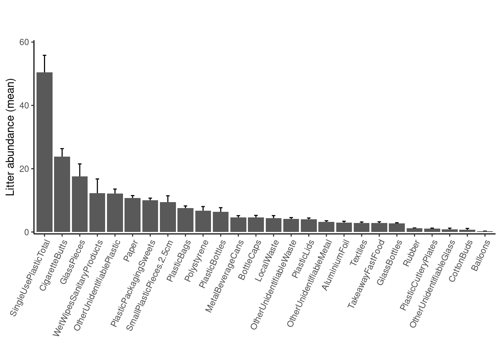


###### Litter type abundance per country

If we now want to visualize the contribution per each country, we have:


``` r
# Average litter type
Average_litter_type_country <- 
GroupB_data_validated %>% 
  select(CountryResponsible, PlasticBags:LocalWaste) %>%  
  pivot_longer(
    PlasticBags:LocalWaste,
    names_to  = "Litter_type",
    values_to = "Abundance"
  ) %>% 
  # 1) group by country AND type
  group_by(CountryResponsible, Litter_type) %>% 
  summarise(
    Av_Abundance = mean(Abundance, na.rm = TRUE),
    SE_Abundance = sd(Abundance,   na.rm = TRUE) / sqrt(n()),
    .groups = "drop"
  ) %>% 
  # title‐case country, reorder types by their overall mean if you like
  mutate(
    CountryResponsible = str_to_title(CountryResponsible),
    Litter_type       = reorder(Litter_type, -Av_Abundance)
  ) %>% 
  # 2) plot bars first, then error bars
  ggplot(aes(x = Litter_type, y = Av_Abundance)) +
  geom_col(fill = "lightgray", colour = "black") +
  geom_errorbar(aes(ymin = Av_Abundance - SE_Abundance,
                    ymax = Av_Abundance + SE_Abundance), width = 0.2) +
  facet_wrap(~ CountryResponsible, ncol   = 3, scales = "free_y") +
  labs(x = "", y = "Litter abundance (mean)", title = '', subtitle = "") +
  # theme_classic() +
  # theme(axis.text.x = element_text(angle = 65, vjust = 1, hjust = 1)) +
  theme_classic(base_size = 16) +
  theme(
    # rotate axis labels, center title, etc.
    axis.text.x     = element_text(angle = 65, hjust = 1),
    plot.title      = element_text(hjust = 0.5),
    strip.background = element_rect(
      fill   = "lightgrey",  # background color
      color  = "black",      # border color
      size   = 0.5           # border thickness
    ),
    strip.text       = element_text(
      colour = "black",      # text color
      face   = "bold"        # make it stand out
    )
  )

Average_litter_type_country
```

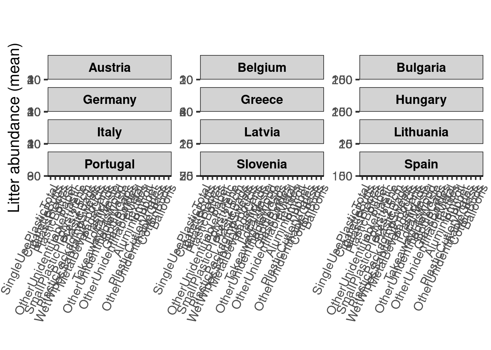


###### Litter type Proportion I - "Across‑type" proportions

* The first approach will be a "*Across‑type*" proportions. 
  * For each litter type, what fraction comes from each country? (not from an european total)
  * total abundance of that litter type over each total country.


``` r
Prop_Liter_Country <- 
  GroupB_data_validated %>%
  # 1) pivot to long form
  pivot_longer(
    cols      = PlasticBags:LocalWaste,
    names_to  = "Litter_type",
    values_to = "Abundance"
  ) %>%
  # 2) sum abundance by (Country, Type)
  group_by(CountryResponsible, Litter_type) %>%
  summarise(
    Total_Abundance = sum(Abundance, na.rm = TRUE),
    .groups = "drop"
  ) %>%
  # 3) compute, per type, the global total
  group_by(Litter_type) %>%
  mutate(
    Global_Total   = sum(Total_Abundance),
    Prop_Country   = Total_Abundance / Global_Total
  ) %>%
  ungroup()

Prop_Liter_Country
```

```
## # A tibble: 312 × 5
##    CountryResponsible Litter_type              Total_Abundance Global_Total Prop_Country
##    <fct>              <chr>                              <dbl>        <dbl>        <dbl>
##  1 austria            AluminiumFoil                        246         1636      0.150  
##  2 austria            Balloons                              12          126      0.0952 
##  3 austria            BottleCaps                           503         2501      0.201  
##  4 austria            CigaretteButts                      2915        12962      0.225  
##  5 austria            CottonBuds                             6          396      0.0152 
##  6 austria            GlassBottles                         209         1462      0.143  
##  7 austria            GlassPieces                         2364         9527      0.248  
##  8 austria            LocalWaste                           146         2343      0.0623 
##  9 austria            MetalBeverageCans                    383         2551      0.150  
## 10 austria            OtherUnidentifiableGlass               3          462      0.00649
## # ℹ 302 more rows
```


``` r
# Example 100%-stacked bar
Prop_Liter_Country %>% 
mutate(CountryResponsible = str_to_title(CountryResponsible)) %>% 
ggplot(., aes(x = Litter_type, y = Prop_Country, fill = CountryResponsible)) +
  geom_col(position = "fill") +
  scale_y_continuous(labels = percent_format()) +
  scale_fill_manual(
    values = brewer.pal(12, "Paired"),
    name   = "Country"
  ) +
  labs(
    x = "Litter type",
    y = "Share of global abundance",
    title = "Country contributions to each litter type"
  ) +
  theme_classic() +
  theme(axis.text.x = element_text(angle = 65, hjust = 1)) +
  coord_flip()
```

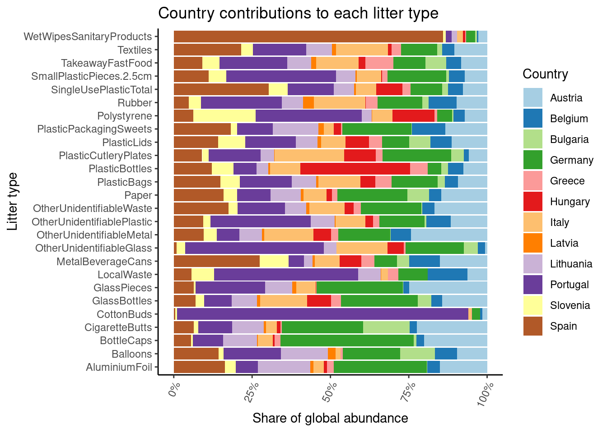

* Now, considering the total of Europe


``` r
# 1) Pivot, sum by country & type, then compute each country’s share of the European total
Data_prop_eu <- 
  GroupB_data_validated %>%
  pivot_longer(
    cols      = PlasticBags:LocalWaste,
    names_to  = "Litter_type",
    values_to = "Abundance"
  ) %>%
  group_by(CountryResponsible, Litter_type) %>%
  summarise(
    Total_Abundance = sum(Abundance, na.rm = TRUE),
    .groups = "drop"
  ) %>%
  group_by(Litter_type) %>%
  mutate(
    European_Total   = sum(Total_Abundance),
    Prop_of_Europe   = Total_Abundance / European_Total
  ) %>%
  ungroup() %>%
  # optional: title‑case and reorder types by overall Prop for consistent ordering
  mutate(
    CountryResponsible = str_to_title(CountryResponsible),
    Litter_type        = reorder(Litter_type, -Prop_of_Europe)
  )

Data_prop_eu
```

```
## # A tibble: 312 × 5
##    CountryResponsible Litter_type              Total_Abundance European_Total Prop_of_Europe
##    <chr>              <fct>                              <dbl>          <dbl>          <dbl>
##  1 Austria            AluminiumFoil                        246           1636        0.150  
##  2 Austria            Balloons                              12            126        0.0952 
##  3 Austria            BottleCaps                           503           2501        0.201  
##  4 Austria            CigaretteButts                      2915          12962        0.225  
##  5 Austria            CottonBuds                             6            396        0.0152 
##  6 Austria            GlassBottles                         209           1462        0.143  
##  7 Austria            GlassPieces                         2364           9527        0.248  
##  8 Austria            LocalWaste                           146           2343        0.0623 
##  9 Austria            MetalBeverageCans                    383           2551        0.150  
## 10 Austria            OtherUnidentifiableGlass               3            462        0.00649
## # ℹ 302 more rows
```

To compare and validate the output, for each `litter_type` the `European_Total` have to be the same.


``` r
# To compare and validate the output, for each `litter_type` the `European_Total` have to be the same.
Data_prop_eu %>% 
  filter(Litter_type == "AluminiumFoil")
```

```
## # A tibble: 12 × 5
##    CountryResponsible Litter_type   Total_Abundance European_Total Prop_of_Europe
##    <chr>              <fct>                   <dbl>          <dbl>          <dbl>
##  1 Austria            AluminiumFoil             246           1636       0.150   
##  2 Belgium            AluminiumFoil              67           1636       0.0410  
##  3 Bulgaria           AluminiumFoil               1           1636       0.000611
##  4 Germany            AluminiumFoil             486           1636       0.297   
##  5 Greece             AluminiumFoil              36           1636       0.0220  
##  6 Hungary            AluminiumFoil              17           1636       0.0104  
##  7 Italy              AluminiumFoil              53           1636       0.0324  
##  8 Latvia             AluminiumFoil              17           1636       0.0104  
##  9 Lithuania          AluminiumFoil             275           1636       0.168   
## 10 Portugal           AluminiumFoil             115           1636       0.0703  
## 11 Slovenia           AluminiumFoil              57           1636       0.0348  
## 12 Spain              AluminiumFoil             266           1636       0.163
```


``` r
# Example 100%-stacked bar
Data_prop_eu %>% 
mutate(CountryResponsible = str_to_title(CountryResponsible)) %>% 
ggplot(., aes(x = Litter_type, y = Prop_of_Europe, fill = CountryResponsible)) +
  geom_col(position = "fill") +
  scale_y_continuous(labels = percent_format()) +
  scale_fill_manual(
    values = brewer.pal(12, "Paired"),
    name   = "Country"
  ) +
  labs(
    x = "Litter type",
    y = "Share of global abundance",
    title = "Country contributions to each litter type (Europe as basis)"
  ) +
  theme_classic() +
  theme(axis.text.x = element_text(angle = 65, hjust = 1)) +
  coord_flip()
```

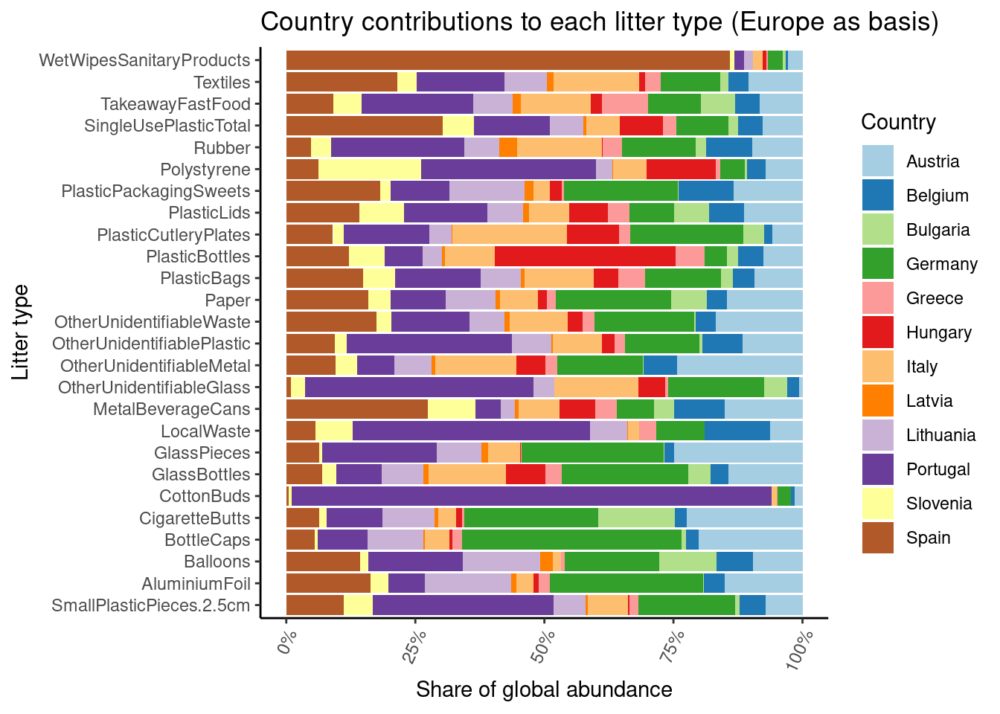


``` r
#x11()
# 2) Faceted bar chart of proportion (country share of European total)
# 2) plot with fixed scales and text labels
ggplot(Data_prop_eu, aes(x = Litter_type, y = Prop_of_Europe)) +
  geom_col(fill = "lightgray", colour = "black") +
  geom_text( # comment if you don't need the numbers above the bars
    #aes(label = percent(Prop_of_Europe, accuracy = 0.1), suffix = "%"),
    aes(label = round((Prop_of_Europe*100), 1)),
    angle   = 45,       # rotate labels 45°
    hjust   = 0,        # left‑align text relative to its anchor
    vjust   = -0.3,     # nudge it a bit above the bar
    size  = 2.7          # adjust text size as needed
  ) +
  scale_y_continuous(
    labels = percent_format(accuracy = 1),
    expand = expansion(mult = c(0, 0.15))  # extra 15% headroom for labels
  ) +
  facet_wrap(~ CountryResponsible, ncol = 3, scales = "fixed") +
  labs(
    x        = NULL,
    y        = "Share of European total (%)",
    title    = "Country contributions to each litter type",
    subtitle = "Proportion of European total abundance for each category"
  ) +
  theme_classic(base_size = 14) +
  theme(
    axis.text.x      = element_text(angle = 65, hjust = 1),
    strip.background = element_rect(fill = "lightgrey", colour = "black"),
    strip.text       = element_text(face = "bold")
  )
```

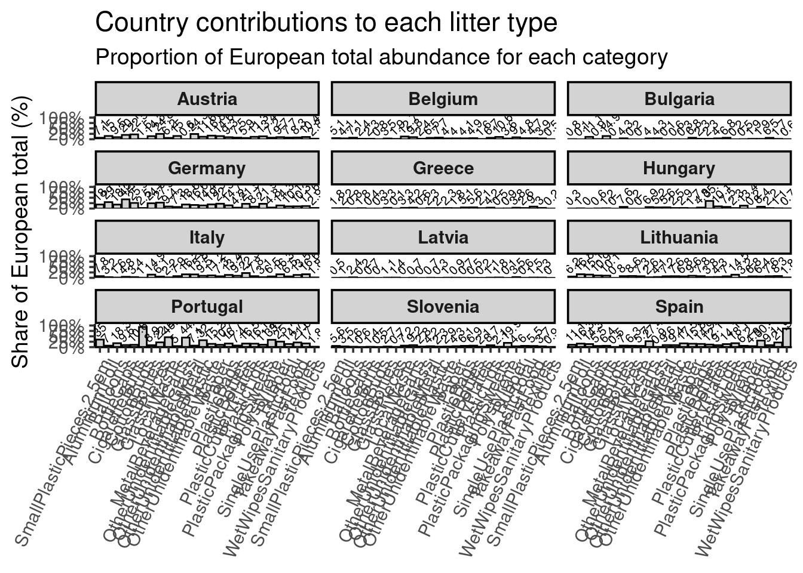

* HeatMaps


``` r
Data_prop_eu %>%
  heatmap(
    .row           = Litter_type,
    .column        = CountryResponsible,
    .value         = Prop_of_Europe,
    scale          = "column", # can be "none" (by default) or "row", "column" or "both". (#column keeps the z‑scaling)
    # a three‑colour gradient: low→mid→high
    palette_value  = c("#F7FBFF", "#6BAED6", "#08306B"),
    name           = "Deviation % from \nEU total",
    column_title   = "Country",
    row_title      = "Litter type",
    show_row_names = TRUE,
    show_column_names = TRUE
  )
```

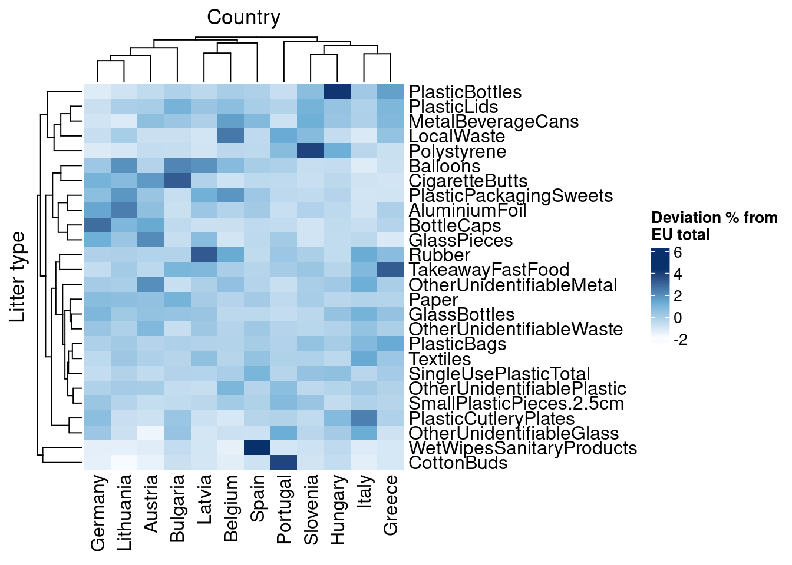


###### Litter type Proportion II - "Within‑country" proportions

* The second approach will be a "*Within‑country*" proportions. 
  * For each country, what fraction of its total litter is each type?
  * Total abundance of all types in that country.


``` r
Prop_Liter_Country2 <- 
  GroupB_data_validated %>%
  # 1) pivot to long
  pivot_longer(
    cols      = PlasticBags:LocalWaste,
    names_to  = "Litter_type",
    values_to = "Abundance"
  ) %>%
  # 2) sum by (Country, Type)
  group_by(CountryResponsible, Litter_type) %>%
  summarise(
    Total_Abundance = sum(Abundance, na.rm = TRUE),
    .groups = "drop"
  ) %>%
  # 3) compute, per country, that country’s total
  group_by(CountryResponsible) %>%
  mutate(
    Country_Total = sum(Total_Abundance),
    Prop_Type     = Total_Abundance / Country_Total
  ) %>%
  ungroup()

Prop_Liter_Country2
```

```
## # A tibble: 312 × 5
##    CountryResponsible Litter_type              Total_Abundance Country_Total Prop_Type
##    <fct>              <chr>                              <dbl>         <dbl>     <dbl>
##  1 austria            AluminiumFoil                        246         14179  0.0173  
##  2 austria            Balloons                              12         14179  0.000846
##  3 austria            BottleCaps                           503         14179  0.0355  
##  4 austria            CigaretteButts                      2915         14179  0.206   
##  5 austria            CottonBuds                             6         14179  0.000423
##  6 austria            GlassBottles                         209         14179  0.0147  
##  7 austria            GlassPieces                         2364         14179  0.167   
##  8 austria            LocalWaste                           146         14179  0.0103  
##  9 austria            MetalBeverageCans                    383         14179  0.0270  
## 10 austria            OtherUnidentifiableGlass               3         14179  0.000212
## # ℹ 302 more rows
```


``` r
# Example 100%-stacked bar per country
Prop_Liter_Country2 %>% 
mutate(CountryResponsible = str_to_title(CountryResponsible)) %>% 
ggplot(., aes(x = CountryResponsible, y = Prop_Type, fill = Litter_type)) +
  geom_col(position = "fill") +
  scale_y_continuous(labels = percent_format()) +
  labs(
    x = "Country",
    y = "Share of country’s total",
    title = "Composition of litter types within each country"
  ) +
  theme_classic() +
  theme(axis.text.x = element_text(angle = 65, hjust = 1))
```

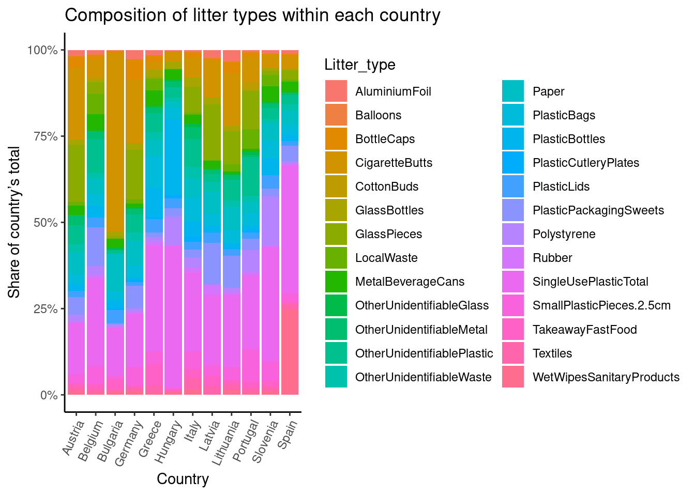


``` r
  # 2) plot bars first, then error bars
Prop_Liter_Country2 %>% 
  # 1) group by country AND type
  group_by(CountryResponsible, Litter_type) %>% 
  summarise(
    Av_Proportion = mean(Prop_Type, na.rm = TRUE),
    SE_Proportion = sd(Prop_Type,   na.rm = TRUE) / sqrt(n()),
    .groups = "drop"
  ) %>% 
  # title‐case country, reorder types by their overall mean if you like
  mutate(
    CountryResponsible = str_to_title(CountryResponsible),
    Litter_type       = reorder(Litter_type, -Av_Proportion)
  ) %>% 
  ggplot(data = ., aes(x = Litter_type, y = Av_Proportion)) +
  geom_col(fill = "lightgray", colour = "black") +
  geom_errorbar(aes(ymin = Av_Proportion - SE_Proportion,
                    ymax = Av_Proportion + SE_Proportion), width = 0.2) +
  facet_wrap(~ CountryResponsible, ncol   = 3, scales = "free_y") +
  labs(x = "", y = "Litter abundance (mean)", title = '', subtitle = "") +
  # theme_classic() +
  # theme(axis.text.x = element_text(angle = 65, vjust = 1, hjust = 1)) +
  theme_classic(base_size = 16) +
  theme(
    # rotate axis labels, center title, etc.
    axis.text.x     = element_text(angle = 65, hjust = 1),
    plot.title      = element_text(hjust = 0.5),
    strip.background = element_rect(
      fill   = "lightgrey",  # background color
      color  = "black",      # border color
      size   = 0.5           # border thickness
    ),
    strip.text       = element_text(
      colour = "black",      # text color
      face   = "bold"        # make it stand out
    )
  )
```

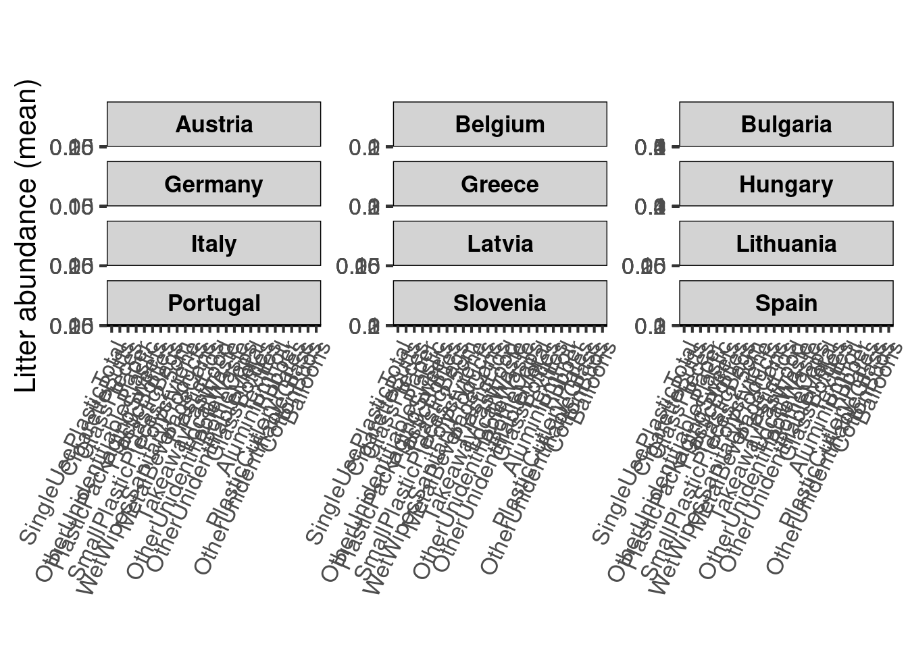


* **Multivariate Perspective**


``` r
# assume your data is in a data.frame called `df`
# and has at least:
#   CountryResponsible | PlasticBags | PlasticBottles | ... | LocalWaste
# Replace the NA values for 0. --> Probably the default behaviour?
df <- GroupB_data_validated %>% 
  select(CountryResponsible, PlasticBags:LocalWaste) %>% 
  #drop_na()
  mutate_all(funs(replace_na(.,0)))
```

```
## Warning: `funs()` was deprecated in dplyr 0.8.0.
## ℹ Please use a list of either functions or lambdas:
## 
## # Simple named list: list(mean = mean, median = median)
## 
## # Auto named with `tibble::lst()`: tibble::lst(mean, median)
## 
## # Using lambdas list(~ mean(., trim = .2), ~ median(., na.rm = TRUE))
## Call `lifecycle::last_lifecycle_warnings()` to see where this warning was generated.
```

``` r
# isolate metadata + community matrix
meta <- df %>% select(CountryResponsible)
comm <- df %>% select(-CountryResponsible)

# Hellinger‐transform community data (recommended for PCA/cluster/PERMANOVA)
comm_hel <- decostand(comm, method = "hellinger")
```


In order to see if there are significant differences across country in the community composition, we will perform a PERMANOVA test:


``` r
# 2a) Compute distance and hierarchical clustering (Ward’s D2)
dist_mat <- vegdist(comm_hel, method = "euclid")

# 3a) PERMANOVA: test if composition differs by Country
set.seed(42)

perm1 <- adonis2(dist_mat ~ CountryResponsible, data = meta, 
                 permutations = 999, by = "margin")
print(perm1)
```

```
## Permutation test for adonis under reduced model
## Marginal effects of terms
## Permutation: free
## Number of permutations: 999
## 
## adonis2(formula = dist_mat ~ CountryResponsible, data = meta, permutations = 999, by = "margin")
##                     Df SumOfSqs      R2      F Pr(>F)    
## CountryResponsible  11   22.479 0.09759 5.2992  0.001 ***
## Residual           539  207.854 0.90241                  
## Total              550  230.333 1.00000                  
## ---
## Signif. codes:  0 '***' 0.001 '**' 0.01 '*' 0.05 '.' 0.1 ' ' 1
```

So, we conclude that there are significant differences among countries. but What are the items that explains these differences? 

The answer will be addressed by performing a **Multivariate Random Forest**.


``` r
# 3b) Multivariate Random Forest:  
#     predict Country from composition → variable importance
rf <- randomForest(
  x      = comm_hel,
  y      = as.factor(meta$CountryResponsible),
  ntree  = 500,
  importance = TRUE
)

print(rf)
```

```
## 
## Call:
##  randomForest(x = comm_hel, y = as.factor(meta$CountryResponsible),      ntree = 500, importance = TRUE) 
##                Type of random forest: classification
##                      Number of trees: 500
## No. of variables tried at each split: 5
## 
##         OOB estimate of  error rate: 64.43%
## Confusion matrix:
##           austria belgium bulgaria germany greece hungary italy latvia lithuania portugal slovenia spain class.error
## austria        29       2        0      14      0       0     3      0         7        0        0    19   0.6081081
## belgium         7       7        0       4      0       0     2      1        10        2        1    15   0.8571429
## bulgaria        1       0        9       0      0       0     0      0         0        0        0     0   0.1000000
## germany        13       2        0      39      0       0     2      0        20        4        0     6   0.5465116
## greece          1       0        0       0      0       0     6      0         0        1        1     2   1.0000000
## hungary         1       1        1       1      0       3     1      0         0        0        0     7   0.8000000
## italy           9       4        0       5      0       1    19      0         3        2        1     7   0.6274510
## latvia          0       0        0       4      0       0     0      0         4        0        0     2   1.0000000
## lithuania       7       4        0      26      0       0     1      0        40        1        0    11   0.5555556
## portugal        6       3        0       7      0       0     7      0         9        8        1     4   0.8222222
## slovenia        2       1        0       0      0       0     4      0         1        3        3    10   0.8750000
## spain          14       5        0       8      0       1     7      2        10        0        0    39   0.5465116
```
The estimated error rate (OOB) is high, so conclusion have to be taken with care. Thus, the more important (differential across countries) litter components are:


``` r
varImpPlot(rf, main="Random Forest: Litter‐type Importance for Country Discrimination")
```

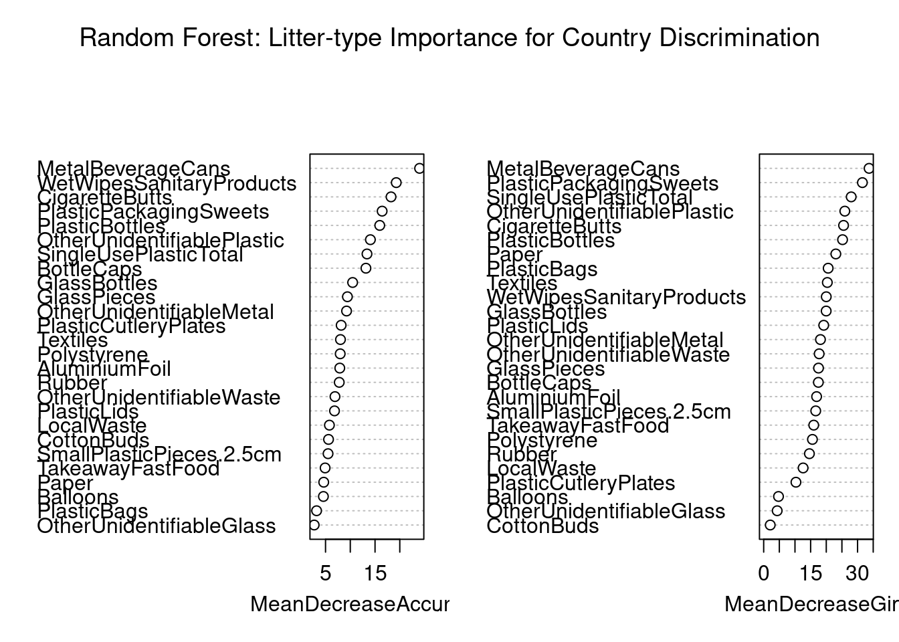


This plot of variable importance importance is telling us:

*  A large `MeanDecreaseAccuracy` (**MDA**) means that, when you break the relationship between that predictor and the response, the model’s accuracy suffers a lot → it’s an important predictor for correct country assignments. 
  * **MDA** is generally the more reliable gauge of predictive importance, since it directly measures impact on OOB‐accuracy.

* A large `MeanDecreaseGini` (**MDG**) means that X frequently appears in high‑up the tree splits and yields big purity gains → it’s structurally important to partitioning the data. 
  * **MDG** is faster to compute and tells you which features the trees “prefer” splitting on, but can overweight high–cardinality or continuous variables.
  
Finally, we will perform a Principal Component Analysis (PCA) to see correlation among litter items and *possible* associations with countries


``` r
# ─── 1) PCA (and optional RDA constrained by Country) ───────────────────────────
# 1a) Unconstrained PCA on Hellinger data
# pca1 <- rda(comm_hel)  
# 
# summary(pca1)
# 
# plot(pca1)

# (re)compute PCA with prcomp
pca_prcomp <- prcomp(comm_hel, scale. = TRUE)

#summary(pca_prcomp)

# 1b) Quick biplot via factoextra
PCA_Litter_Country <- 
fviz_pca_biplot(pca_prcomp,
                geom.ind    = "point",            # show sites as points
                col.ind     = meta$CountryResponsible %>% str_to_title(), 
                palette.ind = "jco",              # color‐blind‐friendly palette
                addEllipses = FALSE,               # 95% CI per country
                label      = "var",               # show arrows for variables
                repel      = TRUE
) +
  labs(title = "PCA of Litter Composition (Hellinger‐transformed)",
       subtitle = "Points = samples colored by Country; arrows = litter types") +
  theme_minimal(base_size = 14)

PCA_Litter_Country
```

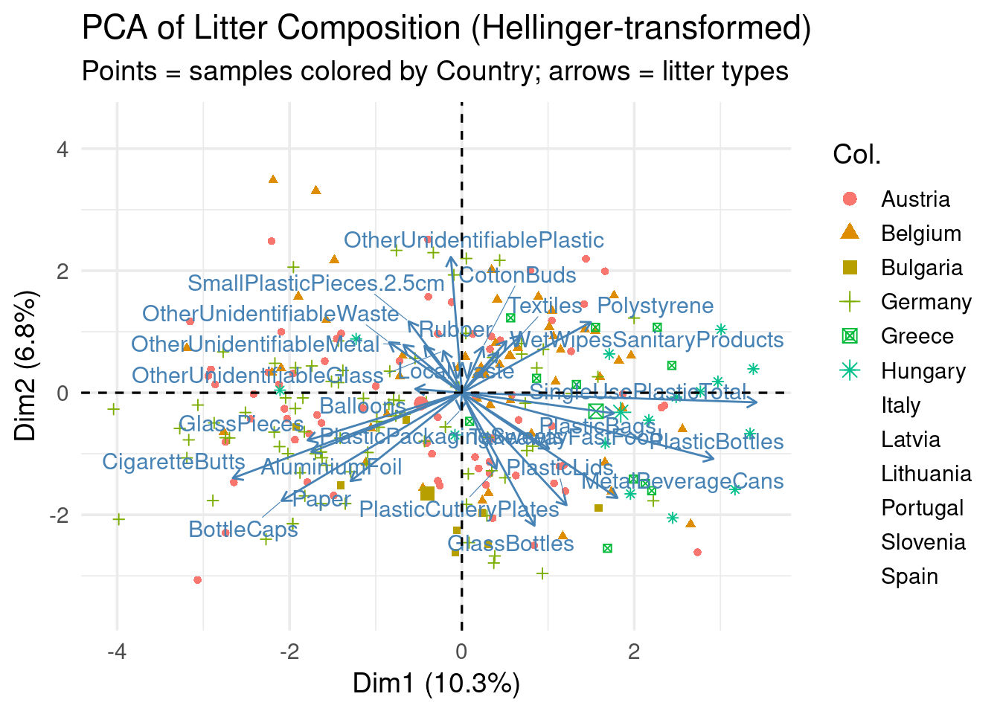


And the most important Items for the two forst principal components are:

* First PC

``` r
# Bar‐plot of top 10 contributors to PC1
fviz_contrib(pca_prcomp, choice = "var", axes = 1, top = 10) +
  ggtitle("Top 10 variables contributing to PC1")
```

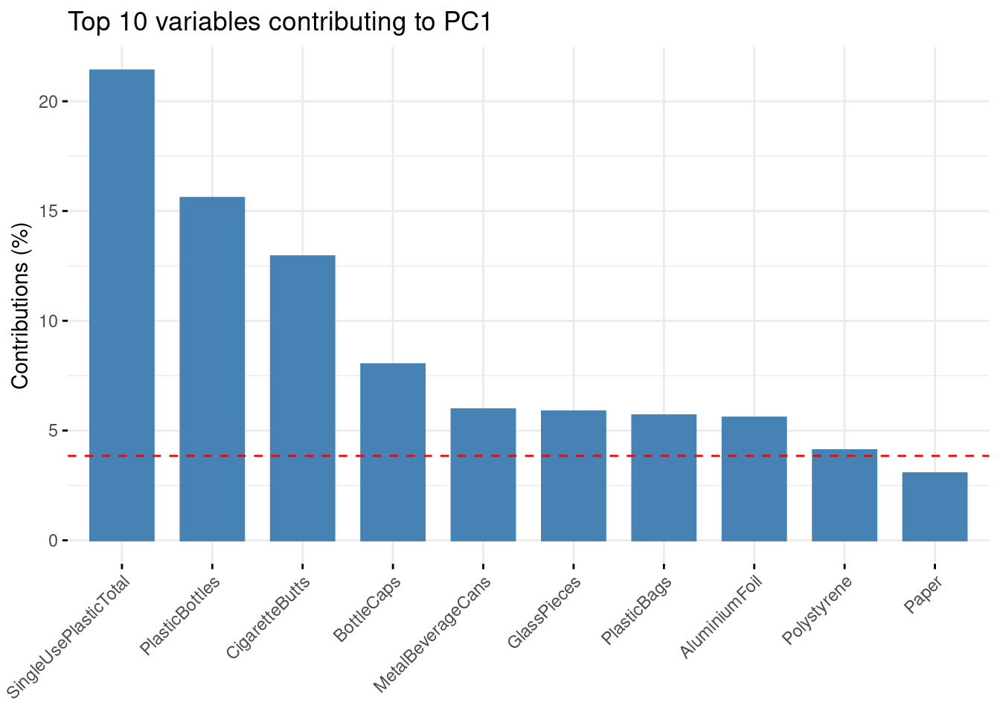


``` r
# Bar‐plot of top 10 contributors to PC2
fviz_contrib(pca_prcomp, choice = "var", axes = 2, top = 10) +
  ggtitle("Top 10 variables contributing to PC2")
```

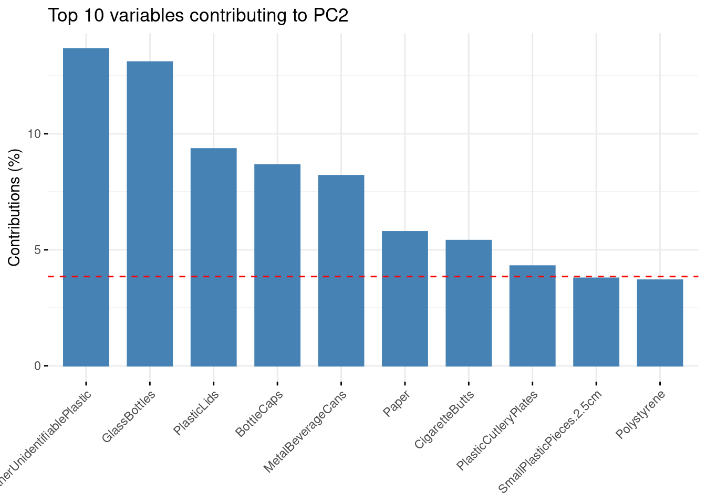

