# Paper’s Skeleton

The idea is to have two papers Questions to be solved

- Calification/descualification rate
  - We need to analyse the raw data in order to have those sampling
    events that were qualified and which doesn’t
    (RiversideWasteVariety_AttemptedSampling == 1 and
    RiversideWasteVariety_Qualified == 1)

# Litter Presence/Absence

# Community-based approach to analyze composition of litter

# Look for explanatory variables inside the dataset from Plastic Pirates. (se está dejando para después)

# Include extra-explanatory variables for all the variables will be nice if something else can take care on this.

# Next meeting before the Workshop on Data Validation/Consolidation and Analysis.

## Focused in the general aspect of data (Types, Kg, Zones, etc.)

# We have to include the informaton of group D (look at quantitative/semi-quantitative data)

# Data Analysis

## Loading Packages

Loading R packages necessary to perform the **EDA**.

``` r
library(tidyverse)
library(readxl)
library(writexl)
library(DT)
library(lubridate)
library(scales)
library(vegan)       # decostand(), rda(), adonis2()
library(factoextra)  # fviz_pca_biplot(), fviz_dend()
library(randomForest)
library(RColorBrewer)
library(tidyHeatmap) # Requieres ComplexHeatmap --> BiocManager::install("ComplexHeatmap")
```

## Data loading

``` r
# Cargamos los datos incorporando las modificaciones para trabajar con él
# https://zenodo.org/records/15535434
# Cuidado con el nombre de los ríos, hay besòs y bessos.
Riverbank <- 
  read.csv(file = "PlasticPirates_Riverbank_data/Riverbank_data_v2.0.0.csv", header = TRUE, sep = ",", na.strings = "na") %>% 
  mutate(SamplingDate = lubridate::ymd(SamplingDate)) %>% 
  mutate(across(where(is.character), as.factor))
```

## Pre-proccessing

``` r
# Loading the rivers' dictionary
Riverbank_dictionary <- read_excel("Riverbank_data_v2.1.xlsx", sheet = "Final vocabulary clean")

Riverbank <-
  Riverbank %>%
  left_join(Riverbank_dictionary, by = "SamplingRiver") %>%
    #select(SamplingRiver, Corrected_river_English, SamplingRiverSystem, River_basin, everything()) %>% 
    mutate(River_basin = str_remove(River_basin, regex("\\s+Basin$", ignore_case = TRUE))) %>% 
  mutate(SamplingRiver = coalesce(Corrected_river_English, SamplingRiver),
         SamplingRiverSystem = River_basin) %>% 
  select(-c("No", "Country", "Corrected_river", "Corrected_river_English", "River_basin", "Count of SamplingRiver"))
```

## RESEARCH QUESTIONS

### Citizens Description

#### Numer of samplings per year and country

- Table

``` r
Riverbank %>% 
  group_by(CountryResponsible, SamplingYear) %>%
  summarise(Num_Sampling = n())
```

    ## # A tibble: 29 × 3
    ## # Groups:   CountryResponsible [12]
    ##    CountryResponsible SamplingYear Num_Sampling
    ##    <fct>                     <int>        <int>
    ##  1 austria                    2021            1
    ##  2 austria                    2022           17
    ##  3 austria                    2023           58
    ##  4 austria                    2024           66
    ##  5 belgium                    2022           22
    ##  6 belgium                    2024           31
    ##  7 bulgaria                   2023           10
    ##  8 germany                    2022           75
    ##  9 germany                    2023           11
    ## 10 germany                    2024            6
    ## # ℹ 19 more rows

- Plot

``` r
Temp_Num_Samp_Campaigns <- 
Riverbank %>% 
  group_by(CountryResponsible, SamplingYear) %>%
  summarise(Num_Sampling = n(), .groups = 'drop') %>%
    # Capitalizar primera letra de cada país
  mutate(CountryResponsible = str_to_title(CountryResponsible)) %>%
  # Crear todas las combinaciones posibles de país y año
  complete(CountryResponsible, SamplingYear, fill = list(Num_Sampling = 0)) %>%
  # Ordenar por total acumulado
  mutate(CountryResponsible = reorder(CountryResponsible, -Num_Sampling, sum)) %>%
  ggplot(aes(x = CountryResponsible, y = Num_Sampling, fill = factor(SamplingYear))) +
  geom_bar(stat = "identity", position = "dodge", colour = 'black') +
  theme_classic() +
  theme(axis.text.x = element_text(angle = 45, hjust = 1)) +
  # Paleta de colores con intensidad creciente hacia 2024
  scale_fill_manual(values = c("2021" = "#E0FFFF", "2022" = "#B8D4F0", "2023" = "#4A90E2", "2024" = "#1E3A8A")) +
  scale_y_continuous(expand = expansion(mult = c(0, 0.1))) +
  labs(x = "", 
       y = "Number of samplings campaigns",
       fill = "Sampling Year")

Temp_Num_Samp_Campaigns
```

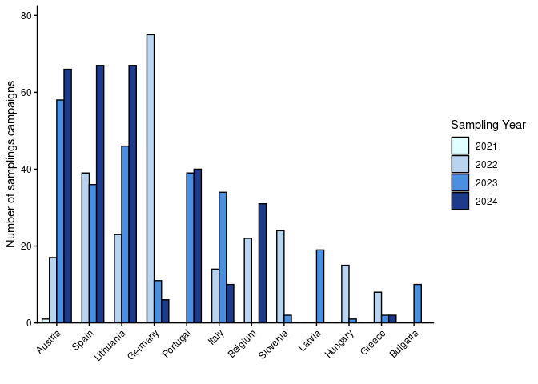<!-- -->

``` r
#ggsave(filename = "Temporal_Number_Campaigns.png", plot = Temp_Num_Samp_Campaigns, path = paste(getwd(), "/OUTPUT/FIGURES", sep = ""), scale = 1.3, width = 15, height = 10, units = "cm", dpi = 300, limitsize = FALSE)
```

#### Numer of Rivers sampled per year and country

- Table

``` r
Riverbank %>% 
  group_by(CountryResponsible, SamplingYear) %>%
  summarise(Rivers = n_distinct(SamplingRiver))
```

    ## # A tibble: 29 × 3
    ## # Groups:   CountryResponsible [12]
    ##    CountryResponsible SamplingYear Rivers
    ##    <fct>                     <int>  <int>
    ##  1 austria                    2021      1
    ##  2 austria                    2022     10
    ##  3 austria                    2023     35
    ##  4 austria                    2024     35
    ##  5 belgium                    2022     12
    ##  6 belgium                    2024     18
    ##  7 bulgaria                   2023      1
    ##  8 germany                    2022     58
    ##  9 germany                    2023     10
    ## 10 germany                    2024      5
    ## # ℹ 19 more rows

- Plot (without numbers)

``` r
Riverbank %>% 
  group_by(CountryResponsible, SamplingYear) %>%
  summarise(Rivers = n_distinct(SamplingRiver), .groups = 'drop') %>%
  # Capitalizar primera letra de cada país
  mutate(CountryResponsible = str_to_title(CountryResponsible)) %>%
  # Crear todas las combinaciones posibles de país y año
  complete(CountryResponsible, SamplingYear, fill = list(Rivers = 0)) %>%
  # Ordenar por total acumulado de ríos
  mutate(CountryResponsible = reorder(CountryResponsible, -Rivers, sum)) %>%
  ggplot(aes(x = CountryResponsible, y = Rivers, fill = factor(SamplingYear))) +
  geom_bar(stat = "identity", position = "dodge", colour = 'black') +
  theme_classic() +
  theme(axis.text.x = element_text(angle = 45, hjust = 1)) +
  # Paleta de colores con intensidad creciente hacia 2024
  scale_fill_manual(values = c("2021" = "#E0FFFF", "2022" = "#B8D4F0", "2023" = "#4A90E2", "2024" = "#1E3A8A")) +
  scale_y_continuous(expand = expansion(mult = c(0, 0.1))) +
  labs(x = "", 
       y = "Number of rivers",
       fill = "Sampling Year")
```

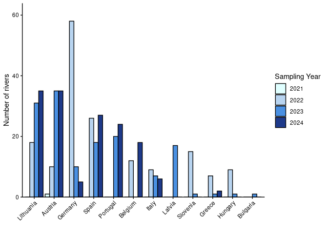<!-- -->

- Plot (with numbers)

``` r
# Preparar los datos
plot_data <- Riverbank %>% 
  group_by(CountryResponsible, SamplingYear) %>%
  summarise(Rivers = n_distinct(SamplingRiver), .groups = 'drop') %>%
  # Capitalizar primera letra de cada país
  mutate(CountryResponsible = str_to_title(CountryResponsible)) %>%
  # Crear todas las combinaciones posibles de país y año
  complete(CountryResponsible, SamplingYear, fill = list(Rivers = 0)) %>%
  # Ordenar por total acumulado de ríos
  mutate(CountryResponsible = reorder(CountryResponsible, -Rivers, sum))

# Crear el gráfico
Num_rios_year <- 
ggplot(plot_data, aes(x = CountryResponsible, y = Rivers, fill = factor(SamplingYear))) +
  geom_bar(stat = "identity", position = "dodge", colour = 'black') +
  # Añadir etiquetas solo para valores superiores a 20
  geom_text(data = filter(plot_data, Rivers > 8), 
            aes(label = Rivers), 
            position = position_stack(vjust = 0.5),
            color = "white", fontweight = "bold", size = 2.5) +
  theme_classic() +
  theme(axis.text.x = element_text(angle = 45, hjust = 1)) +
  # Paleta de colores con intensidad creciente hacia 2024
  scale_fill_manual(values = c("2021" = "#E0FFFF", "2022" = "#B8D4F0", "2023" = "#4A90E2", "2024" = "#1E3A8A")) +
  scale_y_continuous(expand = expansion(mult = c(0, 0.1))) +
  labs(x = "", 
       y = "Number of rivers",
       fill = "Sampling Year")

print(Num_rios_year)
```

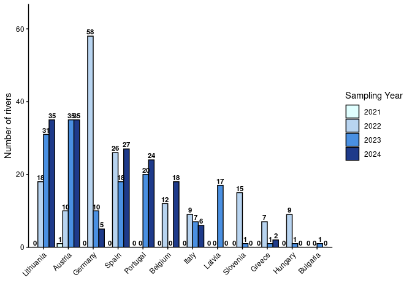<!-- -->

``` r
#ggsave(filename = "Temporal_Number_Rivers.png", plot = Num_rios_year, path = paste(getwd(), "/OUTPUT/FIGURES", sep = ""), scale = 1.3, width = 15, height = 10, units = "cm", dpi = 300, limitsize = FALSE)
```

### Most common types and quantities of litter per region? (Group B: riverbanks; Group C: floating litter)

#### Group B: Riverside Waste

Statistics of the variable `RiversideWasteVariety_AttemptedSampling` to
see how many samplings were performed.

``` r
Riverbank %>% 
  select(RiversideWasteVariety_AttemptedSampling) %>% 
  table()
```

    ## RiversideWasteVariety_AttemptedSampling
    ##   0   1 
    ##  27 756

To work with the `RiversideWasteVariety_` data, we need to filter the
dataset to include only those rows where
`RiversideWasteVariety_AttemptedSampling` is 1 (indicating that a
sampling was attempted) and `RiversideWasteVariety_Qualified` is also 1
(indicating that the sampling was qualified).

``` r
Riverbank %>% 
  filter(RiversideWasteVariety_AttemptedSampling == 1 & RiversideWasteVariety_Qualified == 1)
```

##### Percentage of qualified samplings

This represents the percentage of validated data among the total number
of sampling beign attempted.

``` r
Riverbank %>%
  summarise(
    total_rows = n(),
    total_valid = sum(
      RiversideWasteVariety_AttemptedSampling == 1 &
      RiversideWasteVariety_Qualified == 1,
      na.rm = TRUE
    ),
    pct_valid_total = round((total_valid / total_rows) * 100, digits = 1),
    pct_valid_percent = paste(round((total_valid / total_rows) * 100, 1), "%", sep = "")
  )
```

    ##   total_rows total_valid pct_valid_total pct_valid_percent
    ## 1        785         551            70.2             70.2%

``` r
validated_pct_by_country <- 
  Riverbank %>% 
  group_by(CountryResponsible) %>% 
  summarise(total_rows = n(),
            total_valid = sum(RiversideWasteVariety_AttemptedSampling == 1 & RiversideWasteVariety_Qualified == 1, na.rm = TRUE),
    `pct_valid_total(%)`        = round((total_valid / total_rows) * 100,1),
    total_attempts         = sum(RiversideWasteVariety_AttemptedSampling == 1, na.rm = TRUE),
    valid_among_attempts   = sum(RiversideWasteVariety_AttemptedSampling == 1 & RiversideWasteVariety_Qualified == 1, na.rm = TRUE),
    `pct_valid_among_attempts(%)` = round((valid_among_attempts / total_attempts) * 100,1), .groups = "drop") %>% 
  mutate(CountryResponsible = str_to_title(CountryResponsible))

validated_pct_by_country
```

    ## # A tibble: 12 × 7
    ##    CountryResponsible total_rows total_valid `pct_valid_total(%)` total_attempts valid_among_attempts pct_valid_among_attempts(…¹
    ##    <chr>                   <int>       <int>                <dbl>          <int>                <int>                       <dbl>
    ##  1 Austria                   142          74                 52.1            128                   74                        57.8
    ##  2 Belgium                    53          49                 92.5             52                   49                        94.2
    ##  3 Bulgaria                   10          10                100               10                   10                       100  
    ##  4 Germany                    92          86                 93.5             91                   86                        94.5
    ##  5 Greece                     12          11                 91.7             11                   11                       100  
    ##  6 Hungary                    16          15                 93.8             16                   15                        93.8
    ##  7 Italy                      58          51                 87.9             55                   51                        92.7
    ##  8 Latvia                     19          10                 52.6             19                   10                        52.6
    ##  9 Lithuania                 136          90                 66.2            133                   90                        67.7
    ## 10 Portugal                   79          45                 57               77                   45                        58.4
    ## 11 Slovenia                   26          24                 92.3             25                   24                        96  
    ## 12 Spain                     142          86                 60.6            139                   86                        61.9
    ## # ℹ abbreviated name: ¹​`pct_valid_among_attempts(%)`

``` r
Riverbank %>% 
  group_by(CountryResponsible, SamplingYear) %>% 
  summarise(
    n_attempted = sum(RiversideWasteVariety_AttemptedSampling == 1, na.rm = TRUE),
    n_validated = sum(RiversideWasteVariety_AttemptedSampling == 1 & RiversideWasteVariety_Qualified == 1, na.rm = TRUE),
    pct_validated = if_else(n_attempted > 0, n_validated / n_attempted * 100, 0),
    .groups = "drop"
  ) %>% 
  mutate(CountryResponsible = str_to_title(CountryResponsible)) %>% 
  complete(CountryResponsible, SamplingYear,
           fill = list(n_attempted   = 0,
                       n_validated   = 0,
                       pct_validated = 0)
  ) %>% 
  filter(SamplingYear > 2021)  %>% 
  mutate(CountryResponsible = reorder(CountryResponsible,-pct_validated, FUN = mean)) %>% 
  ggplot(aes(
    x    = CountryResponsible,
    y    = pct_validated,
    fill = factor(SamplingYear)
  )) +
    geom_col(
      position = "dodge",
      colour  = "black"
    ) +
  geom_text(aes(label = n_attempted),
              position = position_dodge(width = 0.9),
              vjust    = -0.3,
              size     = 3
    ) +
  # geom_text(aes(label = paste0("(", n_attempted, ")")),
  #           position = position_dodge(width = 0.9),
  #           vjust    = -0.3,
  #           size     = 2.8) +
    scale_fill_manual(
      values = c(
        "2021" = "#E0FFFF",
        "2022" = "#B8D4F0",
        "2023" = "#4A90E2",
        "2024" = "#1E3A8A"
      ),
      name = "Sampling Year"
    ) +
    scale_y_continuous(
      labels = percent_format(scale = 1),
      expand = expansion(mult = c(0, 0.05))
    ) +
    labs(
      x     = NULL,
      y     = "Validated sampling (%)",
      title = "Percentage of validated records and total sampling per country and year"
    ) +
    theme_classic(base_size = 12) +
    theme(
      axis.text.x = element_text(angle = 45, hjust = 1),
      plot.title  = element_text(hjust = 0.5)
    )
```

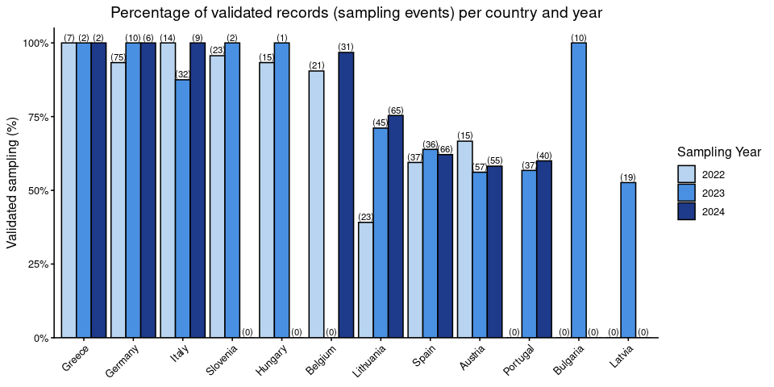<!-- -->

##### Most common types/quantities of litter

``` r
Riverbank %>% 
  filter(RiversideWasteVariety_AttemptedSampling == 1 & RiversideWasteVariety_Qualified == 1)
```

Firstly, we will pick up data to answer the question about group B. Only
some variables are taken from the general dataset.

``` r
# GroupB dataset
GroupB_data <- 
  Riverbank %>% 
  select(DatasetID, CountryResponsible, SamplingCampaign, SamplingYear, SamplingCoordinatesLatitude, SamplingCoordinatesLongitude, SamplingRiverSystem, SamplingParticipants, RiversideWasteVariety_AttemptedSampling, RiversideWasteVariety_Qualified:RiversideWasteVariety_Results_ResultsComment)
```

The, Attributes’ names are so complicated to work that I’ll remote the
preceding information **RiversideWasteVariety_Results\_** which is
common to all attributes; and finally to work with only the validated
`Group B` dataset we create:

``` r
# GroupB dataset
GroupB_data_validated <- 
  Riverbank %>% 
  select(DatasetID, CountryResponsible, SamplingCampaign, SamplingYear, SamplingCoordinatesLatitude, SamplingCoordinatesLongitude, SamplingRiverSystem, SamplingParticipants, RiversideWasteVariety_AttemptedSampling, RiversideWasteVariety_Qualified:RiversideWasteVariety_Results_ResultsComment) %>% 
  filter(RiversideWasteVariety_AttemptedSampling == 1 & RiversideWasteVariety_Qualified == 1) %>% 
  # Primero quitamos `RiversideWasteVariety_Results_`
  rename_with(
    .cols = starts_with("RiversideWasteVariety_Results_"),
    # solo seleccionamos los tipos de residuos
    .fn = ~ gsub("RiversideWasteVariety_Results_", "", .) # Mantenemos la ultima extensión del nombre
  )

#GroupB_data_validated
```

**CAUTION**! There are some `NAs` values in the litter items that are
probably incorrect since the groups did find other items.

``` r
summary(GroupB_data_validated)
```

After meeting and email fro Charlotte, we realise that NA in group B for
some items it’s really a zero. So we update these columns replacing `NA`
values with a `0`.

``` r
GroupB_data_validated <-
  GroupB_data_validated %>% 
  mutate(across(PlasticBags:LocalWaste, ~replace_na(., 0)))
```

###### Litter type abundance

We will obtain the plot for the most common (average abundance) litter
type

``` r
# Average litter type
Average_litter_type <- 
  GroupB_data_validated %>% 
  select(CountryResponsible, SamplingYear, PlasticBags:LocalWaste) %>%  
  pivot_longer(
    cols = PlasticBags:LocalWaste,
    names_to = "Litter_type",
    values_to = "Abundance") %>% 
  group_by(Litter_type) %>% 
  dplyr::summarise(Av_Abundance = mean(Abundance, na.rm = TRUE), 
                   SE_Abundance = sd(Abundance, na.rm = TRUE)/sqrt(n())) %>% 
  ggplot(., aes(x = reorder(Litter_type, -Av_Abundance), y = Av_Abundance)) +
  geom_errorbar(aes(ymin = Av_Abundance - SE_Abundance, ymax = Av_Abundance + SE_Abundance), width = 0.2) +
  geom_bar(stat = "identity") +
  scale_y_continuous(limits = c(0, 60), expand = c(0.01,0)) +
  #geom_text(aes(label = sprintf("%.1f", round(Av_Abundance, digits = 1))), vjust = 1.4, size = 3.5, colour = "white") +
  labs(x = "",  y = expression(Litter~abundance~"(mean" %+-% s.e.~")"), title = '', subtitle = "") +
  theme_classic() +
  theme(axis.text.x = element_text(angle = 65, vjust = 1, hjust = 1))

print(Average_litter_type)
```

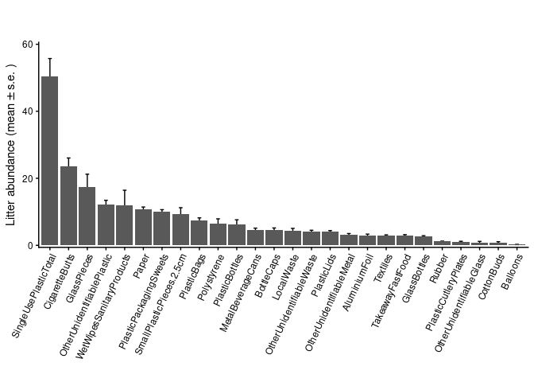<!-- -->

###### Litter type abundance per country

If we now want to visualize the contribution per each country, we have:

``` r
# Average litter type
Average_litter_type_country <- 
GroupB_data_validated %>% 
  select(CountryResponsible, PlasticBags:LocalWaste) %>%  
  pivot_longer(
    PlasticBags:LocalWaste,
    names_to  = "Litter_type",
    values_to = "Abundance"
  ) %>% 
  # 1) group by country AND type
  group_by(CountryResponsible, Litter_type) %>% 
  summarise(
    Av_Abundance = mean(Abundance, na.rm = TRUE),
    SE_Abundance = sd(Abundance,   na.rm = TRUE) / sqrt(n()),
    .groups = "drop"
  ) %>% 
  # title‐case country, reorder types by their overall mean if you like
  mutate(
    CountryResponsible = str_to_title(CountryResponsible),
    Litter_type       = reorder(Litter_type, -Av_Abundance)
  ) %>% 
  # 2) plot bars first, then error bars
  ggplot(aes(x = Litter_type, y = Av_Abundance)) +
  geom_col(fill = "lightgray", colour = "black") +
  geom_errorbar(aes(ymin = Av_Abundance - SE_Abundance,
                    ymax = Av_Abundance + SE_Abundance), width = 0.2) +
  facet_wrap(~ CountryResponsible, ncol   = 3, scales = "free_y") +
  labs(x = "", y = expression(Litter~abundance~"(mean" %+-% s.e.~")"), title = '', subtitle = "") +
  # theme_classic() +
  # theme(axis.text.x = element_text(angle = 65, vjust = 1, hjust = 1)) +
  theme_classic(base_size = 16) +
  theme(
    # rotate axis labels, center title, etc.
    axis.text.x     = element_text(angle = 65, hjust = 1),
    plot.title      = element_text(hjust = 0.5),
    strip.background = element_rect(
      fill   = "lightgrey",  # background color
      color  = "black",      # border color
      size   = 0.5           # border thickness
    ),
    strip.text       = element_text(
      colour = "black",      # text color
      face   = "bold"        # make it stand out
    )
  )

Average_litter_type_country
```

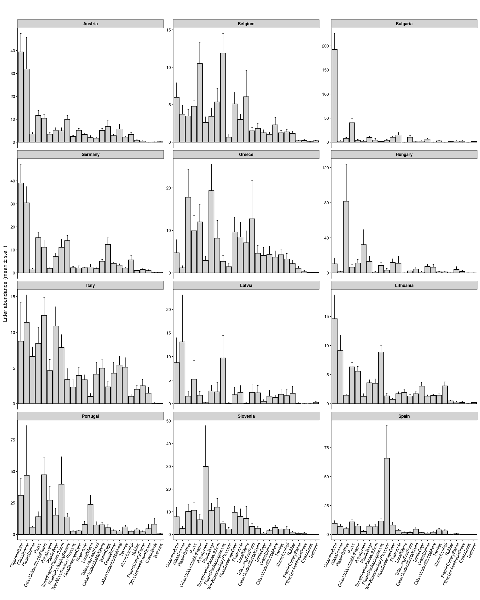<!-- -->

###### Litter type Proportion I - “Across‑type” proportions

- The first approach will be a “*Across‑type*” proportions.
  - For each litter type, what fraction comes from each country? (not
    from an european total)
  - total abundance of that litter type over each total country.

``` r
Prop_Liter_Country <- 
  GroupB_data_validated %>%
  # 1) pivot to long form
  pivot_longer(
    cols      = PlasticBags:LocalWaste,
    names_to  = "Litter_type",
    values_to = "Abundance"
  ) %>%
  # 2) sum abundance by (Country, Type)
  group_by(CountryResponsible, Litter_type) %>%
  summarise(
    Total_Abundance = sum(Abundance, na.rm = TRUE),
    .groups = "drop"
  ) %>%
  # 3) compute, per type, the global total
  group_by(Litter_type) %>%
  mutate(
    Global_Total   = sum(Total_Abundance),
    Prop_Country   = Total_Abundance / Global_Total
  ) %>%
  ungroup()

Prop_Liter_Country
```

    ## # A tibble: 312 × 5
    ##    CountryResponsible Litter_type              Total_Abundance Global_Total Prop_Country
    ##    <fct>              <chr>                              <dbl>        <dbl>        <dbl>
    ##  1 austria            AluminiumFoil                        246         1636      0.150  
    ##  2 austria            Balloons                              12          126      0.0952 
    ##  3 austria            BottleCaps                           503         2501      0.201  
    ##  4 austria            CigaretteButts                      2915        12962      0.225  
    ##  5 austria            CottonBuds                             6          396      0.0152 
    ##  6 austria            GlassBottles                         209         1462      0.143  
    ##  7 austria            GlassPieces                         2364         9527      0.248  
    ##  8 austria            LocalWaste                           146         2343      0.0623 
    ##  9 austria            MetalBeverageCans                    383         2551      0.150  
    ## 10 austria            OtherUnidentifiableGlass               3          462      0.00649
    ## # ℹ 302 more rows

``` r
# Example 100%-stacked bar
Country_contribution_litter_type <- 
Prop_Liter_Country %>% 
mutate(CountryResponsible = str_to_title(CountryResponsible)) %>% 
ggplot(., aes(x = Litter_type, y = Prop_Country, fill = CountryResponsible)) +
  geom_col(position = "fill") +
  scale_y_continuous(labels = percent_format()) +
  scale_fill_manual(
    values = brewer.pal(12, "Paired"),
    name   = "Country"
  ) +
  labs(
    x = "Litter type",
    y = "Relative abundance (%)",
    title = "Country contributions to each litter type"
  ) +
  theme_classic() +
  theme(axis.text.x = element_text(angle = 65, hjust = 1)) +
  coord_flip()

print(Country_contribution_litter_type)
```

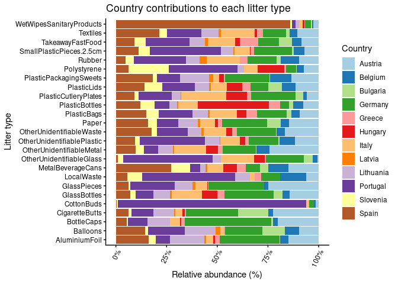<!-- -->

- Now, considering the total of Europe

``` r
# 1) Pivot, sum by country & type, then compute each country’s share of the European total
Data_prop_eu <- 
  GroupB_data_validated %>%
  pivot_longer(
    cols      = PlasticBags:LocalWaste,
    names_to  = "Litter_type",
    values_to = "Abundance"
  ) %>%
  group_by(CountryResponsible, Litter_type) %>%
  summarise(
    Total_Abundance = sum(Abundance, na.rm = TRUE),
    .groups = "drop"
  ) %>%
  group_by(Litter_type) %>%
  mutate(
    European_Total   = sum(Total_Abundance),
    Prop_of_Europe   = Total_Abundance / European_Total
  ) %>%
  ungroup() %>%
  # optional: title‑case and reorder types by overall Prop for consistent ordering
  mutate(
    CountryResponsible = str_to_title(CountryResponsible),
    Litter_type        = reorder(Litter_type, -Prop_of_Europe)
  )

Data_prop_eu
```

    ## # A tibble: 312 × 5
    ##    CountryResponsible Litter_type              Total_Abundance European_Total Prop_of_Europe
    ##    <chr>              <fct>                              <dbl>          <dbl>          <dbl>
    ##  1 Austria            AluminiumFoil                        246           1636        0.150  
    ##  2 Austria            Balloons                              12            126        0.0952 
    ##  3 Austria            BottleCaps                           503           2501        0.201  
    ##  4 Austria            CigaretteButts                      2915          12962        0.225  
    ##  5 Austria            CottonBuds                             6            396        0.0152 
    ##  6 Austria            GlassBottles                         209           1462        0.143  
    ##  7 Austria            GlassPieces                         2364           9527        0.248  
    ##  8 Austria            LocalWaste                           146           2343        0.0623 
    ##  9 Austria            MetalBeverageCans                    383           2551        0.150  
    ## 10 Austria            OtherUnidentifiableGlass               3            462        0.00649
    ## # ℹ 302 more rows

To compare and validate the output, for each `litter_type` the
`European_Total` have to be the same.

``` r
# To compare and validate the output, for each `litter_type` the `European_Total` have to be the same.
Data_prop_eu %>% 
  filter(Litter_type == "AluminiumFoil")
```

    ## # A tibble: 12 × 5
    ##    CountryResponsible Litter_type   Total_Abundance European_Total Prop_of_Europe
    ##    <chr>              <fct>                   <dbl>          <dbl>          <dbl>
    ##  1 Austria            AluminiumFoil             246           1636       0.150   
    ##  2 Belgium            AluminiumFoil              67           1636       0.0410  
    ##  3 Bulgaria           AluminiumFoil               1           1636       0.000611
    ##  4 Germany            AluminiumFoil             486           1636       0.297   
    ##  5 Greece             AluminiumFoil              36           1636       0.0220  
    ##  6 Hungary            AluminiumFoil              17           1636       0.0104  
    ##  7 Italy              AluminiumFoil              53           1636       0.0324  
    ##  8 Latvia             AluminiumFoil              17           1636       0.0104  
    ##  9 Lithuania          AluminiumFoil             275           1636       0.168   
    ## 10 Portugal           AluminiumFoil             115           1636       0.0703  
    ## 11 Slovenia           AluminiumFoil              57           1636       0.0348  
    ## 12 Spain              AluminiumFoil             266           1636       0.163

``` r
# Example 100%-stacked bar
Data_prop_eu %>% 
mutate(CountryResponsible = str_to_title(CountryResponsible)) %>% 
ggplot(., aes(x = Litter_type, y = Prop_of_Europe, fill = CountryResponsible)) +
  geom_col(position = "fill") +
  scale_y_continuous(labels = percent_format()) +
  scale_fill_manual(
    values = brewer.pal(12, "Paired"),
    name   = "Country"
  ) +
  labs(
    x = "Litter type",
    y = "Share of global abundance",
    title = "Country contributions to each litter type (Europe as basis)"
  ) +
  theme_classic() +
  theme(axis.text.x = element_text(angle = 65, hjust = 1)) +
  coord_flip()
```

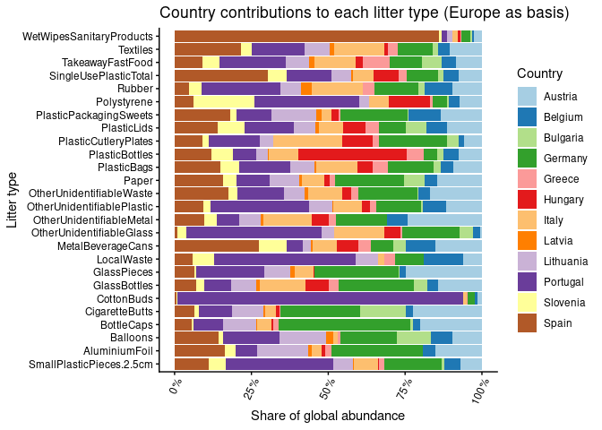

``` r
#x11()
# 2) Faceted bar chart of proportion (country share of European total)
# 2) plot with fixed scales and text labels
ggplot(Data_prop_eu, aes(x = Litter_type, y = Prop_of_Europe)) +
  geom_col(fill = "lightgray", colour = "black") +
  geom_text( # comment if you don't need the numbers above the bars
    #aes(label = percent(Prop_of_Europe, accuracy = 0.1), suffix = "%"),
    aes(label = round((Prop_of_Europe*100), 1)),
    angle   = 45,       # rotate labels 45°
    hjust   = 0,        # left‑align text relative to its anchor
    vjust   = -0.3,     # nudge it a bit above the bar
    size  = 2.7          # adjust text size as needed
  ) +
  scale_y_continuous(
    labels = percent_format(accuracy = 1),
    expand = expansion(mult = c(0, 0.15))  # extra 15% headroom for labels
  ) +
  facet_wrap(~ CountryResponsible, ncol = 3, scales = "fixed") +
  labs(
    x        = NULL,
    y        = "Share of European total (%)",
    title    = "Country contributions to each litter type",
    subtitle = "Proportion of European total abundance for each category"
  ) +
  theme_classic(base_size = 14) +
  theme(
    axis.text.x      = element_text(angle = 65, hjust = 1),
    strip.background = element_rect(fill = "lightgrey", colour = "black"),
    strip.text       = element_text(face = "bold")
  )
```

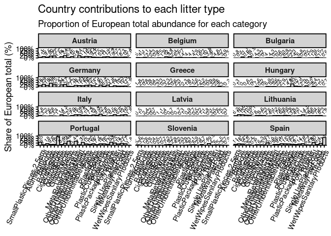

- HeatMaps

``` r
ProportionLitterEuropeHeatMap <- 
Data_prop_eu %>%
  heatmap(
    .row           = Litter_type,
    .column        = CountryResponsible,
    .value         = Prop_of_Europe,
    scale          = "column", # can be "none" (by default) or "row", "column" or "both". (#column keeps the z‑scaling)
    # a three‑colour gradient: low→mid→high
    palette_value  = c("#F7FBFF", "#6BAED6", "#08306B"),
    name           = "Relative \nimportance (%)",
    column_title   = "Country",
    row_title      = "Litter type",
    show_row_names = TRUE,
    show_column_names = TRUE
  )

print(ProportionLitterEuropeHeatMap)
```

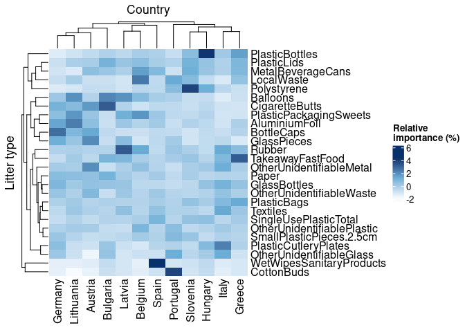

###### Litter type Proportion II - “Within‑country” proportions

- The second approach will be a “*Within‑country*” proportions.
  - For each country, what fraction of its total litter is each type?
  - Total abundance of all types in that country.

``` r
Prop_Liter_Country2 <- 
  GroupB_data_validated %>%
  # 1) pivot to long
  pivot_longer(
    cols      = PlasticBags:LocalWaste,
    names_to  = "Litter_type",
    values_to = "Abundance"
  ) %>%
  # 2) sum by (Country, Type)
  group_by(CountryResponsible, Litter_type) %>%
  summarise(
    Total_Abundance = sum(Abundance, na.rm = TRUE),
    .groups = "drop"
  ) %>%
  # 3) compute, per country, that country’s total
  group_by(CountryResponsible) %>%
  mutate(
    Country_Total = sum(Total_Abundance),
    Prop_Type     = Total_Abundance / Country_Total
  ) %>%
  ungroup()

Prop_Liter_Country2
```

    ## # A tibble: 312 × 5
    ##    CountryResponsible Litter_type              Total_Abundance Country_Total Prop_Type
    ##    <fct>              <chr>                              <dbl>         <dbl>     <dbl>
    ##  1 austria            AluminiumFoil                        246         14179  0.0173  
    ##  2 austria            Balloons                              12         14179  0.000846
    ##  3 austria            BottleCaps                           503         14179  0.0355  
    ##  4 austria            CigaretteButts                      2915         14179  0.206   
    ##  5 austria            CottonBuds                             6         14179  0.000423
    ##  6 austria            GlassBottles                         209         14179  0.0147  
    ##  7 austria            GlassPieces                         2364         14179  0.167   
    ##  8 austria            LocalWaste                           146         14179  0.0103  
    ##  9 austria            MetalBeverageCans                    383         14179  0.0270  
    ## 10 austria            OtherUnidentifiableGlass               3         14179  0.000212
    ## # ℹ 302 more rows

``` r
# Example 100%-stacked bar per country
Prop_Liter_Country2 %>% 
mutate(CountryResponsible = str_to_title(CountryResponsible)) %>% 
ggplot(., aes(x = CountryResponsible, y = Prop_Type, fill = Litter_type)) +
  geom_col(position = "fill") +
  scale_y_continuous(labels = percent_format()) +
  labs(
    x = "Country",
    y = "Share of country’s total",
    title = "Composition of litter types within each country"
  ) +
  theme_classic() +
  theme(axis.text.x = element_text(angle = 65, hjust = 1))
```

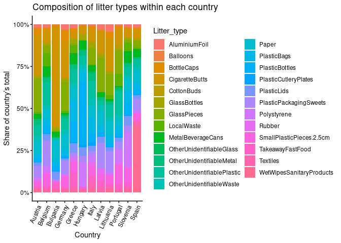<!-- -->

``` r
  # 2) plot bars first, then error bars
Prop_Liter_Country2 %>% 
  # 1) group by country AND type
  group_by(CountryResponsible, Litter_type) %>% 
  summarise(
    Av_Proportion = mean(Prop_Type, na.rm = TRUE),
    SE_Proportion = sd(Prop_Type,   na.rm = TRUE) / sqrt(n()),
    .groups = "drop"
  ) %>% 
  # title‐case country, reorder types by their overall mean if you like
  mutate(
    CountryResponsible = str_to_title(CountryResponsible),
    Litter_type       = reorder(Litter_type, -Av_Proportion)
  ) %>% 
  ggplot(data = ., aes(x = Litter_type, y = Av_Proportion)) +
  geom_col(fill = "lightgray", colour = "black") +
  geom_errorbar(aes(ymin = Av_Proportion - SE_Proportion,
                    ymax = Av_Proportion + SE_Proportion), width = 0.2) +
  facet_wrap(~ CountryResponsible, ncol   = 3, scales = "free_y") +
  labs(x = "", y = "Litter abundance (mean)", title = '', subtitle = "") +
  # theme_classic() +
  # theme(axis.text.x = element_text(angle = 65, vjust = 1, hjust = 1)) +
  theme_classic(base_size = 16) +
  theme(
    # rotate axis labels, center title, etc.
    axis.text.x     = element_text(angle = 65, hjust = 1),
    plot.title      = element_text(hjust = 0.5),
    strip.background = element_rect(
      fill   = "lightgrey",  # background color
      color  = "black",      # border color
      size   = 0.5           # border thickness
    ),
    strip.text       = element_text(
      colour = "black",      # text color
      face   = "bold"        # make it stand out
    )
  )
```

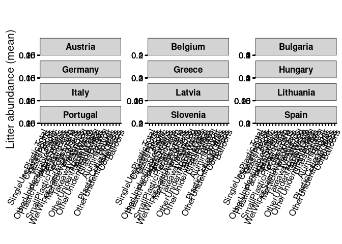<!-- -->

###### Multivariate Perspective

``` r
# assume your data is in a data.frame called `df`
# and has at least:
#   CountryResponsible | PlasticBags | PlasticBottles | ... | LocalWaste
# Replace the NA values for 0. --> Probably the default behaviour?
df <- GroupB_data_validated %>% 
  select(CountryResponsible, PlasticBags:LocalWaste)
# %>% 
# #drop_na()
# mutate_all(funs(replace_na(.,0)))

# isolate metadata + community matrix
meta <- df %>% select(CountryResponsible)
comm <- df %>% select(-CountryResponsible)

# Hellinger‐transform community data (recommended for PCA/cluster/PERMANOVA)
comm_hel <- decostand(comm, method = "hellinger")
```

In order to see if there are significant differences across country in
the community composition, we will perform a PERMANOVA test:

``` r
# 2a) Compute distance and hierarchical clustering (Ward’s D2)
dist_mat <- vegdist(comm_hel, method = "euclid")

# 3a) PERMANOVA: test if composition differs by Country
set.seed(42)

perm1 <- adonis2(dist_mat ~ CountryResponsible, data = meta, 
                 permutations = 999, by = "margin")
print(perm1)
```

    ## Permutation test for adonis under reduced model
    ## Marginal effects of terms
    ## Permutation: free
    ## Number of permutations: 999
    ## 
    ## adonis2(formula = dist_mat ~ CountryResponsible, data = meta, permutations = 999, by = "margin")
    ##                     Df SumOfSqs      R2      F Pr(>F)    
    ## CountryResponsible  11   22.479 0.09759 5.2992  0.001 ***
    ## Residual           539  207.854 0.90241                  
    ## Total              550  230.333 1.00000                  
    ## ---
    ## Signif. codes:  0 '***' 0.001 '**' 0.01 '*' 0.05 '.' 0.1 ' ' 1

So, we conclude that there are significant differences among countries.
but What are the items that explains these differences?

The answer will be addressed by performing a **Multivariate Random
Forest**.

``` r
# 3b) Multivariate Random Forest:  
#     predict Country from composition → variable importance
rf <- randomForest(
  x      = comm_hel,
  y      = as.factor(meta$CountryResponsible),
  ntree  = 500,
  importance = TRUE
)

print(rf)
```

    ## 
    ## Call:
    ##  randomForest(x = comm_hel, y = as.factor(meta$CountryResponsible),      ntree = 500, importance = TRUE) 
    ##                Type of random forest: classification
    ##                      Number of trees: 500
    ## No. of variables tried at each split: 5
    ## 
    ##         OOB estimate of  error rate: 64.43%
    ## Confusion matrix:
    ##           austria belgium bulgaria germany greece hungary italy latvia lithuania portugal slovenia spain class.error
    ## austria        29       2        0      14      0       0     3      0         7        0        0    19   0.6081081
    ## belgium         7       7        0       4      0       0     2      1        10        2        1    15   0.8571429
    ## bulgaria        1       0        9       0      0       0     0      0         0        0        0     0   0.1000000
    ## germany        13       2        0      39      0       0     2      0        20        4        0     6   0.5465116
    ## greece          1       0        0       0      0       0     6      0         0        1        1     2   1.0000000
    ## hungary         1       1        1       1      0       3     1      0         0        0        0     7   0.8000000
    ## italy           9       4        0       5      0       1    19      0         3        2        1     7   0.6274510
    ## latvia          0       0        0       4      0       0     0      0         4        0        0     2   1.0000000
    ## lithuania       7       4        0      26      0       0     1      0        40        1        0    11   0.5555556
    ## portugal        6       3        0       7      0       0     7      0         9        8        1     4   0.8222222
    ## slovenia        2       1        0       0      0       0     4      0         1        3        3    10   0.8750000
    ## spain          14       5        0       8      0       1     7      2        10        0        0    39   0.5465116

The estimated error rate (OOB) is high, so conclusion have to be taken
with care. Thus, the more important (differential across countries)
litter components are:

``` r
varImpPlot(rf, main="Random Forest: Litter‐type Importance for Country Discrimination")
```

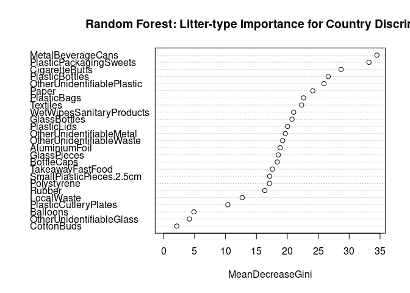<!-- -->

This plot of variable importance importance is telling us:

- A large `MeanDecreaseAccuracy` (**MDA**) means that, when you break
  the relationship between that predictor and the response, the model’s
  accuracy suffers a lot → it’s an important predictor for correct
  country assignments.

- **MDA** is generally the more reliable gauge of predictive importance,
  since it directly measures impact on OOB‐accuracy.

- A large `MeanDecreaseGini` (**MDG**) means that X frequently appears
  in high‑up the tree splits and yields big purity gains → it’s
  structurally important to partitioning the data.

  - **MDG** is faster to compute and tells you which features the trees
    “prefer” splitting on, but can overweight high–cardinality or
    continuous variables.

Finally, we will perform a Principal Component Analysis (PCA) to see
correlation among litter items and *possible* associations with
countries

``` r
# ─── 1) PCA (and optional RDA constrained by Country) ───────────────────────────
# 1a) Unconstrained PCA on Hellinger data
# pca1 <- rda(comm_hel)  
# 
# summary(pca1)
# 
# plot(pca1)

# (re)compute PCA with prcomp
pca_prcomp <- prcomp(comm_hel, scale. = TRUE)

#summary(pca_prcomp)
```

``` r
# 1b) Quick biplot via factoextra
PCA_Litter_Country <- 
fviz_pca_biplot(pca_prcomp,
                geom.ind    = "point",            # show sites as points
                col.ind     = meta$CountryResponsible %>% str_to_title(), 
                palette.ind = "jco",              # color‐blind‐friendly palette
                addEllipses = FALSE,               # 95% CI per country
                label      = "var",               # show arrows for variables
                repel      = TRUE
) +
  labs(title = "PCA of Litter Composition (Hellinger‐transformed)",
       subtitle = "Points = samples colored by Country; arrows = litter types") +
  theme_minimal(base_size = 14)

PCA_Litter_Country
```

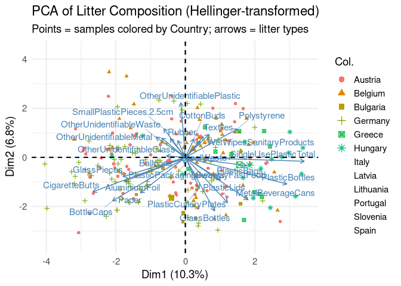<!-- -->

``` r
PCA_Litter_Country2 <- 
  fviz_pca_biplot(pca_prcomp,
                  geom.ind    = "point",
                  col.ind     = meta$CountryResponsible %>% str_to_title(), 
                  palette     = "Set3",  # O prueba: "Paired", "Set1", "Dark2"
                  addEllipses = FALSE,
                  ellipse.type = "confidence",
                  label       = "var",
                  repel       = TRUE,
                  #mean.point  = FALSE,  # Desactiva los centroides (promedio de todos los puntos de cada país)
                  pointsize   = 3,
                  pointshape  = 16,  # Fuerza todos los puntos a círculos
                  alpha.ind   = 0.5  # Transparencia de los puntos (0-1)
  ) +
  labs(title = "PCA of Litter Composition (Hellinger‐transformed)",
       subtitle = "Points = samples colored by Country; arrows = litter types",
       color = "Country") +
  theme_minimal(base_size = 14) +
  guides(fill = "none")  # Quita la leyenda de fill (elipses)

PCA_Litter_Country2
```

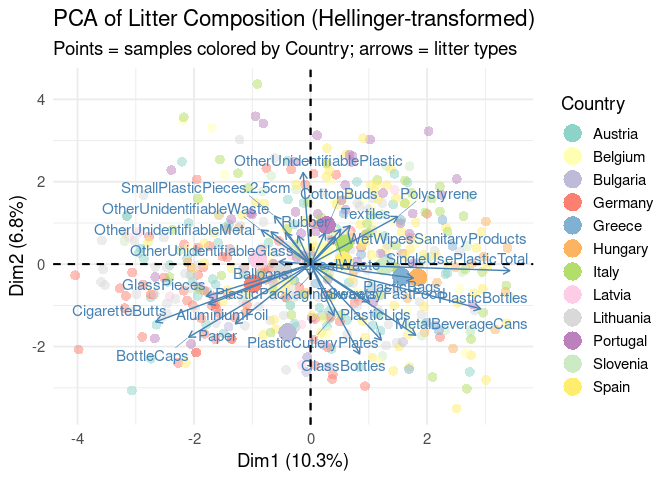<!-- -->

And the most important Items for the two forst principal components are:

- First PC

``` r
# Bar‐plot of top 10 contributors to PC1
fviz_contrib(pca_prcomp, choice = "var", axes = 1, top = 10) +
  ggtitle("Top 10 variables contributing to PC1")
```

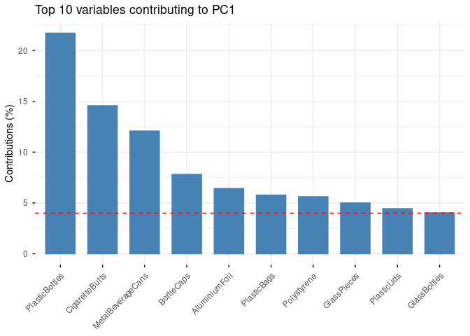<!-- -->

``` r
# Bar‐plot of top 10 contributors to PC2
fviz_contrib(pca_prcomp, choice = "var", axes = 2, top = 10) +
  ggtitle("Top 10 variables contributing to PC2")
```

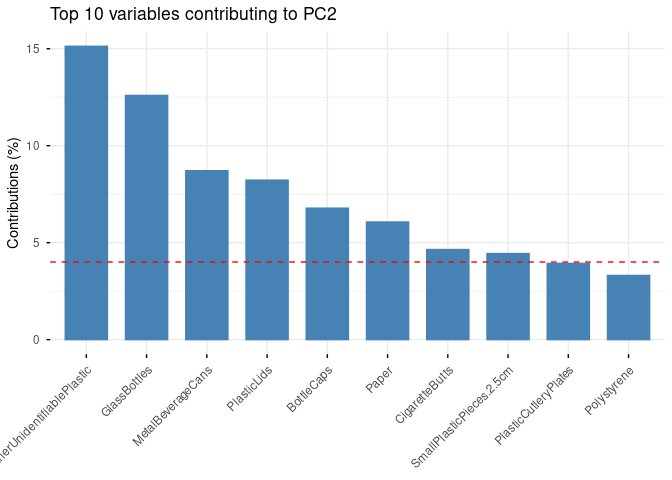<!-- -->

#### Group B: Single Use Plastic - Riverside Waste

Cogeremos el subset de datos que si representan los plásticos de un solo
uso (`SUP`) para el grupo B.

``` r
# GroupB dataset
GroupB_SingleUsePlastic_data_validated <- 
  GroupB_data_validated %>% 
  select(DatasetID:Polystyrene) # Seleccionamos metadata y los Single Use Plastic

GroupB_SingleUsePlastic_data_validated
```

    ##    DatasetID CountryResponsible SamplingCampaign SamplingYear SamplingCoordinatesLatitude SamplingCoordinatesLongitude
    ## 1    at_6270            austria      autumn 2022         2022                    48.04275                    14.421917
    ## 2    at_6297            austria      autumn 2022         2022                    48.26034                    13.034405
    ## 3    at_6382            austria      autumn 2022         2022                    47.11828                    13.814191
    ## 4    at_6393            austria      autumn 2022         2022                    46.58301                    13.841153
    ## 5    at_6429            austria      autumn 2022         2022                    48.21108                    16.439735
    ## 6    at_6429            austria      autumn 2022         2022                    48.21108                    16.439735
    ## 7    at_6448            austria      autumn 2022         2022                    46.60477                    14.278000
    ## 8    at_6463            austria      autumn 2022         2022                    48.12415                    16.852121
    ## 9    at_6463            austria      autumn 2022         2022                    48.12415                    16.852121
    ## 10   at_6536            austria      autumn 2022         2022                    47.92751                    13.799256
    ## 11   at_6718            austria      spring 2023         2023                    48.84332                    15.500350
    ## 12   at_6719            austria      spring 2023         2023                    48.84647                    15.493286
    ## 13   at_6741            austria      spring 2023         2023                    48.01260                    16.993900
    ## 14   at_6743            austria      spring 2023         2023                    47.99862                    13.684950
    ## 15   at_6755            austria      spring 2023         2023                    47.42645                     9.885644
    ## 16   at_6760            austria      spring 2023         2023                    48.20613                    16.232443
    ## 17   at_6761            austria      spring 2023         2023                    48.20502                    16.174887
    ## 18   at_6767            austria      spring 2023         2023                    48.20902                    16.439306
    ## 19   at_6768            austria      spring 2023         2023                    48.13444                    16.284613
    ## 20   at_6868            austria      autumn 2023         2023                    48.25910                    16.356975
    ## 21   at_6895            austria      autumn 2023         2023                    47.82920                    16.526400
    ## 22   at_6904            austria      autumn 2023         2023                    47.81962                    16.229218
    ## 23   at_6908            austria      autumn 2023         2023                    48.13602                    16.403070
    ## 24   at_6932            austria      autumn 2023         2023                    48.76646                    14.969000
    ## 25   at_6933            austria      autumn 2023         2023                    48.76870                    14.974959
    ## 26   at_6952            austria      autumn 2023         2023                    48.77175                    14.995096
    ## 27   at_6953            austria      autumn 2023         2023                    49.35973                    11.048799
    ## 28   at_6959            austria      autumn 2023         2023                    48.77406                    14.989170
    ## 29   at_6962            austria      autumn 2023         2023                    46.86610                    16.026200
    ## 30   at_6967            austria      autumn 2023         2023                    46.72640                    14.095900
    ## 31   at_6972            austria      autumn 2023         2023                    48.24499                    16.394919
    ## 32   at_6972            austria      autumn 2023         2023                    48.24499                    16.394919
    ## 33   at_6976            austria      autumn 2023         2023                    48.13704                    16.288800
    ## 34   at_6977            austria      autumn 2023         2023                    48.27519                    16.358199
    ## 35   at_6977            austria      autumn 2023         2023                    48.27519                    16.358199
    ## 36   at_6985            austria      autumn 2023         2023                    47.06145                    15.434583
    ## 37   at_6996            austria      autumn 2023         2023                    47.52583                    14.372720
    ## 38   at_7008            austria      autumn 2023         2023                    48.21650                    14.486400
    ## 39   at_7009            austria      autumn 2023         2023                    47.76881                    13.090367
    ## 40   at_7015            austria      autumn 2023         2023                    47.17816                    14.711636
    ## 41   at_7016            austria      autumn 2023         2023                    47.17831                    14.711724
    ## 42   at_7039            austria      autumn 2023         2023                    48.22940                    14.270600
    ## 43   at_7138            austria      spring 2024         2024                    48.20051                    15.511326
    ## 44   at_7142            austria      spring 2024         2024                    48.32800                    16.073200
    ## 45   at_7152            austria      spring 2024         2024                    47.80681                    13.019035
    ## 46   at_7163            austria      spring 2024         2024                    47.94881                    13.597128
    ## 47   at_7168            austria      spring 2024         2024                    46.83875                    12.773110
    ## 48   at_7170            austria      spring 2024         2024                    48.60466                    15.164971
    ## 49   at_7178            austria      spring 2024         2024                    47.27141                    11.392735
    ## 50   at_7189            austria      spring 2024         2024                    47.55330                    13.684260
    ## 51   at_7214            austria      spring 2024         2024                    47.17817                    14.711642
    ## 52   at_7220            austria      spring 2024         2024                    48.13705                    16.288710
    ##    SamplingRiverSystem SamplingParticipants RiversideWasteVariety_AttemptedSampling RiversideWasteVariety_Qualified PlasticBags
    ## 1               Danube                    9                                       1                               1           2
    ## 2               Danube                    8                                       1                               1           0
    ## 3               Danube                   20                                       1                               1           0
    ## 4               Danube                   38                                       1                               1          34
    ## 5               Danube                   20                                       1                               1           7
    ## 6               Danube                   20                                       1                               1           7
    ## 7               Danube                   16                                       1                               1           3
    ## 8               Danube                   20                                       1                               1           0
    ## 9               Danube                   20                                       1                               1           0
    ## 10              Danube                    6                                       1                               1           0
    ## 11              Danube                   23                                       1                               1           0
    ## 12              Danube                   24                                       1                               1           1
    ## 13              Danube                   22                                       1                               1           0
    ## 14              Danube                   26                                       1                               1           0
    ## 15               Rhine                   14                                       1                               1           2
    ## 16              Danube                   22                                       1                               1           1
    ## 17              Danube                   27                                       1                               1           7
    ## 18              Danube                   22                                       1                               1           0
    ## 19              Danube                   NA                                       1                               1           3
    ## 20              Danube                   14                                       1                               1          30
    ## 21              Danube                    8                                       1                               1           2
    ## 22              Danube                   30                                       1                               1           1
    ## 23              Danube                   21                                       1                               1           0
    ## 24                Elbe                   19                                       1                               1          10
    ## 25                Elbe                   19                                       1                               1           2
    ## 26              Danube                   20                                       1                               1           0
    ## 27              Danube                   13                                       1                               1           0
    ## 28                Elbe                   20                                       1                               1           3
    ## 29              Danube                   13                                       1                               1           3
    ## 30              Danube                   13                                       1                               1          10
    ## 31              Danube                   17                                       1                               1           0
    ## 32              Danube                   17                                       1                               1           0
    ## 33              Danube                   24                                       1                               1          21
    ## 34              Danube                   18                                       1                               1           0
    ## 35              Danube                   18                                       1                               1           0
    ## 36              Danube                   23                                       1                               1           0
    ## 37              Danube                   20                                       1                               1           2
    ## 38              Danube                   14                                       1                               1           0
    ## 39              Danube                   18                                       1                               1           2
    ## 40              Danube                   27                                       1                               1           0
    ## 41              Danube                   24                                       1                               1           0
    ## 42              Danube                   25                                       1                               1          10
    ## 43              Danube                   18                                       1                               1           9
    ## 44              Danube                   23                                       1                               1           4
    ## 45              Danube                   20                                       1                               1           2
    ## 46              Danube                   20                                       1                               1          10
    ## 47              Danube                   20                                       1                               1           2
    ## 48              Danube                   14                                       1                               1           0
    ## 49              Danube                    4                                       1                               1          13
    ## 50              Danube                    9                                       1                               1           0
    ## 51              Danube                   29                                       1                               1           2
    ## 52              Danube                   22                                       1                               1          46
    ##    PlasticBottles PlasticLids TakeawayFastFood PlasticCutleryPlates PlasticPackagingSweets CottonBuds WetWipesSanitaryProducts
    ## 1               0           0                2                    0                      1          0                        1
    ## 2               1           4                1                    1                     14          0                        3
    ## 3               0           0                0                    0                      2          0                        0
    ## 4              22          13                2                    0                     34          0                        0
    ## 5              22          17                9                    3                     10          2                        7
    ## 6              22          17                9                    3                     10          2                        7
    ## 7               4           1                3                    0                      1          0                        0
    ## 8              16          13                1                    0                     37          0                        1
    ## 9              16          13                1                    0                     37          0                        1
    ## 10              1           1                1                    1                      2          0                        0
    ## 11              1           3                0                    0                     12          0                        0
    ## 12              2           0                0                    0                      5          0                        0
    ## 13              2           0                2                    0                      5          0                       12
    ## 14              5           5                0                    0                     12          0                        0
    ## 15              1           1                0                    0                      4          0                        5
    ## 16              0           0                1                    0                      3          0                        0
    ## 17              1           1                0                    0                      1          0                        1
    ## 18              1           8                0                    0                     31          0                        0
    ## 19              0           3                0                    0                      8          0                       13
    ## 20              1           2                3                    0                     14          0                        5
    ## 21             16           5                5                    0                      1          0                        3
    ## 22              0           1                0                    4                      5          0                        0
    ## 23              2           3                1                    0                      1          0                        0
    ## 24              3           3                5                    0                      7          0                        1
    ## 25              8           2                0                    5                     10          0                        0
    ## 26              0           0                0                    0                      1          0                        0
    ## 27              1           1                0                    0                      0          0                        0
    ## 28              1           2                0                    0                      0          0                        0
    ## 29              8          10                1                    0                      0          0                        0
    ## 30              0           1                0                    0                      7          0                        1
    ## 31              0           0                0                    0                      1          0                        0
    ## 32              0           0                0                    0                      1          0                        0
    ## 33             10          25                1                    0                     29          0                        5
    ## 34             11           3               21                    0                      0          0                       11
    ## 35             11           3               21                    0                      0          0                       11
    ## 36              1          18                2                    4                     28          0                        0
    ## 37              1           1                0                    0                      2          0                        1
    ## 38              1           0                2                    0                      1          0                        3
    ## 39              0           0                1                    0                      0          0                        0
    ## 40              0           0                0                    0                      1          0                        0
    ## 41              1           1                1                    0                      3          0                        7
    ## 42              0           5                2                    1                      3          0                        5
    ## 43              2           1                2                    0                      4          0                        0
    ## 44              3           1                0                    0                      8          0                        1
    ## 45              0           3                1                    0                      9          0                        0
    ## 46              1           4                0                    2                      9          0                        0
    ## 47              2           1                0                    0                      0          0                        1
    ## 48              4           0                2                    0                     22          0                        0
    ## 49              2           2                3                    0                      1          0                        0
    ## 50              2           0                0                    0                      6          0                        2
    ## 51              1           1                0                    0                      0          0                        1
    ## 52              6          23                0                    1                     25          0                        0
    ##    Polystyrene
    ## 1            0
    ## 2            0
    ## 3            1
    ## 4            0
    ## 5            6
    ## 6            6
    ## 7            0
    ## 8           25
    ## 9           25
    ## 10           0
    ## 11           0
    ## 12           0
    ## 13           2
    ## 14           5
    ## 15           0
    ## 16           0
    ## 17           2
    ## 18          18
    ## 19           0
    ## 20           3
    ## 21           5
    ## 22           1
    ## 23           0
    ## 24           1
    ## 25           1
    ## 26           1
    ## 27           0
    ## 28           0
    ## 29           0
    ## 30           2
    ## 31           0
    ## 32           0
    ## 33          14
    ## 34          13
    ## 35          13
    ## 36           0
    ## 37          13
    ## 38           0
    ## 39           0
    ## 40           1
    ## 41           0
    ## 42           0
    ## 43           0
    ## 44           1
    ## 45           0
    ## 46           1
    ## 47           0
    ## 48           0
    ## 49           0
    ## 50           0
    ## 51           0
    ## 52           0
    ##  [ reached 'max' / getOption("max.print") -- omitted 499 rows ]

``` r
summary(GroupB_SingleUsePlastic_data_validated)
```

    ##    DatasetID   CountryResponsible    SamplingCampaign  SamplingYear  SamplingCoordinatesLatitude SamplingCoordinatesLongitude
    ##  at_6429:  2   lithuania: 90      autumn 2021:  0     Min.   :2022   Min.   :37.18               Min.   :-9.309              
    ##  at_6463:  2   germany  : 86      autumn 2022:198     1st Qu.:2022   1st Qu.:42.03               1st Qu.: 2.946              
    ##  at_6972:  2   spain    : 86      autumn 2023:144     Median :2023   Median :48.07               Median :12.331              
    ##  at_6977:  2   austria  : 74      autumn 2024: 50     Mean   :2023   Mean   :47.47               Mean   :10.912              
    ##  de_6237:  2   italy    : 51      spring 2022:  1     3rd Qu.:2024   3rd Qu.:51.33               3rd Qu.:16.923              
    ##  de_6457:  2   belgium  : 49      spring 2023: 26     Max.   :2024   Max.   :57.75               Max.   :27.488              
    ##  (Other):539   (Other)  :115      spring 2024:132                                                                            
    ##  SamplingRiverSystem SamplingParticipants RiversideWasteVariety_AttemptedSampling RiversideWasteVariety_Qualified
    ##  Length:551          Min.   :  2.00       Min.   :1                               Min.   :1                      
    ##  Class :character    1st Qu.: 13.00       1st Qu.:1                               1st Qu.:1                      
    ##  Mode  :character    Median : 19.00       Median :1                               Median :1                      
    ##                      Mean   : 19.58       Mean   :1                               Mean   :1                      
    ##                      3rd Qu.: 24.00       3rd Qu.:1                               3rd Qu.:1                      
    ##                      Max.   :250.00       Max.   :1                               Max.   :1                      
    ##                      NA's   :10                                                                                  
    ##   PlasticBags      PlasticBottles     PlasticLids      TakeawayFastFood  PlasticCutleryPlates PlasticPackagingSweets
    ##  Min.   :  0.000   Min.   :  0.000   Min.   :  0.000   Min.   :  0.000   Min.   : 0.000       Min.   :  0.000       
    ##  1st Qu.:  0.000   1st Qu.:  0.000   1st Qu.:  0.000   1st Qu.:  0.000   1st Qu.: 0.000       1st Qu.:  1.000       
    ##  Median :  3.000   Median :  1.000   Median :  1.000   Median :  0.000   Median : 0.000       Median :  4.000       
    ##  Mean   :  7.506   Mean   :  6.334   Mean   :  3.991   Mean   :  2.828   Mean   : 1.044       Mean   :  9.984       
    ##  3rd Qu.:  7.000   3rd Qu.:  4.000   3rd Qu.:  4.000   3rd Qu.:  2.500   3rd Qu.: 1.000       3rd Qu.: 11.500       
    ##  Max.   :196.000   Max.   :576.000   Max.   :115.000   Max.   :102.000   Max.   :49.000       Max.   :121.000       
    ##                                                                                                                     
    ##    CottonBuds       WetWipesSanitaryProducts  Polystyrene     
    ##  Min.   :  0.0000   Min.   :   0.00          Min.   :  0.000  
    ##  1st Qu.:  0.0000   1st Qu.:   0.00          1st Qu.:  0.000  
    ##  Median :  0.0000   Median :   0.00          Median :  0.000  
    ##  Mean   :  0.7187   Mean   :  11.97          Mean   :  6.563  
    ##  3rd Qu.:  0.0000   3rd Qu.:   2.00          3rd Qu.:  2.000  
    ##  Max.   :145.0000   Max.   :1897.00          Max.   :423.000  
    ## 

###### SUP type abundance

We will obtain the plot for the most common (average abundance) Single
Use Plastic type

``` r
# Average litter type
SUP_Average_litter_type <- 
  GroupB_SingleUsePlastic_data_validated %>% 
  select(CountryResponsible, SamplingYear, PlasticBags:Polystyrene) %>%  
  pivot_longer(
    cols = PlasticBags:Polystyrene,
    names_to = "Litter_type",
    values_to = "Abundance") %>% 
  group_by(Litter_type) %>% 
  dplyr::summarise(Av_Abundance = mean(Abundance, na.rm = TRUE), 
                   SE_Abundance = sd(Abundance, na.rm = TRUE)/sqrt(n())) %>% 
  ggplot(., aes(x = reorder(Litter_type, -Av_Abundance), y = Av_Abundance)) +
  geom_errorbar(aes(ymin = Av_Abundance - SE_Abundance, ymax = Av_Abundance + SE_Abundance), width = 0.2) +
  geom_bar(stat = "identity") +
  scale_y_continuous(limits = c(0, 20), expand = c(0.01,0)) +
  #geom_text(aes(label = sprintf("%.1f", round(Av_Abundance, digits = 1))), vjust = 1.4, size = 3.5, colour = "white") +
  labs(x = "", y = expression("Single use plastic abundance (mean" %+-% "s.e.)"), title = '', subtitle = "") +
  theme_classic() +
  theme(axis.text.x = element_text(angle = 65, vjust = 1, hjust = 1))

print(SUP_Average_litter_type)
```

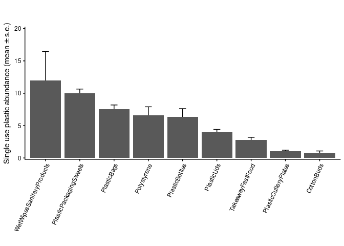<!-- -->

###### SUP type abundance per country

If we now want to visualize the contribution per each country, we have:

``` r
# Average litter type
SUP_Average_litter_type_country <- 
GroupB_SingleUsePlastic_data_validated %>% 
  select(CountryResponsible, PlasticBags:Polystyrene) %>%  
  pivot_longer(
    PlasticBags:Polystyrene,
    names_to  = "Litter_type",
    values_to = "Abundance"
  ) %>% 
  # 1) group by country AND type
  group_by(CountryResponsible, Litter_type) %>% 
  summarise(
    Av_Abundance = mean(Abundance, na.rm = TRUE),
    SE_Abundance = sd(Abundance,   na.rm = TRUE) / sqrt(n()),
    .groups = "drop"
  ) %>% 
  # title‐case country, reorder types by their overall mean if you like
  mutate(
    CountryResponsible = str_to_title(CountryResponsible),
    #Litter_type       = reorder(Litter_type, -Av_Abundance) # Reordenando el eje X (poco util)
    Litter_type       = Litter_type
  ) %>% 
  # 2) plot bars first, then error bars
  ggplot(aes(x = Litter_type, y = Av_Abundance)) +
  geom_col(fill = "lightgray", colour = "black") +
  geom_errorbar(aes(ymin = Av_Abundance - SE_Abundance,
                    ymax = Av_Abundance + SE_Abundance), width = 0.2) +
  facet_wrap(~ CountryResponsible, ncol   = 3, scales = "free_y") +
  labs(x = "", y = expression("Single use plastic abundance (mean" %+-% "s.e.)"), title = '', subtitle = "") +
  # theme_classic() +
  # theme(axis.text.x = element_text(angle = 65, vjust = 1, hjust = 1)) +
  theme_classic(base_size = 16) +
  theme(
    # rotate axis labels, center title, etc.
    axis.text.x     = element_text(angle = 65, hjust = 1),
    plot.title      = element_text(hjust = 0.5),
    strip.background = element_rect(
      fill   = "lightgrey",  # background color
      color  = "black",      # border color
      size   = 0.5           # border thickness
    ),
    strip.text       = element_text(
      colour = "black",      # text color
      face   = "bold"        # make it stand out
    )
  )

SUP_Average_litter_type_country
```

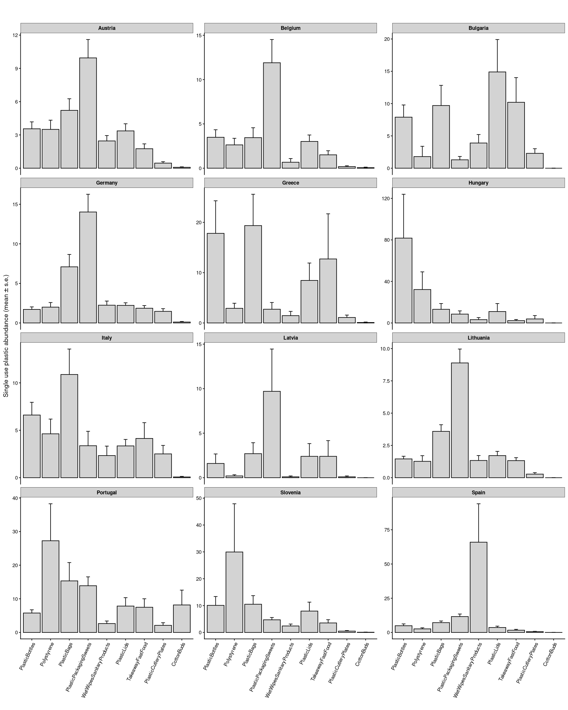<!-- -->

###### SUP type Proportion I - “Across‑type” proportions

- The first approach will be a “*Across‑type*” proportions.
  - For each litter type, what fraction comes from each country? (not
    from an european total)
  - total abundance of that litter type over each total country.

``` r
SUP_Prop_Liter_Country <- 
  GroupB_SingleUsePlastic_data_validated %>% 
  select(CountryResponsible, PlasticBags:Polystyrene) %>%  
  pivot_longer(
    PlasticBags:Polystyrene,
    names_to  = "Litter_type",
    values_to = "Abundance"
  ) %>%
  # 2) sum abundance by (Country, Type)
  group_by(CountryResponsible, Litter_type) %>%
  summarise(
    Total_Abundance = sum(Abundance, na.rm = TRUE),
    .groups = "drop"
  ) %>%
  # 3) compute, per type, the global total
  group_by(Litter_type) %>%
  mutate(
    Global_Total   = sum(Total_Abundance),
    Prop_Country   = Total_Abundance / Global_Total
  ) %>%
  ungroup()

SUP_Prop_Liter_Country
```

    ## # A tibble: 108 × 5
    ##    CountryResponsible Litter_type              Total_Abundance Global_Total Prop_Country
    ##    <fct>              <chr>                              <dbl>        <dbl>        <dbl>
    ##  1 austria            CottonBuds                             6          396      0.0152 
    ##  2 austria            PlasticBags                          386         4136      0.0933 
    ##  3 austria            PlasticBottles                       263         3490      0.0754 
    ##  4 austria            PlasticCutleryPlates                  34          575      0.0591 
    ##  5 austria            PlasticLids                          249         2199      0.113  
    ##  6 austria            PlasticPackagingSweets               736         5501      0.134  
    ##  7 austria            Polystyrene                          259         3616      0.0716 
    ##  8 austria            TakeawayFastFood                     130         1558      0.0834 
    ##  9 austria            WetWipesSanitaryProducts             182         6598      0.0276 
    ## 10 belgium            CottonBuds                             3          396      0.00758
    ## # ℹ 98 more rows

``` r
# Example 100%-stacked bar
Country_contribution_SUP_type <- 
SUP_Prop_Liter_Country %>% 
mutate(CountryResponsible = str_to_title(CountryResponsible)) %>% 
ggplot(., aes(x = Litter_type, y = Prop_Country, fill = CountryResponsible)) +
  geom_col(position = "fill") +
  scale_y_continuous(labels = percent_format()) +
  scale_fill_manual(
    values = brewer.pal(12, "Paired"),
    name   = "Country"
  ) +
  labs(
    x = "Single use plastic type",
    y = "Relative abundance (%)",
    title = "Country contributions to each litter type"
  ) +
  theme_classic() +
  theme(axis.text.x = element_text(angle = 65, hjust = 1)) +
  coord_flip()

print(Country_contribution_SUP_type)
```

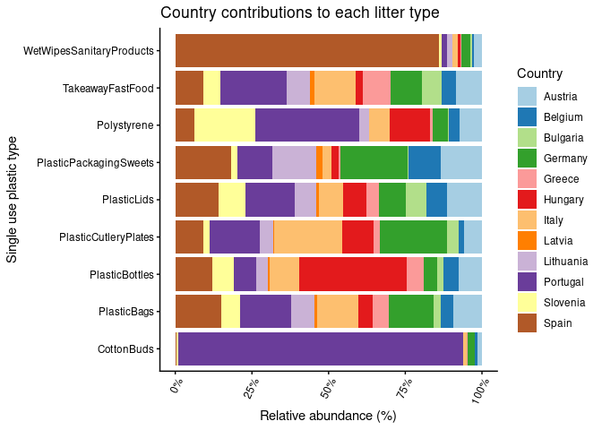<!-- -->

- Now, considering the total of Europe

``` r
# 1) Pivot, sum by country & type, then compute each country’s share of the European total
SUP_Data_prop_eu <- 
  GroupB_SingleUsePlastic_data_validated %>% 
  select(CountryResponsible, PlasticBags:Polystyrene) %>%  
  pivot_longer(
    PlasticBags:Polystyrene,
    names_to  = "Litter_type",
    values_to = "Abundance"
  ) %>%
  group_by(CountryResponsible, Litter_type) %>%
  summarise(
    Total_Abundance = sum(Abundance, na.rm = TRUE),
    .groups = "drop"
  ) %>%
  group_by(Litter_type) %>%
  mutate(
    European_Total   = sum(Total_Abundance),
    Prop_of_Europe   = Total_Abundance / European_Total
  ) %>%
  ungroup() %>%
  # optional: title‑case and reorder types by overall Prop for consistent ordering
  mutate(
    CountryResponsible = str_to_title(CountryResponsible),
    Litter_type        = reorder(Litter_type, -Prop_of_Europe)
  )

SUP_Data_prop_eu
```

    ## # A tibble: 108 × 5
    ##    CountryResponsible Litter_type              Total_Abundance European_Total Prop_of_Europe
    ##    <chr>              <fct>                              <dbl>          <dbl>          <dbl>
    ##  1 Austria            CottonBuds                             6            396        0.0152 
    ##  2 Austria            PlasticBags                          386           4136        0.0933 
    ##  3 Austria            PlasticBottles                       263           3490        0.0754 
    ##  4 Austria            PlasticCutleryPlates                  34            575        0.0591 
    ##  5 Austria            PlasticLids                          249           2199        0.113  
    ##  6 Austria            PlasticPackagingSweets               736           5501        0.134  
    ##  7 Austria            Polystyrene                          259           3616        0.0716 
    ##  8 Austria            TakeawayFastFood                     130           1558        0.0834 
    ##  9 Austria            WetWipesSanitaryProducts             182           6598        0.0276 
    ## 10 Belgium            CottonBuds                             3            396        0.00758
    ## # ℹ 98 more rows

``` r
# Example 100%-stacked bar
SUP_Data_prop_eu %>% 
mutate(CountryResponsible = str_to_title(CountryResponsible)) %>% 
ggplot(., aes(x = Litter_type, y = Prop_of_Europe, fill = CountryResponsible)) +
  geom_col(position = "fill") +
  scale_y_continuous(labels = percent_format()) +
  scale_fill_manual(
    values = brewer.pal(12, "Paired"),
    name   = "Country"
  ) +
  labs(
    x = "Single use plastic type",
    y = "Share of global abundance",
    title = "Country contributions to each litter type (Europe as basis)"
  ) +
  theme_classic() +
  theme(axis.text.x = element_text(angle = 65, hjust = 1)) +
  coord_flip()
```

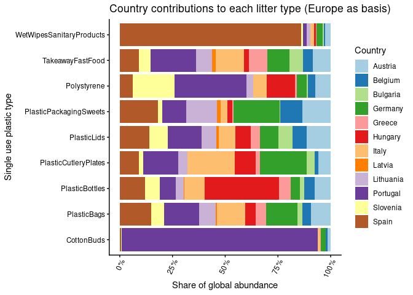

``` r
#x11()
# 2) Faceted bar chart of proportion (country share of European total)
# 2) plot with fixed scales and text labels
ggplot(SUP_Data_prop_eu, aes(x = Litter_type, y = Prop_of_Europe)) +
  geom_col(fill = "lightgray", colour = "black") +
  geom_text( # comment if you don't need the numbers above the bars
    #aes(label = percent(Prop_of_Europe, accuracy = 0.1), suffix = "%"),
    aes(label = round((Prop_of_Europe*100), 1)),
    angle   = 45,       # rotate labels 45°
    hjust   = 0,        # left‑align text relative to its anchor
    vjust   = -0.3,     # nudge it a bit above the bar
    size  = 2.7          # adjust text size as needed
  ) +
  scale_y_continuous(
    labels = percent_format(accuracy = 1),
    expand = expansion(mult = c(0, 0.15))  # extra 15% headroom for labels
  ) +
  facet_wrap(~ CountryResponsible, ncol = 3, scales = "fixed") +
  labs(
    x        = NULL,
    y        = "Share of European total (%)",
    title    = "Country contributions to each litter type",
    subtitle = "Proportion of European total abundance for each category"
  ) +
  theme_classic(base_size = 14) +
  theme(
    axis.text.x      = element_text(angle = 65, hjust = 1),
    strip.background = element_rect(fill = "lightgrey", colour = "black"),
    strip.text       = element_text(face = "bold")
  )
```

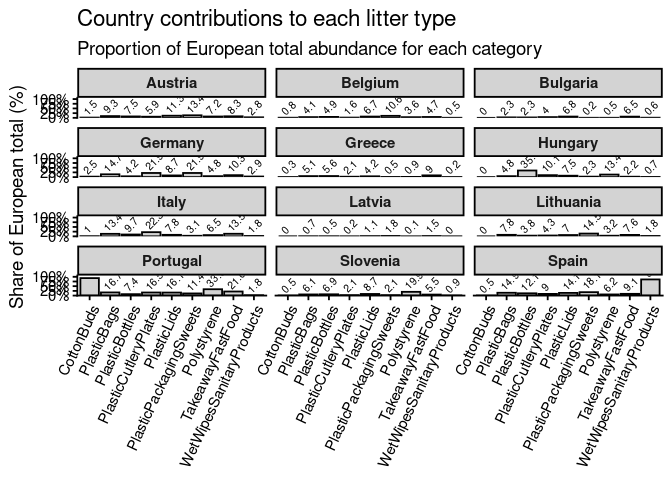

- HeatMaps

``` r
ProportionSUPEuropeHeatMap <- 
SUP_Data_prop_eu %>%
  heatmap(
    .row           = Litter_type,
    .column        = CountryResponsible,
    .value         = Prop_of_Europe,
    scale          = "column", # can be "none" (by default) or "row", "column" or "both". (#column keeps the z‑scaling)
    # a three‑colour gradient: low→mid→high
    palette_value  = c("#F7FBFF", "#6BAED6", "#08306B"),
    name           = "Relative \nimportance (%)",
    column_title   = "Country",
    row_title      = "Litter type",
    show_row_names = TRUE,
    show_column_names = TRUE
  )

print(ProportionSUPEuropeHeatMap)
```

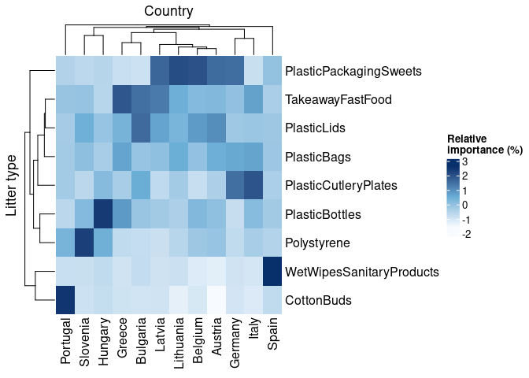

###### SUP type Proportion II - “Within‑country” proportions

- The second approach will be a “*Within‑country*” proportions.
  - For each country, what fraction of its total litter is each type?
  - Total abundance of all types in that country.

``` r
SUP_Prop_Liter_Country2 <- 
  GroupB_SingleUsePlastic_data_validated %>% 
  select(CountryResponsible, PlasticBags:Polystyrene) %>%  
  pivot_longer(
    PlasticBags:Polystyrene,
    names_to  = "Litter_type",
    values_to = "Abundance"
  ) %>%
  # 2) sum by (Country, Type)
  group_by(CountryResponsible, Litter_type) %>%
  summarise(
    Total_Abundance = sum(Abundance, na.rm = TRUE),
    .groups = "drop"
  ) %>%
  # 3) compute, per country, that country’s total
  group_by(CountryResponsible) %>%
  mutate(
    Country_Total = sum(Total_Abundance),
    Prop_Type     = Total_Abundance / Country_Total
  ) %>%
  ungroup()

SUP_Prop_Liter_Country2
```

    ## # A tibble: 108 × 5
    ##    CountryResponsible Litter_type              Total_Abundance Country_Total Prop_Type
    ##    <fct>              <chr>                              <dbl>         <dbl>     <dbl>
    ##  1 austria            CottonBuds                             6          2245   0.00267
    ##  2 austria            PlasticBags                          386          2245   0.172  
    ##  3 austria            PlasticBottles                       263          2245   0.117  
    ##  4 austria            PlasticCutleryPlates                  34          2245   0.0151 
    ##  5 austria            PlasticLids                          249          2245   0.111  
    ##  6 austria            PlasticPackagingSweets               736          2245   0.328  
    ##  7 austria            Polystyrene                          259          2245   0.115  
    ##  8 austria            TakeawayFastFood                     130          2245   0.0579 
    ##  9 austria            WetWipesSanitaryProducts             182          2245   0.0811 
    ## 10 belgium            CottonBuds                             3          1319   0.00227
    ## # ℹ 98 more rows

``` r
# Example 100%-stacked bar per country
SUP_Prop_Liter_Country2 %>% 
mutate(CountryResponsible = str_to_title(CountryResponsible)) %>% 
ggplot(., aes(x = CountryResponsible, y = Prop_Type, fill = Litter_type)) +
  geom_col(position = "fill") +
  scale_y_continuous(labels = percent_format()) +
  labs(
    x = "Country",
    y = "Share of country’s total",
    title = "Composition of litter types within each country",
    fill = "Single use \nplastic type"
  ) +
  theme_classic() +
  theme(axis.text.x = element_text(angle = 65, hjust = 1))
```

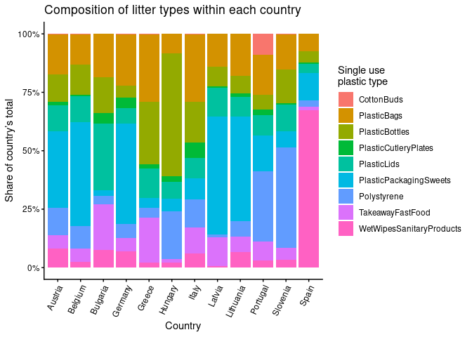<!-- -->

``` r
  # 2) plot bars first, then error bars
SUP_Prop_Liter_Country2 %>% 
  # 1) group by country AND type
  group_by(CountryResponsible, Litter_type) %>% 
  summarise(
    Av_Proportion = mean(Prop_Type, na.rm = TRUE),
    SE_Proportion = sd(Prop_Type,   na.rm = TRUE) / sqrt(n()),
    .groups = "drop"
  ) %>% 
  # title‐case country, reorder types by their overall mean if you like
  mutate(
    CountryResponsible = str_to_title(CountryResponsible),
    Litter_type       = reorder(Litter_type, -Av_Proportion)
  ) %>% 
  ggplot(data = ., aes(x = Litter_type, y = Av_Proportion)) +
  geom_col(fill = "lightgray", colour = "black") +
  geom_errorbar(aes(ymin = Av_Proportion - SE_Proportion,
                    ymax = Av_Proportion + SE_Proportion), width = 0.2) +
  facet_wrap(~ CountryResponsible, ncol   = 3, scales = "free_y") +
  labs(x = "", y = expression("Single use plastic abundance (mean" %+-% "s.e.)"), title = '', subtitle = "") +
  # theme_classic() +
  # theme(axis.text.x = element_text(angle = 65, vjust = 1, hjust = 1)) +
  theme_classic(base_size = 16) +
  theme(
    # rotate axis labels, center title, etc.
    axis.text.x     = element_text(angle = 65, hjust = 1),
    plot.title      = element_text(hjust = 0.5),
    strip.background = element_rect(
      fill   = "lightgrey",  # background color
      color  = "black",      # border color
      size   = 0.5           # border thickness
    ),
    strip.text       = element_text(
      colour = "black",      # text color
      face   = "bold"        # make it stand out
    )
  )
```

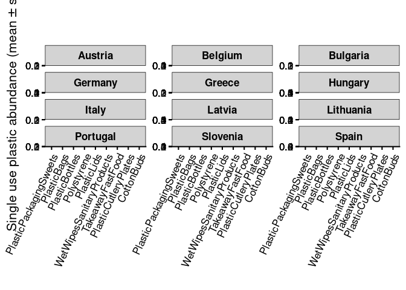<!-- -->

###### SUP Multivariate Perspective

``` r
# assume your data is in a data.frame called `df`
# and has at least:
#   CountryResponsible | PlasticBags | PlasticBottles | ... | LocalWaste

df_SUP <- GroupB_SingleUsePlastic_data_validated %>% 
  select(CountryResponsible, PlasticBags:Polystyrene)
# %>% 
# #drop_na()
# mutate_all(funs(replace_na(.,0)))

# isolate metadata + community matrix
meta_SUP <- df_SUP %>% select(CountryResponsible)
comm_SUP <- df_SUP %>% select(-CountryResponsible)

# Hellinger‐transform community data (recommended for PCA/cluster/PERMANOVA)
comm_hel_SUP <- decostand(comm, method = "hellinger")
```

In order to see if there are significant differences across country in
the community composition, we will perform a PERMANOVA test:

``` r
# 2a) Compute distance and hierarchical clustering (Ward’s D2)
dist_mat_SUP <- vegdist(comm_hel_SUP, method = "euclid")

# 3a) PERMANOVA: test if composition differs by Country
set.seed(42)

perm1_SUP <- adonis2(dist_mat_SUP ~ CountryResponsible, data = meta, 
                 permutations = 999, by = "margin")
print(perm1_SUP)
```

    ## Permutation test for adonis under reduced model
    ## Marginal effects of terms
    ## Permutation: free
    ## Number of permutations: 999
    ## 
    ## adonis2(formula = dist_mat_SUP ~ CountryResponsible, data = meta, permutations = 999, by = "margin")
    ##                     Df SumOfSqs      R2      F Pr(>F)    
    ## CountryResponsible  11   22.479 0.09759 5.2992  0.001 ***
    ## Residual           539  207.854 0.90241                  
    ## Total              550  230.333 1.00000                  
    ## ---
    ## Signif. codes:  0 '***' 0.001 '**' 0.01 '*' 0.05 '.' 0.1 ' ' 1

So, we conclude that there are significant differences among countries.
but What are the items that explains these differences?

The answer will be addressed by performing a **Multivariate Random
Forest**.

``` r
# 3b) Multivariate Random Forest:  
#     predict Country from composition → variable importance
rf_SUP <- randomForest(
  x      = comm_hel_SUP,
  y      = as.factor(meta_SUP$CountryResponsible),
  ntree  = 500,
  importance = TRUE
)

print(rf_SUP)
```

    ## 
    ## Call:
    ##  randomForest(x = comm_hel_SUP, y = as.factor(meta_SUP$CountryResponsible),      ntree = 500, importance = TRUE) 
    ##                Type of random forest: classification
    ##                      Number of trees: 500
    ## No. of variables tried at each split: 5
    ## 
    ##         OOB estimate of  error rate: 64.43%
    ## Confusion matrix:
    ##           austria belgium bulgaria germany greece hungary italy latvia lithuania portugal slovenia spain class.error
    ## austria        29       2        0      14      0       0     3      0         7        0        0    19   0.6081081
    ## belgium         7       7        0       4      0       0     2      1        10        2        1    15   0.8571429
    ## bulgaria        1       0        9       0      0       0     0      0         0        0        0     0   0.1000000
    ## germany        13       2        0      39      0       0     2      0        20        4        0     6   0.5465116
    ## greece          1       0        0       0      0       0     6      0         0        1        1     2   1.0000000
    ## hungary         1       1        1       1      0       3     1      0         0        0        0     7   0.8000000
    ## italy           9       4        0       5      0       1    19      0         3        2        1     7   0.6274510
    ## latvia          0       0        0       4      0       0     0      0         4        0        0     2   1.0000000
    ## lithuania       7       4        0      26      0       0     1      0        40        1        0    11   0.5555556
    ## portugal        6       3        0       7      0       0     7      0         9        8        1     4   0.8222222
    ## slovenia        2       1        0       0      0       0     4      0         1        3        3    10   0.8750000
    ## spain          14       5        0       8      0       1     7      2        10        0        0    39   0.5465116

The estimated error rate (OOB) is high, so conclusion have to be taken
with care. Thus, the more important (differential across countries)
litter components are:

``` r
varImpPlot(rf_SUP, main="Random Forest: Litter‐type Importance for Country Discrimination")
```

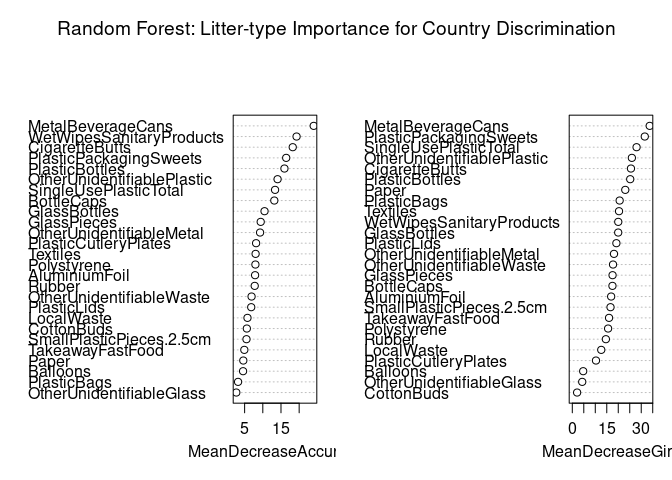<!-- -->

This plot of variable importance importance is telling us:

- A large `MeanDecreaseAccuracy` (**MDA**) means that, when you break
  the relationship between that predictor and the response, the model’s
  accuracy suffers a lot → it’s an important predictor for correct
  country assignments.

- **MDA** is generally the more reliable gauge of predictive importance,
  since it directly measures impact on OOB‐accuracy.

- A large `MeanDecreaseGini` (**MDG**) means that X frequently appears
  in high‑up the tree splits and yields big purity gains → it’s
  structurally important to partitioning the data.

  - **MDG** is faster to compute and tells you which features the trees
    “prefer” splitting on, but can overweight high–cardinality or
    continuous variables.

Finally, we will perform a Principal Component Analysis (PCA) to see
correlation among litter items and *possible* associations with
countries

``` r
# ─── 1) PCA (and optional RDA constrained by Country) ───────────────────────────
# 1a) Unconstrained PCA on Hellinger data
# pca1 <- rda(comm_hel)  
# 
# summary(pca1)
# 
# plot(pca1)

# (re)compute PCA with prcomp
pca_prcomp_SUP <- prcomp(comm_hel_SUP, scale. = TRUE)

#summary(pca_prcomp_SUP)
```

``` r
# # 1b) Quick biplot via factoextra
# SUP_PCA_Litter_Country <- 
# fviz_pca_biplot(pca_prcomp_SUP,
#                 geom.ind    = "point",            # show sites as points
#                 col.ind     = meta_SUP$CountryResponsible %>% str_to_title(), 
#                 palette.ind = "jco",              # color‐blind‐friendly palette
#                 addEllipses = FALSE,               # 95% CI per country
#                 label      = "var",               # show arrows for variables
#                 repel      = TRUE
# ) +
#   labs(title = "PCA of Litter Composition (Hellinger‐transformed)",
#        subtitle = "Points = samples colored by Country; arrows = Single use plastic types") +
#   theme_minimal(base_size = 14)
# 
# SUP_PCA_Litter_Country
```

``` r
SUP_PCA_Litter_Country2 <- 
  fviz_pca_biplot(pca_prcomp_SUP,
                  geom.ind    = "point",
                  col.ind     = meta_SUP$CountryResponsible %>% str_to_title(), 
                  palette     = "Set3",  # O prueba: "Paired", "Set1", "Dark2"
                  addEllipses = FALSE,
                  ellipse.type = "confidence",
                  label       = "var",
                  repel       = TRUE,
                  #mean.point  = FALSE,  # Desactiva los centroides (promedio de todos los puntos de cada país)
                  pointsize   = 3,
                  pointshape  = 16,  # Fuerza todos los puntos a círculos
                  alpha.ind   = 0.5  # Transparencia de los puntos (0-1)
  ) +
  labs(title = "PCA of Litter Composition (Hellinger‐transformed)",
       subtitle = "Points = samples colored by Country; arrows = Single use plastic types",
       color = "Country") +
  theme_minimal(base_size = 14) +
  guides(fill = "none")  # Quita la leyenda de fill (elipses)

SUP_PCA_Litter_Country2
```

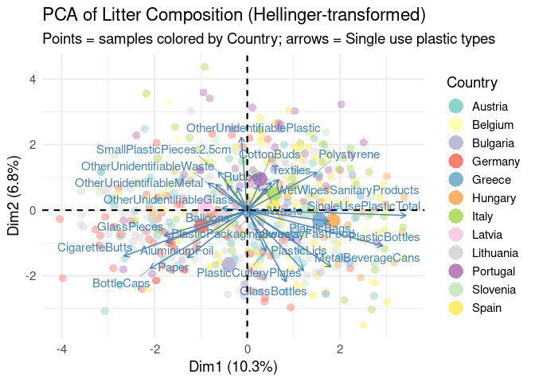<!-- -->

And the most important Items for the two forst principal components are:

- First PC

``` r
# Bar‐plot of top 10 contributors to PC1
fviz_contrib(pca_prcomp_SUP, choice = "var", axes = 1, top = 10) +
  ggtitle("Top 10 variables contributing to PC1")
```

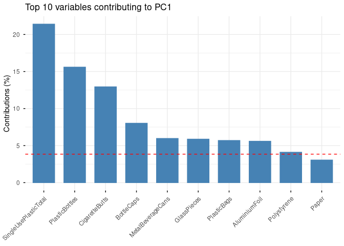<!-- -->

``` r
# Bar‐plot of top 10 contributors to PC2
fviz_contrib(pca_prcomp_SUP, choice = "var", axes = 2, top = 10) +
  ggtitle("Top 10 variables contributing to PC2")
```

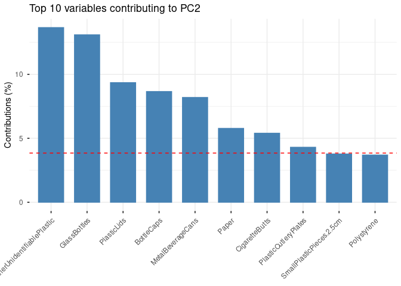<!-- -->
