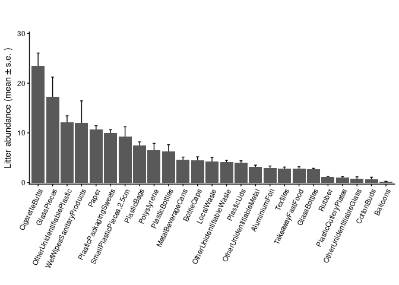
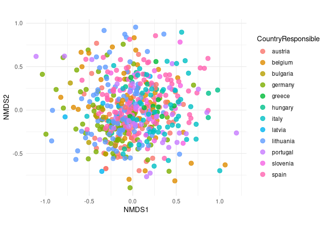
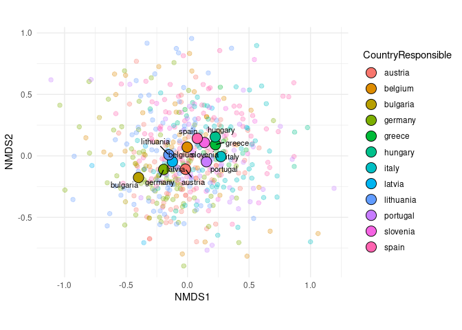
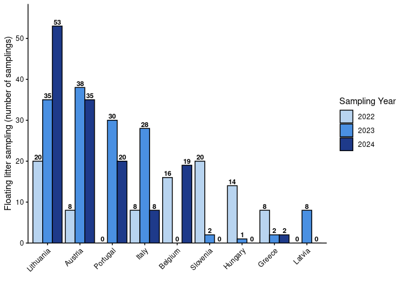
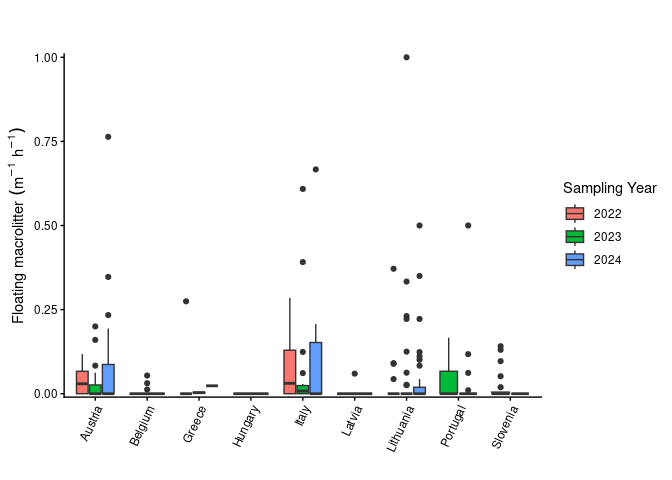

# Data Analysis

## Loading Packages

Loading R packages necessary to perform the **EDA**.

## Data loading

## Pre-proccessing

## RESEARCH QUESTIONS

### Citizens Description

#### Numer of samplings per year and country

- Table

<!-- -->

    ## # A tibble: 29 × 3
    ## # Groups:   CountryResponsible [12]
    ##    CountryResponsible SamplingYear Num_Sampling
    ##    <fct>                     <int>        <int>
    ##  1 austria                    2021            1
    ##  2 austria                    2022           17
    ##  3 austria                    2023           58
    ##  4 austria                    2024           66
    ##  5 belgium                    2022           22
    ##  6 belgium                    2024           31
    ##  7 bulgaria                   2023           10
    ##  8 germany                    2022           75
    ##  9 germany                    2023           11
    ## 10 germany                    2024            6
    ## # ℹ 19 more rows

- Plot

<!-- -->

#### Numer of Rivers sampled per year and country

- Table

<!-- -->

    ## # A tibble: 29 × 3
    ## # Groups:   CountryResponsible [12]
    ##    CountryResponsible SamplingYear Rivers
    ##    <fct>                     <int>  <int>
    ##  1 austria                    2021      1
    ##  2 austria                    2022     10
    ##  3 austria                    2023     35
    ##  4 austria                    2024     35
    ##  5 belgium                    2022     12
    ##  6 belgium                    2024     18
    ##  7 bulgaria                   2023      1
    ##  8 germany                    2022     58
    ##  9 germany                    2023     10
    ## 10 germany                    2024      5
    ## # ℹ 19 more rows

- Plot (without numbers)

<!-- -->

- Plot (with numbers)

<!-- -->

### Most common types and quantities of litter per region? (Group B: riverbanks; Group C: floating litter)

#### Group B: Riverside Waste

Statistics of the variable `RiversideWasteVariety_AttemptedSampling` to
see how many samplings were performed.

    ## RiversideWasteVariety_AttemptedSampling
    ##   0   1 
    ##  27 756

To work with the `RiversideWasteVariety_` data, we need to filter the
dataset to include only those rows where
`RiversideWasteVariety_AttemptedSampling` is 1 (indicating that a
sampling was attempted) and `RiversideWasteVariety_Qualified` is also 1
(indicating that the sampling was qualified).

##### Percentage of qualified samplings

This represents the percentage of validated data among the total number
of sampling beign attempted.

    ##   total_rows total_valid pct_valid_total pct_valid_percent
    ## 1        785         551            70.2             70.2%

    ## # A tibble: 12 × 7
    ##    CountryResponsible total_rows total_valid `pct_valid_total(%)` total_attempts valid_among_attempts pct_valid_among_attempts(…¹
    ##    <chr>                   <int>       <int>                <dbl>          <int>                <int>                       <dbl>
    ##  1 Austria                   142          74                 52.1            128                   74                        57.8
    ##  2 Belgium                    53          49                 92.5             52                   49                        94.2
    ##  3 Bulgaria                   10          10                100               10                   10                       100  
    ##  4 Germany                    92          86                 93.5             91                   86                        94.5
    ##  5 Greece                     12          11                 91.7             11                   11                       100  
    ##  6 Hungary                    16          15                 93.8             16                   15                        93.8
    ##  7 Italy                      58          51                 87.9             55                   51                        92.7
    ##  8 Latvia                     19          10                 52.6             19                   10                        52.6
    ##  9 Lithuania                 136          90                 66.2            133                   90                        67.7
    ## 10 Portugal                   79          45                 57               77                   45                        58.4
    ## 11 Slovenia                   26          24                 92.3             25                   24                        96  
    ## 12 Spain                     142          86                 60.6            139                   86                        61.9
    ## # ℹ abbreviated name: ¹​`pct_valid_among_attempts(%)`

<!-- -->

##### Most common types/quantities of litter

Firstly, we will pick up data to answer the question about group B. Only
some variables are taken from the general dataset.

The, Attributes’ names are so complicated to work that I’ll remote the
preceding information **RiversideWasteVariety_Results\_** which is
common to all attributes; and finally to work with only the validated
`Group B` dataset we create:

**CAUTION**! There are some `NAs` values in the litter items that are
probably incorrect since the groups did find other items.

After meeting and email from Charlotte, we realise that NA in group B
for some items it’s really a zero. So we update these columns replacing
`NA` values with a `0`.

###### Litter type abundance

We will obtain the plot for the most common (average abundance) litter
type, as a table and then as a plot.

<!-- -->

<!-- -->

###### Litter type abundance per country

If we now want to visualize the contribution per each country, we have:

<!-- -->

###### Litter type Proportion I - “Across‑type” proportions

- The first approach will be a “*Across‑type*” proportions.
  - For each litter type, what fraction comes from each country? (not
    from an european total)
  - total abundance of that litter type over each total country.

<!-- -->

    ## # A tibble: 300 × 5
    ##    CountryResponsible Litter_type              Total_Abundance Global_Total Prop_Country
    ##    <fct>              <chr>                              <dbl>        <dbl>        <dbl>
    ##  1 austria            AluminiumFoil                        246         1636      0.150  
    ##  2 austria            Balloons                              12          126      0.0952 
    ##  3 austria            BottleCaps                           503         2501      0.201  
    ##  4 austria            CigaretteButts                      2915        12962      0.225  
    ##  5 austria            CottonBuds                             6          396      0.0152 
    ##  6 austria            GlassBottles                         209         1462      0.143  
    ##  7 austria            GlassPieces                         2364         9527      0.248  
    ##  8 austria            LocalWaste                           146         2343      0.0623 
    ##  9 austria            MetalBeverageCans                    383         2551      0.150  
    ## 10 austria            OtherUnidentifiableGlass               3          462      0.00649
    ## # ℹ 290 more rows

<!-- -->

<!--
* Now, considering the total of Europe
&#10;
```
## # A tibble: 300 × 5
##    CountryResponsible Litter_type              Total_Abundance European_Total Prop_of_Europe
##    <chr>              <fct>                              <dbl>          <dbl>          <dbl>
##  1 Austria            AluminiumFoil                        246           1636        0.150  
##  2 Austria            Balloons                              12            126        0.0952 
##  3 Austria            BottleCaps                           503           2501        0.201  
##  4 Austria            CigaretteButts                      2915          12962        0.225  
##  5 Austria            CottonBuds                             6            396        0.0152 
##  6 Austria            GlassBottles                         209           1462        0.143  
##  7 Austria            GlassPieces                         2364           9527        0.248  
##  8 Austria            LocalWaste                           146           2343        0.0623 
##  9 Austria            MetalBeverageCans                    383           2551        0.150  
## 10 Austria            OtherUnidentifiableGlass               3            462        0.00649
## # ℹ 290 more rows
```
&#10;To compare and validate the output, for each `litter_type` the `European_Total` have to be the same.
&#10;
```
## # A tibble: 12 × 5
##    CountryResponsible Litter_type   Total_Abundance European_Total Prop_of_Europe
##    <chr>              <fct>                   <dbl>          <dbl>          <dbl>
##  1 Austria            AluminiumFoil             246           1636       0.150   
##  2 Belgium            AluminiumFoil              67           1636       0.0410  
##  3 Bulgaria           AluminiumFoil               1           1636       0.000611
##  4 Germany            AluminiumFoil             486           1636       0.297   
##  5 Greece             AluminiumFoil              36           1636       0.0220  
##  6 Hungary            AluminiumFoil              17           1636       0.0104  
##  7 Italy              AluminiumFoil              53           1636       0.0324  
##  8 Latvia             AluminiumFoil              17           1636       0.0104  
##  9 Lithuania          AluminiumFoil             275           1636       0.168   
## 10 Portugal           AluminiumFoil             115           1636       0.0703  
## 11 Slovenia           AluminiumFoil              57           1636       0.0348  
## 12 Spain              AluminiumFoil             266           1636       0.163
```
&#10;
&#10;

&#10;-->

- HeatMaps


<!--
###### Litter type Proportion II - "Within‑country" proportions
&#10;* The second approach will be a "*Within‑country*" proportions. 
  * For each country, what fraction of its total litter is each type?
  * Total abundance of all types in that country.
&#10;
&#10;```
## # A tibble: 300 × 5
##    CountryResponsible Litter_type              Total_Abundance Country_Total Prop_Type
##    <fct>              <chr>                              <dbl>         <dbl>     <dbl>
##  1 austria            AluminiumFoil                        246         12052  0.0204  
##  2 austria            Balloons                              12         12052  0.000996
##  3 austria            BottleCaps                           503         12052  0.0417  
##  4 austria            CigaretteButts                      2915         12052  0.242   
##  5 austria            CottonBuds                             6         12052  0.000498
##  6 austria            GlassBottles                         209         12052  0.0173  
##  7 austria            GlassPieces                         2364         12052  0.196   
##  8 austria            LocalWaste                           146         12052  0.0121  
##  9 austria            MetalBeverageCans                    383         12052  0.0318  
## 10 austria            OtherUnidentifiableGlass               3         12052  0.000249
## # ℹ 290 more rows
```
&#10;
<!-- -->

<!-- -->

–\>

###### Multivariate Perspective

In order to see if there are significant differences across country in
the community composition, we will perform a PERMANOVA test:

    ## Permutation test for adonis under reduced model
    ## Marginal effects of terms
    ## Permutation: free
    ## Number of permutations: 999
    ## 
    ## adonis2(formula = dist_mat ~ CountryResponsible, data = meta, permutations = 999, by = "margin")
    ##                     Df SumOfSqs      R2      F Pr(>F)    
    ## CountryResponsible  11   27.724 0.09814 5.3324  0.001 ***
    ## Residual           539  254.764 0.90186                  
    ## Total              550  282.488 1.00000                  
    ## ---
    ## Signif. codes:  0 '***' 0.001 '**' 0.01 '*' 0.05 '.' 0.1 ' ' 1

So, we conclude that there are significant differences among countries.
but What are the items that explains these differences?

The answer will be addressed by performing a **Multivariate Random
Forest**.

    ## 
    ## Call:
    ##  randomForest(x = comm_hel, y = as.factor(meta$CountryResponsible),      ntree = 500, importance = TRUE) 
    ##                Type of random forest: classification
    ##                      Number of trees: 500
    ## No. of variables tried at each split: 5
    ## 
    ##         OOB estimate of  error rate: 62.43%
    ## Confusion matrix:
    ##           austria belgium bulgaria germany greece hungary italy latvia lithuania portugal slovenia spain class.error
    ## austria        31       2        0      12      0       0     6      0         6        0        0    17   0.5810811
    ## belgium         6       5        0       2      0       0     5      2        12        3        2    12   0.8979592
    ## bulgaria        0       0        9       0      0       1     0      0         0        0        0     0   0.1000000
    ## germany        10       3        0      41      0       0     2      0        18        6        0     6   0.5232558
    ## greece          1       0        0       0      0       0     6      0         0        2        0     2   1.0000000
    ## hungary         2       1        0       1      0       2     3      0         0        0        0     6   0.8666667
    ## italy          10       3        0       4      0       0    20      0         1        1        0    12   0.6078431
    ## latvia          2       2        0       1      0       0     0      0         5        0        0     0   1.0000000
    ## lithuania       9       6        0      19      0       0     1      0        45        0        0    10   0.5000000
    ## portugal        5       4        0       7      0       0     7      0         3       12        1     6   0.7333333
    ## slovenia        4       0        0       0      0       0     5      0         1        4        0    10   1.0000000
    ## spain          16       5        0       7      0       0     6      0         9        1        0    42   0.5116279

Decisions have to be taken carefully since the prediction accuracy is
very low (0.38). Furthermore, the estimated error rate (OOB) is high, so
conclusion have to be taken with care.

Eventhough, the more important (differential across countries) litter
components are:


This plot of variable importance importance is telling us:

<!--
*  A large `MeanDecreaseAccuracy` (**MDA**) means that, when you break the relationship between that predictor and the response, the model’s accuracy suffers a lot → it’s an important predictor for correct country assignments. 
  * **MDA** is generally the more reliable gauge of predictive importance, since it directly measures impact on OOB‐accuracy.
-->

- A large `MeanDecreaseGini` (**MDG**) means that X frequently appears
  in high‑up the tree splits and yields big purity gains → it’s
  structurally important to partitioning the data.
  - **MDG** tells you which features the trees “prefer” splitting on.
- **Principal Component Analysis**

We will perform a Principal Component Analysis (PCA) to see correlation
among litter items and *possible* associations with countries

<!-- -->

And the most important Items for the two forst principal components are:

- First PC
  <!-- -->

<!-- -->

- **Non-Metric Multidimensional Scaling - nMDS**

We will perform a Non-Metric Multidimensional Scaling (nMDS) to see
correlation among litter items and *possible* associations with
countries.

We can re-use the distance matrix using the hellinger‐transformed data
(`comm_hel`) and then perform the nMDS.

    ## [1] 7

    ## [1]  84  88 202 205 309 324 400

    ## Run 0 stress 0.2879233 
    ## Run 1 stress 0.2892463 
    ## Run 2 stress 0.2891349 
    ## Run 3 stress 0.2883955 
    ## ... Procrustes: rmse 0.008112982  max resid 0.09888423 
    ## Run 4 stress 0.2986248 
    ## Run 5 stress 0.2936857 
    ## Run 6 stress 0.2928485 
    ## Run 7 stress 0.2996566 
    ## Run 8 stress 0.2958115 
    ## Run 9 stress 0.2896938 
    ## Run 10 stress 0.2934799 
    ## Run 11 stress 0.2897592 
    ## Run 12 stress 0.2980122 
    ## Run 13 stress 0.2896273 
    ## Run 14 stress 0.2898469 
    ## Run 15 stress 0.2907951 
    ## Run 16 stress 0.2990182 
    ## Run 17 stress 0.3004775 
    ## Run 18 stress 0.2993824 
    ## Run 19 stress 0.2885904 
    ## Run 20 stress 0.2892856 
    ## *** Best solution was not repeated -- monoMDS stopping criteria:
    ##     17: no. of iterations >= maxit
    ##      3: stress ratio > sratmax

Now, we calculate the scores for the sites (samples) and add the
metadata to be able to visualize the nMDS with the country information.

<!-- -->

To see which countries are more similar than others, we can calculate
the centroids of each country in the NMDS space and then plot them.

<!-- -->

From the above plot, we can say that the non-metric multidimensional
scaling ordination based on Bray–Curtis dissimilarities of
Hellinger-transformed litter composition revealed a clear gradient along
the first two NMDS axes. Countries are arranged in a roughly linear
sequence in this ordination space, indicating systematic shifts in the
relative contribution of the different litter categories rather than
discrete clusters. This pattern suggests that national litter profiles
form a continuum, with some countries showing more similar compositions
and therefore grouping closer together, while others occupy more distant
positions along the gradient. Taken together, the NMDS indicates that
between-country variation in litter is primarily structured along one
dominant compositional axis, with a secondary axis capturing finer
differences among otherwise similar profiles.

#### Group B: Single Use Plastic - Riverside Waste

We wil take as a subset the single use plastic (`SUP`) for the group B.

    ##   DatasetID CountryResponsible SamplingCampaign SamplingYear SamplingCoordinatesLatitude SamplingCoordinatesLongitude
    ## 1   at_6270            austria      autumn 2022         2022                    48.04275                     14.42192
    ## 2   at_6297            austria      autumn 2022         2022                    48.26034                     13.03440
    ## 3   at_6382            austria      autumn 2022         2022                    47.11828                     13.81419
    ## 4   at_6393            austria      autumn 2022         2022                    46.58301                     13.84115
    ## 5   at_6429            austria      autumn 2022         2022                    48.21108                     16.43973
    ## 6   at_6429            austria      autumn 2022         2022                    48.21108                     16.43973
    ##   SamplingRiverSystem SamplingParticipants RiversideWasteVariety_AttemptedSampling RiversideWasteVariety_Qualified PlasticBags
    ## 1              Danube                    9                                       1                               1           2
    ## 2              Danube                    8                                       1                               1           0
    ## 3              Danube                   20                                       1                               1           0
    ## 4              Danube                   38                                       1                               1          34
    ## 5              Danube                   20                                       1                               1           7
    ## 6              Danube                   20                                       1                               1           7
    ##   PlasticBottles PlasticLids TakeawayFastFood PlasticCutleryPlates PlasticPackagingSweets CottonBuds WetWipesSanitaryProducts
    ## 1              0           0                2                    0                      1          0                        1
    ## 2              1           4                1                    1                     14          0                        3
    ## 3              0           0                0                    0                      2          0                        0
    ## 4             22          13                2                    0                     34          0                        0
    ## 5             22          17                9                    3                     10          2                        7
    ## 6             22          17                9                    3                     10          2                        7
    ##   Polystyrene
    ## 1           0
    ## 2           0
    ## 3           1
    ## 4           0
    ## 5           6
    ## 6           6

    ##    DatasetID   CountryResponsible    SamplingCampaign  SamplingYear  SamplingCoordinatesLatitude SamplingCoordinatesLongitude
    ##  at_6429:  2   lithuania: 90      autumn 2021:  0     Min.   :2022   Min.   :37.18               Min.   :-9.309              
    ##  at_6463:  2   germany  : 86      autumn 2022:198     1st Qu.:2022   1st Qu.:42.03               1st Qu.: 2.946              
    ##  at_6972:  2   spain    : 86      autumn 2023:144     Median :2023   Median :48.07               Median :12.331              
    ##  at_6977:  2   austria  : 74      autumn 2024: 50     Mean   :2023   Mean   :47.47               Mean   :10.912              
    ##  de_6237:  2   italy    : 51      spring 2022:  1     3rd Qu.:2024   3rd Qu.:51.33               3rd Qu.:16.923              
    ##  de_6457:  2   belgium  : 49      spring 2023: 26     Max.   :2024   Max.   :57.75               Max.   :27.488              
    ##  (Other):539   (Other)  :115      spring 2024:132                                                                            
    ##  SamplingRiverSystem SamplingParticipants RiversideWasteVariety_AttemptedSampling RiversideWasteVariety_Qualified
    ##  Length:551          Min.   :  2.00       Min.   :1                               Min.   :1                      
    ##  Class :character    1st Qu.: 13.00       1st Qu.:1                               1st Qu.:1                      
    ##  Mode  :character    Median : 19.00       Median :1                               Median :1                      
    ##                      Mean   : 19.58       Mean   :1                               Mean   :1                      
    ##                      3rd Qu.: 24.00       3rd Qu.:1                               3rd Qu.:1                      
    ##                      Max.   :250.00       Max.   :1                               Max.   :1                      
    ##                      NA's   :10                                                                                  
    ##   PlasticBags      PlasticBottles     PlasticLids      TakeawayFastFood  PlasticCutleryPlates PlasticPackagingSweets
    ##  Min.   :  0.000   Min.   :  0.000   Min.   :  0.000   Min.   :  0.000   Min.   : 0.000       Min.   :  0.000       
    ##  1st Qu.:  0.000   1st Qu.:  0.000   1st Qu.:  0.000   1st Qu.:  0.000   1st Qu.: 0.000       1st Qu.:  1.000       
    ##  Median :  3.000   Median :  1.000   Median :  1.000   Median :  0.000   Median : 0.000       Median :  4.000       
    ##  Mean   :  7.506   Mean   :  6.334   Mean   :  3.991   Mean   :  2.828   Mean   : 1.044       Mean   :  9.984       
    ##  3rd Qu.:  7.000   3rd Qu.:  4.000   3rd Qu.:  4.000   3rd Qu.:  2.500   3rd Qu.: 1.000       3rd Qu.: 11.500       
    ##  Max.   :196.000   Max.   :576.000   Max.   :115.000   Max.   :102.000   Max.   :49.000       Max.   :121.000       
    ##                                                                                                                     
    ##    CottonBuds       WetWipesSanitaryProducts  Polystyrene     
    ##  Min.   :  0.0000   Min.   :   0.00          Min.   :  0.000  
    ##  1st Qu.:  0.0000   1st Qu.:   0.00          1st Qu.:  0.000  
    ##  Median :  0.0000   Median :   0.00          Median :  0.000  
    ##  Mean   :  0.7187   Mean   :  11.97          Mean   :  6.563  
    ##  3rd Qu.:  0.0000   3rd Qu.:   2.00          3rd Qu.:  2.000  
    ##  Max.   :145.0000   Max.   :1897.00          Max.   :423.000  
    ## 

###### SUP type abundance

We will obtain the plot for the most common (average abundance) Single
Use Plastic type
<!-- -->

###### SUP type abundance per country

If we now want to visualize the contribution per each country, we have:

<!-- -->

###### SUP type Proportion I - “Across‑type” proportions

- The first approach will be a “*Across‑type*” proportions.
  - total abundance of that litter type over each total country.

<!--
    * For each litter type, what fraction comes from each country? (not from an european total) 
    -->

    ## # A tibble: 108 × 5
    ##    CountryResponsible Litter_type              Total_Abundance Global_Total Prop_Country
    ##    <fct>              <chr>                              <dbl>        <dbl>        <dbl>
    ##  1 austria            CottonBuds                             6          396      0.0152 
    ##  2 austria            PlasticBags                          386         4136      0.0933 
    ##  3 austria            PlasticBottles                       263         3490      0.0754 
    ##  4 austria            PlasticCutleryPlates                  34          575      0.0591 
    ##  5 austria            PlasticLids                          249         2199      0.113  
    ##  6 austria            PlasticPackagingSweets               736         5501      0.134  
    ##  7 austria            Polystyrene                          259         3616      0.0716 
    ##  8 austria            TakeawayFastFood                     130         1558      0.0834 
    ##  9 austria            WetWipesSanitaryProducts             182         6598      0.0276 
    ## 10 belgium            CottonBuds                             3          396      0.00758
    ## # ℹ 98 more rows

<!-- -->

<!--
&#10;* Now, considering the total of Europe
&#10;
```
## # A tibble: 108 × 5
##    CountryResponsible Litter_type              Total_Abundance European_Total Prop_of_Europe
##    <chr>              <fct>                              <dbl>          <dbl>          <dbl>
##  1 Austria            CottonBuds                             6            396        0.0152 
##  2 Austria            PlasticBags                          386           4136        0.0933 
##  3 Austria            PlasticBottles                       263           3490        0.0754 
##  4 Austria            PlasticCutleryPlates                  34            575        0.0591 
##  5 Austria            PlasticLids                          249           2199        0.113  
##  6 Austria            PlasticPackagingSweets               736           5501        0.134  
##  7 Austria            Polystyrene                          259           3616        0.0716 
##  8 Austria            TakeawayFastFood                     130           1558        0.0834 
##  9 Austria            WetWipesSanitaryProducts             182           6598        0.0276 
## 10 Belgium            CottonBuds                             3            396        0.00758
## # ℹ 98 more rows
```
&#10;
&#10;
&#10;
-->

- HeatMaps


<!--
&#10;###### SUP type Proportion II - "Within‑country" proportions
&#10;* The second approach will be a "*Within‑country*" proportions. 
  * For each country, what fraction of its total litter is each type?
  * Total abundance of all types in that country.
&#10;
&#10;```
## # A tibble: 108 × 5
##    CountryResponsible Litter_type              Total_Abundance Country_Total Prop_Type
##    <fct>              <chr>                              <dbl>         <dbl>     <dbl>
##  1 austria            CottonBuds                             6          2245   0.00267
##  2 austria            PlasticBags                          386          2245   0.172  
##  3 austria            PlasticBottles                       263          2245   0.117  
##  4 austria            PlasticCutleryPlates                  34          2245   0.0151 
##  5 austria            PlasticLids                          249          2245   0.111  
##  6 austria            PlasticPackagingSweets               736          2245   0.328  
##  7 austria            Polystyrene                          259          2245   0.115  
##  8 austria            TakeawayFastFood                     130          2245   0.0579 
##  9 austria            WetWipesSanitaryProducts             182          2245   0.0811 
## 10 belgium            CottonBuds                             3          1319   0.00227
## # ℹ 98 more rows
```
&#10;
&#10;
&#10;<!-- -->

–\>

###### SUP Multivariate Perspective

In order to see if there are significant differences across country in
the community composition, we will perform a PERMANOVA test:

    ## Permutation test for adonis under reduced model
    ## Marginal effects of terms
    ## Permutation: free
    ## Number of permutations: 999
    ## 
    ## adonis2(formula = dist_mat_SUP ~ CountryResponsible, data = meta, permutations = 999, by = "margin")
    ##                     Df SumOfSqs      R2      F Pr(>F)    
    ## CountryResponsible  11   23.006 0.09697 5.2616  0.001 ***
    ## Residual           539  214.252 0.90303                  
    ## Total              550  237.258 1.00000                  
    ## ---
    ## Signif. codes:  0 '***' 0.001 '**' 0.01 '*' 0.05 '.' 0.1 ' ' 1

So, we conclude that there are significant differences among countries.
The R-Square value (0.098) means that the country “effects” explain 9.8%
of the total variability. 90.2% is the remaining (unexplained)
variability among countries. ***There is a significant country effect,
but is small***.

Or even better: **There are statistically significant multivariate
differences in litter composition among countries, although the effect
size is modest (R² = 0.098).**

We can look for **heterocedasticity** among countries

    ## 
    ##  Homogeneity of multivariate dispersions
    ## 
    ## Call: betadisper(d = dist_mat_SUP, group = meta_SUP$CountryResponsible)
    ## 
    ## No. of Positive Eigenvalues: 9
    ## No. of Negative Eigenvalues: 0
    ## 
    ## Average distance to median:
    ##   austria   belgium  bulgaria   germany    greece   hungary     italy    latvia lithuania  portugal  slovenia     spain 
    ##    0.6196    0.6059    0.5416    0.5887    0.4907    0.5711    0.6412    0.5485    0.5783    0.6154    0.5959    0.6310 
    ## 
    ## Eigenvalues for PCoA axes:
    ## (Showing 8 of 9 eigenvalues)
    ##  PCoA1  PCoA2  PCoA3  PCoA4  PCoA5  PCoA6  PCoA7  PCoA8 
    ## 63.710 39.977 35.962 29.495 22.832 18.822 15.019  9.756

    ## 
    ## Permutation test for homogeneity of multivariate dispersions
    ## Permutation: free
    ## Number of permutations: 999
    ## 
    ## Response: Distances
    ##            Df  Sum Sq  Mean Sq      F N.Perm Pr(>F)
    ## Groups     11  0.4642 0.042201 1.5106    999  0.144
    ## Residuals 539 15.0577 0.027936

The **heterocedasticity** is significant, so we must be carefully
conclude about the inter-countries differences. There is a Country
effect butis small.

If we need to parametrize this model, we should use a Mixed Multivariate
Model (necessary?)

but What are the items that explains these differences?

The answer will be addressed by performing a **Multivariate Random
Forest**.

    ## 
    ## Call:
    ##  randomForest(x = comm_hel_SUP, y = as.factor(meta_SUP$CountryResponsible),      ntree = 500, importance = TRUE) 
    ##                Type of random forest: classification
    ##                      Number of trees: 500
    ## No. of variables tried at each split: 3
    ## 
    ##         OOB estimate of  error rate: 73.68%
    ## Confusion matrix:
    ##           austria belgium bulgaria germany greece hungary italy latvia lithuania portugal slovenia spain class.error
    ## austria        15       3        0      14      0       0     5      0        21        5        1    10   0.7972973
    ## belgium         3       9        1       5      0       0     4      0        15        2        0    10   0.8163265
    ## bulgaria        2       1        5       0      0       0     2      0         0        0        0     0   0.5000000
    ## germany        10       3        0      32      0       1     6      0        22        4        0     8   0.6279070
    ## greece          2       0        0       0      0       1     7      0         0        0        1     0   1.0000000
    ## hungary         2       1        1       0      0       4     5      0         2        0        0     0   0.7333333
    ## italy           7       4        0       8      0       2    17      0         5        0        1     7   0.6666667
    ## latvia          2       2        0       1      0       0     0      0         4        0        0     1   1.0000000
    ## lithuania      12       9        0      20      0       0     4      0        35        1        1     8   0.6111111
    ## portugal        9       6        1       6      0       0     4      0         6        6        1     6   0.8666667
    ## slovenia        2       1        0       2      1       0     6      0         5        4        1     2   0.9583333
    ## spain          11      10        1      15      0       1     9      0        13        3        2    21   0.7558140

Decisions have to be taken carefully since the prediction accuracy is
very low (0.26). Furthermore, the estimated error rate (OOB) is high, so
conclusion have to be taken with care.

Even though, the more important (differential across countries) litter
components are:

<!-- -->

This plot of variable importance importance is telling us:

- A large `MeanDecreaseAccuracy` (**MDA**) means that, when you break
  the relationship between that predictor and the response, the model’s
  accuracy suffers a lot → it’s an important predictor for correct
  country assignments.

- **MDA** is generally the more reliable gauge of predictive importance,
  since it directly measures impact on OOB‐accuracy.

- A large `MeanDecreaseGini` (**MDG**) means that X frequently appears
  in high‑up the tree splits and yields big purity gains → it’s
  structurally important to partitioning the data.

  - **MDG** is faster to compute and tells you which features the trees
    “prefer” splitting on, but can overweight high–cardinality or
    continuous variables.

Finally, we will perform a Principal Component Analysis (PCA) to see
correlation among litter items and *possible* associations with
countries

<!-- -->

And the most important Items for the two forst principal components are:

- First PC
  <!-- -->

<!-- -->

## Floating DATA

### Data loading

    ## # A tibble: 375 × 15
    ##    DatasetID CountryResponsible SamplingYear SamplingAttempted DatasetQualified SamplingDate SamplingCoordinatesLatitude
    ##    <fct>     <chr>                     <dbl>             <dbl>            <dbl> <date>                             <dbl>
    ##  1 at_6270   Austria                    2022                 1                1 2022-10-18                          48.0
    ##  2 at_6297   Austria                    2022                 1                1 2022-10-22                          48.3
    ##  3 at_6349   Austria                    2022                 1                1 2022-10-19                          48.1
    ##  4 at_6372   Austria                    2022                 1                1 2022-11-10                          48.3
    ##  5 at_6382   Austria                    2022                 1                1 2022-11-08                          47.1
    ##  6 at_6393   Austria                    2022                 1                1 2022-11-09                          46.6
    ##  7 at_6414   Austria                    2022                 1                1 2022-11-11                          48.2
    ##  8 at_6448   Austria                    2022                 1                1 2022-11-11                          46.6
    ##  9 at_6703   Austria                    2023                 1                1 2023-05-10                          48.4
    ## 10 at_6718   Austria                    2023                 1                1 2023-05-24                          48.8
    ## # ℹ 365 more rows
    ## # ℹ 8 more variables: SamplingCoordinatesLongitude <dbl>, SamplingRiverSystem <fct>, FloatingMacro_AttemptedSampling <dbl>,
    ## #   FloatingMacro_Qualified <dbl>, FloatingMacro_ObservationTimeInMinutes <dbl>, FloatingMacro_RiverWidth <fct>,
    ## #   FloatingMacro_ObservedWidth <fct>, FloatingMacro_AmountOfFloatingMacrolitter <dbl>

#### Sampling Effor for Floating Data

<!-- -->

#### Macrolitter Flow calculation

The variable `FlowMacrolitter` is represented as the Number of floating
macrolitter $`m^{-1}`$ $`h^{-1}`$.

    ## # A tibble: 375 × 18
    ##    DatasetID CountryResponsible SamplingYear SamplingAttempted DatasetQualified SamplingDate SamplingCoordinatesLatitude
    ##    <fct>     <chr>                     <dbl>             <dbl>            <dbl> <date>                             <dbl>
    ##  1 at_6270   Austria                    2022                 1                1 2022-10-18                          48.0
    ##  2 at_6297   Austria                    2022                 1                1 2022-10-22                          48.3
    ##  3 at_6349   Austria                    2022                 1                1 2022-10-19                          48.1
    ##  4 at_6372   Austria                    2022                 1                1 2022-11-10                          48.3
    ##  5 at_6382   Austria                    2022                 1                1 2022-11-08                          47.1
    ##  6 at_6393   Austria                    2022                 1                1 2022-11-09                          46.6
    ##  7 at_6414   Austria                    2022                 1                1 2022-11-11                          48.2
    ##  8 at_6448   Austria                    2022                 1                1 2022-11-11                          46.6
    ##  9 at_6703   Austria                    2023                 1                1 2023-05-10                          48.4
    ## 10 at_6718   Austria                    2023                 1                1 2023-05-24                          48.8
    ## # ℹ 365 more rows
    ## # ℹ 11 more variables: SamplingCoordinatesLongitude <dbl>, SamplingRiverSystem <fct>, FloatingMacro_AttemptedSampling <dbl>,
    ## #   FloatingMacro_Qualified <dbl>, FloatingMacro_ObservationTimeInMinutes <dbl>, FloatingMacro_RiverWidth <fct>,
    ## #   FloatingMacro_ObservedWidth <fct>, FloatingMacro_AmountOfFloatingMacrolitter <dbl>, TimeInHours <dbl>, RiverWidth <dbl>,
    ## #   FlowMacrolitter <dbl>

#### Macrolitter Flow Visualization

##### Differences across countries

<!-- -->

- **Statistical test**

  - Generalize linear mixed model (Tweedie)

  Family error distribution was selected due to the data restriction
  (only positive values with high numbers of zeroes)

<!-- -->

    ##  Family: tweedie  ( log )
    ## Formula:          FlowMacrolitter ~ CountryResponsible
    ## Data: FlowData
    ## 
    ##       AIC       BIC    logLik -2*log(L)  df.resid 
    ##     290.0     331.8    -134.0     268.0       320 
    ## 
    ## 
    ## Dispersion parameter for tweedie family (): 2.16 
    ## 
    ## Conditional model:
    ##                               Estimate Std. Error z value Pr(>|z|)    
    ## (Intercept)                    -3.0551     0.3049 -10.018  < 2e-16 ***
    ## CountryResponsibleBelgium      -2.1601     1.0099  -2.139   0.0324 *  
    ## CountryResponsibleGreece        2.4984     0.5812   4.299 1.72e-05 ***
    ## CountryResponsibleHungary     -49.0697 22469.0664  -0.002   0.9983    
    ## CountryResponsibleItaly         0.6001     0.5143   1.167   0.2433    
    ## CountryResponsibleLatvia        1.5887     0.8014   1.982   0.0474 *  
    ## CountryResponsibleLithuania     0.0708     0.3976   0.178   0.8587    
    ## CountryResponsiblePortugal      1.0816     0.4367   2.477   0.0132 *  
    ## CountryResponsibleSlovenia     -0.8575     0.7405  -1.158   0.2469    
    ## ---
    ## Signif. codes:  0 '***' 0.001 '**' 0.01 '*' 0.05 '.' 0.1 ' ' 1

    ## Data: FlowData
    ## Models:
    ## mod_null: FlowMacrolitter ~ 1, zi=~0, disp=~1
    ## mod_full: FlowMacrolitter ~ CountryResponsible, zi=~0, disp=~1
    ##          Df    AIC    BIC  logLik deviance  Chisq Chi Df Pr(>Chisq)    
    ## mod_null  3 318.27 329.68 -156.14   312.27                             
    ## mod_full 11 290.01 331.83 -134.00   268.01 44.266      8  5.068e-07 ***
    ## ---
    ## Signif. codes:  0 '***' 0.001 '**' 0.01 '*' 0.05 '.' 0.1 ' ' 1

- Posthoc with multple comparisons

<!-- -->

    ##  contrast                ratio       SE  df null z.ratio p.value
    ##  Austria / Belgium    9.00e+00 9.00e+00 Inf    1   2.139  0.4464
    ##  Austria / Greece     0.00e+00 0.00e+00 Inf    1  -4.299  0.0006
    ##  Austria / Hungary    2.05e+21 4.60e+25 Inf    1   0.002  1.0000
    ##  Austria / Italy      1.00e+00 0.00e+00 Inf    1  -1.167  0.9634
    ##  Austria / Latvia     0.00e+00 0.00e+00 Inf    1  -1.982  0.5557
    ##  Austria / Lithuania  1.00e+00 0.00e+00 Inf    1  -0.178  1.0000
    ##  Austria / Portugal   0.00e+00 0.00e+00 Inf    1  -2.477  0.2431
    ##  Austria / Slovenia   2.00e+00 2.00e+00 Inf    1   1.158  0.9650
    ##  Belgium / Greece     0.00e+00 0.00e+00 Inf    1  -4.304  0.0006
    ##  Belgium / Hungary    2.36e+20 5.30e+24 Inf    1   0.002  1.0000
    ##  Belgium / Italy      0.00e+00 0.00e+00 Inf    1  -2.634  0.1726
    ##  Belgium / Latvia     0.00e+00 0.00e+00 Inf    1  -3.086  0.0524
    ##  Belgium / Lithuania  0.00e+00 0.00e+00 Inf    1  -2.240  0.3795
    ##  Belgium / Portugal   0.00e+00 0.00e+00 Inf    1  -3.203  0.0368
    ##  Belgium / Slovenia   0.00e+00 0.00e+00 Inf    1  -1.108  0.9732
    ##  Greece / Hungary     2.49e+22 5.59e+26 Inf    1   0.002  1.0000
    ##  Greece / Italy       7.00e+00 4.00e+00 Inf    1   2.942  0.0790
    ##  Greece / Latvia      2.00e+00 2.00e+00 Inf    1   1.021  0.9840
    ##  Greece / Lithuania   1.10e+01 6.00e+00 Inf    1   4.361  0.0004
    ##  Greece / Portugal    4.00e+00 2.00e+00 Inf    1   2.421  0.2722
    ##  Greece / Slovenia    2.90e+01 2.40e+01 Inf    1   4.011  0.0020
    ##  Hungary / Italy      0.00e+00 0.00e+00 Inf    1  -0.002  1.0000
    ##  Hungary / Latvia     0.00e+00 0.00e+00 Inf    1  -0.002  1.0000
    ##  Hungary / Lithuania  0.00e+00 0.00e+00 Inf    1  -0.002  1.0000
    ##  Hungary / Portugal   0.00e+00 0.00e+00 Inf    1  -0.002  1.0000
    ##  Hungary / Slovenia   0.00e+00 0.00e+00 Inf    1  -0.002  1.0000
    ##  Italy / Latvia       0.00e+00 0.00e+00 Inf    1  -1.164  0.9638
    ##  Italy / Lithuania    2.00e+00 1.00e+00 Inf    1   1.088  0.9761
    ##  Italy / Portugal     1.00e+00 0.00e+00 Inf    1  -0.928  0.9914
    ##  Italy / Slovenia     4.00e+00 3.00e+00 Inf    1   1.841  0.6547
    ##  Latvia / Lithuania   5.00e+00 4.00e+00 Inf    1   1.937  0.5880
    ##  Latvia / Portugal    2.00e+00 1.00e+00 Inf    1   0.630  0.9994
    ##  Latvia / Slovenia    1.20e+01 1.20e+01 Inf    1   2.441  0.2618
    ##  Lithuania / Portugal 0.00e+00 0.00e+00 Inf    1  -2.505  0.2291
    ##  Lithuania / Slovenia 3.00e+00 2.00e+00 Inf    1   1.287  0.9355
    ##  Portugal / Slovenia  7.00e+00 5.00e+00 Inf    1   2.608  0.1832
    ## 
    ## P value adjustment: tukey method for comparing a family of 9 estimates 
    ## Tests are performed on the log scale
